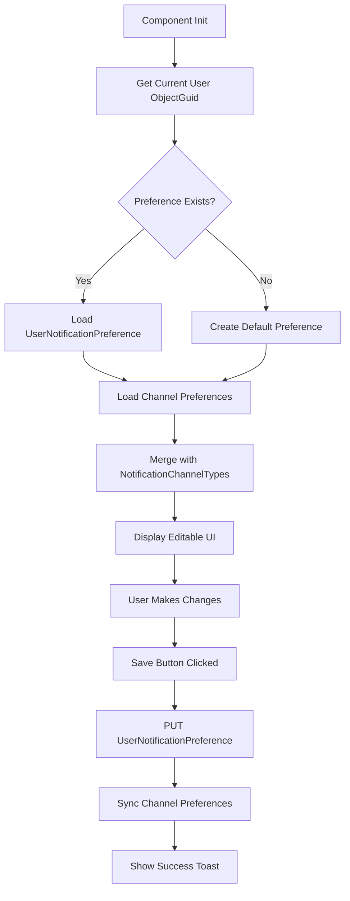

# User Notification Preferences Editor

Build a premium, full-page editor for managing user notification preferences in the Alerting module.

## Goal

Create a best-in-class notification preferences screen where users can:
- Enable/disable and prioritize notification channels (Email, SMS, Voice, Push)
- Configure quiet hours with timezone support
- Toggle Do Not Disturb mode with optional expiration

---

## Proposed Changes

### Alerting.Client

#### [NEW] [notification-preferences-editor.component.ts](file:///g:/source/repos/Scheduler/Alerting/Alerting.Client/src/app/components/notification-preferences-editor/notification-preferences-editor.component.ts)

Custom full-page editor component with:
- **Hero Header** - Teal gradient header with page title and save button
- **Channel Cards Section** - 4 draggable cards (Email, SMS, VoiceCall, MobilePush) with:
  - Toggle switch for enabled/disabled
  - Priority indicator (1st, 2nd, 3rd, 4th)
  - Visual priority reordering via drag-and-drop
  - Channel-specific icon
- **Quiet Hours Section** - Time range picker with:
  - Start/end time inputs (HH:mm format)
  - Timezone dropdown using user's preference
  - Enable/disable toggle
- **Do Not Disturb Section** - Prominent toggle with:
  - Optional "until" datetime picker
  - "Permanent" checkbox option
- **Notification Preview** - "If you were notified now..." showing which channel would fire

#### [NEW] [notification-preferences-editor.component.html](file:///g:/source/repos/Scheduler/Alerting/Alerting.Client/src/app/components/notification-preferences-editor/notification-preferences-editor.component.html)

Template implementing the card-based layout with:
- Bootstrap grid for responsive design
- cdkDrag/cdkDropList for reorderable channel cards
- Premium styling consistent with schedule/escalation editors

#### [NEW] [notification-preferences-editor.component.scss](file:///g:/source/repos/Scheduler/Alerting/Alerting.Client/src/app/components/notification-preferences-editor/notification-preferences-editor.component.scss)

Ultra-premium styling including:
- Teal/cyan gradient hero header
- Glassmorphism channel cards with hover effects
- Smooth toggle animations
- Time picker styling
- CDK drag preview styling

---

#### [MODIFY] [app-routing.module.ts](file:///g:/source/repos/Scheduler/Alerting/Alerting.Client/src/app/app-routing.module.ts)

Add route: `notification-preferences` → `NotificationPreferencesEditorComponent`

#### [MODIFY] [app.module.ts](file:///g:/source/repos/Scheduler/Alerting/Alerting.Client/src/app/app.module.ts)

- Import `NotificationPreferencesEditorComponent`
- Import `DragDropModule` from `@angular/cdk/drag-drop`
- Add to declarations

#### [MODIFY] [sidebar.component.ts](file:///g:/source/repos/Scheduler/Alerting/Alerting.Client/src/app/components/sidebar/sidebar.component.ts)

Add "Notification Preferences" menu item under user settings section

---

## Data Flow



---

## Key Implementation Details

### Auto-Create Preference
On first visit, if no `UserNotificationPreference` exists for the current user, automatically create one with defaults.

### Channel Priority Sync
When user reorders channels via drag-drop, update `priorityOverride` values (1, 2, 3, 4) for each `UserNotificationChannelPreference` record.

### Relational Synchronization Pattern
Use the established "Relational Synchronizer" pattern to sync channel preferences:
1. Fetch existing `UserNotificationChannelPreference` records
2. Compare with user's new ordering
3. Create/Update/Delete as needed in a single transaction

### Timezone Handling
- Populate timezone dropdown from a standard list (similar to schedule editor)
- Store user's selection in `timeZoneId` field
- Display quiet hours in user's local timezone

---

## Verification Plan

### Build Verification
```bash
cd g:\source\repos\Scheduler\Alerting\Alerting.Client
npm run build
```

### Manual Testing
1. Navigate to `/notification-preferences`
2. Toggle channels on/off - verify toggles animate smoothly
3. Drag to reorder channels - verify priority updates persist
4. Set quiet hours - verify time inputs work correctly
5. Enable DND with expiration - verify datetime picker works
6. Save and refresh - verify all settings persist
7. Test on narrow viewport - verify responsive behavior
