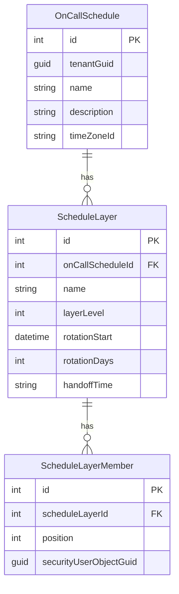

# On-Call Schedule Management UI

A world-class on-call schedule management interface inspired by PagerDuty, Opsgenie, and Incident.io.

## Background

The Alerting module requires a sophisticated UI for managing on-call schedules. The Escalation Policy Editor already supports targeting schedules, but there's no way to create or manage them. This implementation will deliver a **best-of-breed scheduling experience**.

### Database Schema



---

## User Review Required

> [!IMPORTANT]
> **Scope Decision**: This plan proposes a comprehensive scheduling UI with advanced features. Please confirm if you'd like to:
> 1. **Full Implementation** - All features including visual timeline, gap detection, override management
> 2. **Core Implementation** - Basic CRUD with visual timeline preview only
> 3. **MVP Implementation** - Simple form-based management without timeline visualization

> [!NOTE]
> **Override Management** is not currently in the database schema. This would require adding an `OnCallOverride` table to support temporary coverage swaps. Should we add this to the schema as part of this work?

---

## Proposed Changes

### Component 1: Schedule Management Infrastructure

---

#### [NEW] [schedule-management.component.ts](file:///g:/source/repos/Scheduler/Alerting/Alerting.Client/src/app/components/schedule-management/schedule-management.component.ts)

**Listing Component** - Premium listing following the established Integration/Service/Policy pattern.

- **Ultra-Premium Header (Pattern 87)**: Gradient header with `fa-calendar-alt` icon and animated background
- **Searchable Table**: List of schedules with columns for Name, Timezone, Layers Count, On-Call Now
- **Live "On-Call Now" Badge**: Real-time calculation showing current on-call user(s)
- **Quick Actions**: Edit (navigate to editor), Delete (confirmation modal)

---

#### [NEW] [schedule-editor.component.ts](file:///g:/source/repos/Scheduler/Alerting/Alerting.Client/src/app/components/schedule-editor/schedule-editor.component.ts)

**Full-Page Editor (Pattern 94)** - The core of the scheduling experience.

**Hero Section:**
- Editable Name/Description fields
- Timezone selector (dropdown with common timezones)
- "Who's On-Call Now" prominent display

**Visual Timeline Preview:**
```
┌─────────────────────────────────────────────────────────────────────────┐
│ Timeline Preview (Next 14 Days)                                          │
├─────────────────────────────────────────────────────────────────────────┤
│ Mon 3  │ Tue 4  │ Wed 5  │ Thu 6  │ Fri 7  │ Sat 8  │ Sun 9  │ Mon 10 │
├─────────────────────────────────────────────────────────────────────────┤
│ Primary: [████ John S. ████][████ Jane D. ████][████ Bob K. ████]       │
│ Backup:  [████ Alice M. ████████████████████████████████████████]       │
└─────────────────────────────────────────────────────────────────────────┘
```

- Horizontal scrollable timeline (2-4 weeks)
- Color-coded layers stacked vertically
- Hover tooltips showing exact shift times
- Current time marker (red vertical line)

**Layer Management Section:**
- Collapsible cards for each layer
- Drag-and-drop layer reordering (CDK)
- "Add Layer" button

**Per-Layer Configuration:**
- Layer name (e.g., "Primary", "Secondary", "Weekend Override")
- Layer level (priority - lower = higher priority)
- Rotation start date/time picker
- Rotation period (days) - common presets: 1 day, 7 days, 14 days
- Handoff time picker (e.g., "09:00")

**Member Rotation List:**
- Drag-and-drop reordering of members within a layer
- User selector dropdown (using `AlertingUserService`)
- "Add Member" button with user search
- Visual position indicators (1st, 2nd, 3rd, etc.)
- Remove member button

**Action Bar (Sticky Footer):**
- Save / Cancel buttons
- Unsaved changes indicator
- Delete schedule (danger button with confirmation)

---

#### [NEW] [schedule-timeline.component.ts](file:///g:/source/repos/Scheduler/Alerting/Alerting.Client/src/app/components/schedule-editor/schedule-timeline.component.ts)

**Reusable Timeline Visualization Component**

**Inputs:**
- `schedule: OnCallScheduleData` - The schedule to visualize
- `startDate: Date` - Start of timeline window
- `endDate: Date` - End of timeline window
- `showCurrentTime: boolean` - Whether to show "now" marker

**Features:**
- Pure computation of on-call periods based on rotation rules
- SVG-based rendering for crisp scaling
- Layer stacking with transparency for overlaps
- Color palette per user (consistent across views)
- Day/week grid lines
- Current time indicator (pulsing red line)

**Algorithm for On-Call Calculation:**
```typescript
function getOnCallUser(layer: ScheduleLayer, targetTime: Date): User {
    const members = layer.members.sort((a, b) => a.position - b.position);
    const rotationStart = new Date(layer.rotationStart);
    const rotationMs = layer.rotationDays * 24 * 60 * 60 * 1000;
    
    // Calculate which rotation we're in
    const elapsedMs = targetTime.getTime() - rotationStart.getTime();
    const rotationIndex = Math.floor(elapsedMs / rotationMs);
    
    // Map rotation to member (cycling through)
    const memberIndex = rotationIndex % members.length;
    return members[memberIndex];
}
```

---

### Component 2: Services & Utilities

---

#### [NEW] [schedule-calculator.service.ts](file:///g:/source/repos/Scheduler/Alerting/Alerting.Client/src/app/services/schedule-calculator.service.ts)

**Pure TypeScript service for on-call calculations**

```typescript
export interface OnCallSpan {
    userId: string;
    userName: string;
    startTime: Date;
    endTime: Date;
    layerId: number;
    layerName: string;
    layerLevel: number;
}

export class ScheduleCalculatorService {
    // Calculate who is on-call at a specific moment
    getOnCallNow(schedule: OnCallScheduleData): OnCallSpan[];
    
    // Generate timeline spans for visualization
    getTimelineSpans(schedule: OnCallScheduleData, start: Date, end: Date): OnCallSpan[];
    
    // Detect coverage gaps
    findCoverageGaps(schedule: OnCallScheduleData, start: Date, end: Date): DateRange[];
    
    // Validate schedule (no gaps, valid members, etc.)
    validateSchedule(schedule: OnCallScheduleData): ValidationResult;
}
```

---

### Component 3: Styling

---

#### [NEW] [schedule-editor.component.scss](file:///g:/source/repos/Scheduler/Alerting/Alerting.Client/src/app/components/schedule-editor/schedule-editor.component.scss)

**Premium Styling following established patterns:**

- Gradient header (teal/cyan spectrum for "schedule" domain)
- Glassmorphic layer cards
- Timeline grid styling with day/week markers
- User color avatars (initials + consistent colors)
- Drag-drop visual feedback
- Responsive breakpoints for mobile

---

### Component 4: Routing & Navigation

---

#### [MODIFY] [app-routing.module.ts](file:///g:/source/repos/Scheduler/Alerting/Alerting.Client/src/app/app-routing.module.ts)

**Add routes:**

| Route | Component | Description |
|-------|-----------|-------------|
| `/schedule-management` | `ScheduleManagementComponent` | Listing view |
| `/schedule-management/new` | `ScheduleEditorComponent` | Create new schedule |
| `/schedule-management/:id/edit` | `ScheduleEditorComponent` | Edit existing schedule |

---

#### [MODIFY] [sidebar.component.html](file:///g:/source/repos/Scheduler/Alerting/Alerting.Client/src/app/components/sidebar/sidebar.component.html)

**Add navigation item:**

- Icon: `fa-calendar-alt`
- Label: "Schedules"
- Position: After "Escalation Policies", before "Services"

---

### Component 5: Backend Support (If Needed)

---

#### [NEW] [ScheduleService.cs](file:///g:/source/repos/Scheduler/Alerting/Alerting.Server/Services/ScheduleService.cs)

**Optional: Backend calculation service for "Who's On-Call Now"**

If we want server-side calculation (for API consumers), we could add:

```csharp
public interface IScheduleService
{
    Task<List<OnCallUser>> GetOnCallNowAsync(Guid scheduleGuid);
    Task<List<OnCallSpan>> GetTimelineAsync(Guid scheduleGuid, DateTime start, DateTime end);
}
```

> [!NOTE]
> The frontend can calculate on-call locally using the schedule data. A backend service is only needed if external systems need to query "who's on call" via API.

---

## Verification Plan

### Automated Tests

```powershell
# Build verification
cd g:\source\repos\Scheduler\Alerting\Alerting.Client
npm run build

# Backend build (if adding server service)
cd g:\source\repos\Scheduler
dotnet build Alerting/Alerting.Server/Alerting.Server.csproj
```

### Manual Verification

1. **Create Schedule Flow**
   - Navigate to Schedule Management
   - Click "New Schedule"
   - Enter name, select timezone
   - Add a layer with 3 members
   - Verify timeline preview updates in real-time
   - Save and verify redirect to listing

2. **Timeline Accuracy**
   - Create a weekly rotation starting today
   - Verify "Who's On-Call Now" shows correct user
   - Compare timeline visualization against expected rotations

3. **Drag-and-Drop**
   - Reorder layer members
   - Verify position numbers update
   - Save and reload - verify order persisted

4. **Integration with Escalation Policies**
   - Create a schedule
   - Edit an escalation policy
   - Select "Schedule" as target type
   - Verify the new schedule appears in dropdown

---

## Implementation Order

1. **Phase 1: Core Infrastructure** (3-4 hours)
   - Schedule Management listing component
   - Schedule Editor component (basic form, no timeline)
   - Routing and navigation

2. **Phase 2: Visual Timeline** (2-3 hours)
   - ScheduleCalculatorService
   - Timeline component with SVG rendering
   - Integration into editor

3. **Phase 3: Advanced Features** (2-3 hours)
   - Drag-and-drop member reordering
   - Layer add/remove/reorder
   - Gap detection warnings

4. **Phase 4: Polish** (1-2 hours)
   - Premium styling refinements
   - Mobile responsiveness
   - Loading states and error handling
