# Foundation Alerting and Incident Management
## Architecture Documentation

> **Version**: 1.0 | **Status**: Production Ready | **Last Updated**: February 2026

---

# Executive Summary

**Foundation Alerting** is a production-ready, multi-tenant incident management platform integrated into the Foundation framework. It provides complete operational alerting from detection to resolution.

## Core Capabilities

| Capability | Description |
|------------|-------------|
| **Incident Lifecycle** | Full state machine (Triggered → Acknowledged → Resolved) with forensic audit trails |
| **Multi-Channel Notifications** | Email, SMS, Voice, Push, and Microsoft Teams delivery |
| **On-Call Scheduling** | Rotational participant management with layers and overrides |
| **Escalation Policies** | Configurable routing rules with timing delays and repeat logic |
| **Real-Time Dashboards** | Command center, flight control, and responder consoles |

## Technology Stack

- **Backend**: ASP.NET Core Web API with Entity Framework Core
- **Frontend**: Angular 18+ with Premium UI patterns
- **Database**: SQL Server with multi-tenant isolation
- **Integrations**: SendGrid (Email), Twilio (SMS/Voice), Firebase (Push)

## Value Proposition

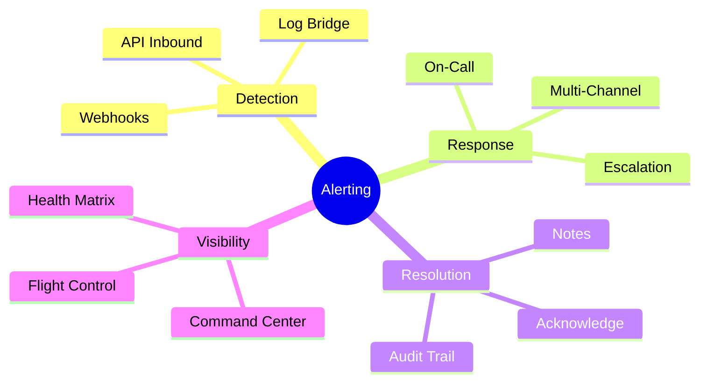

---

# 1. System Architecture

## 1.1 Context Diagram

The Alerting module operates as an independent Foundation module while integrating with the broader ecosystem.

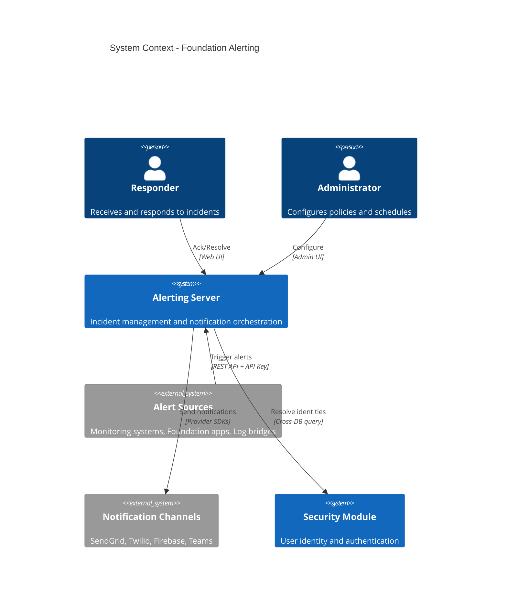

## 1.2 Container Diagram

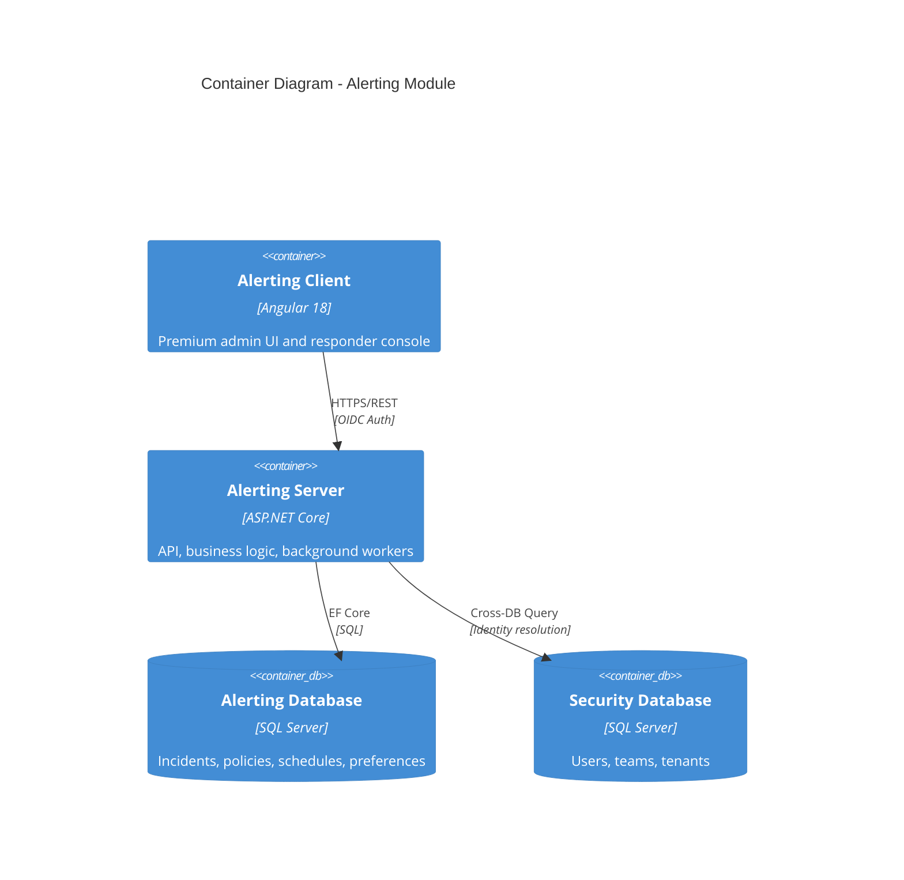

## 1.3 Component Diagram (Server)

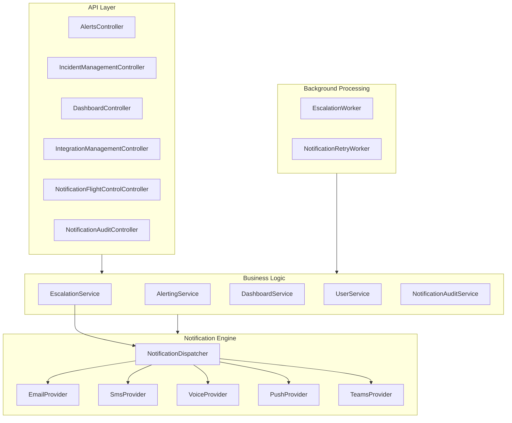

---

# 2. Database Architecture

## 2.1 Table Groupings

The database is organized into logical groupings that reflect their purpose in the system.

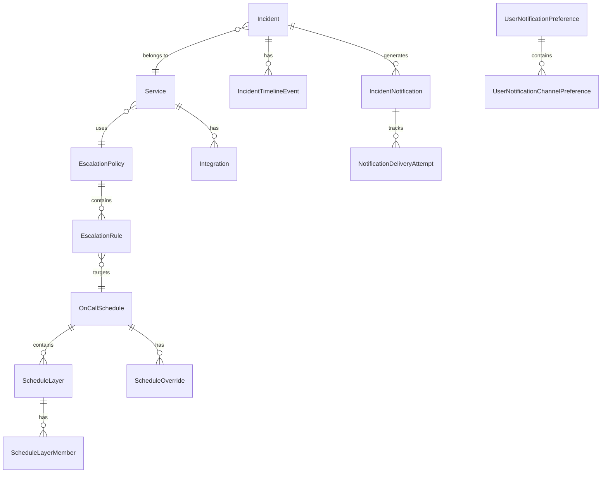

## 2.2 Core Entity Groups

| Group | Tables | Purpose |
|-------|--------|---------|
| **Configuration** | `EscalationPolicy`, `EscalationRule`, `Service`, `Integration` | Defines routing and API access |
| **Scheduling** | `OnCallSchedule`, `ScheduleLayer`, `ScheduleLayerMember`, `ScheduleOverride` | Manages rotational on-call |
| **Operational** | `Incident`, `IncidentTimelineEvent`, `IncidentNotification`, `NotificationDeliveryAttempt` | Active incident data |
| **Preferences** | `UserNotificationPreference`, `UserNotificationChannelPreference`, `UserPushToken` | Per-user notification settings |
| **Static Types** | `SeverityType`, `IncidentStatusType`, `IncidentEventType`, `NotificationChannelType` | Lookup/reference data |

## 2.3 Multi-Tenancy

All configuration and operational tables include `tenantGuid` for complete data isolation. Identity references use `objectGuid` pointing to the central Security database.

---

# 3. Incident Lifecycle

## 3.1 State Machine

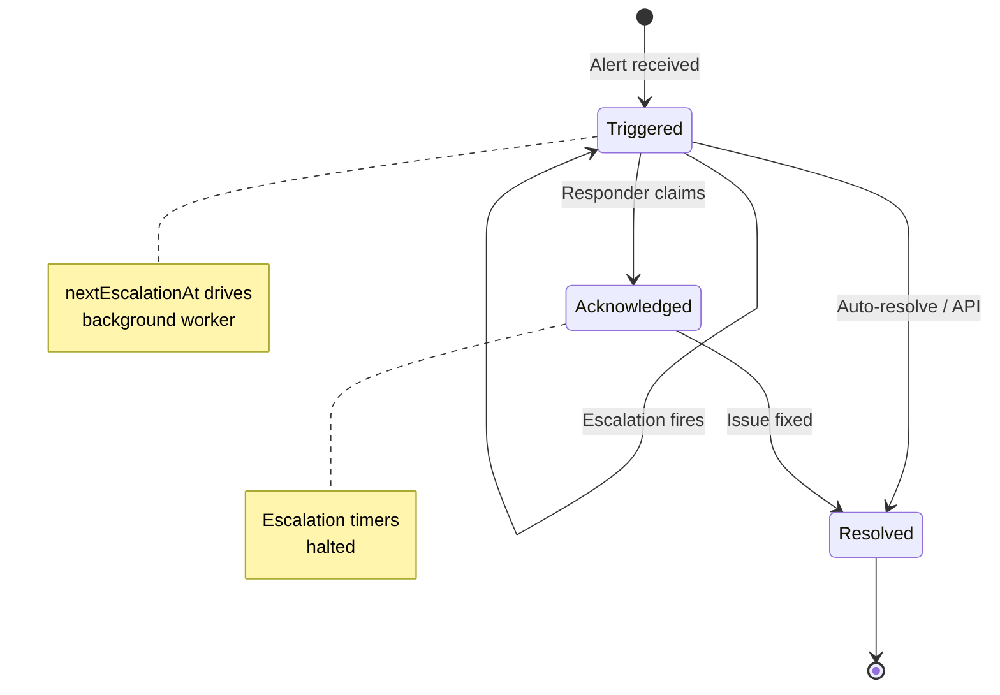

## 3.2 Escalation Flow

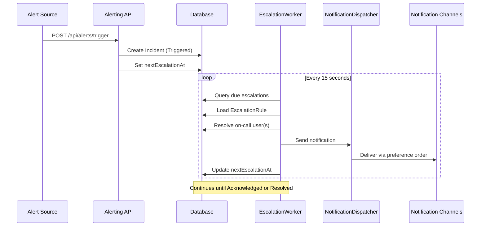

## 3.3 Timeline Events

Every state change is captured in `IncidentTimelineEvent`:

| Event ID | Type | Source |
|----------|------|--------|
| 1 | Triggered | system/api |
| 2 | Escalated | system |
| 3 | Acknowledged | user |
| 4 | Resolved | user/api |
| 5 | NoteAdded | user |
| 6 | NotificationSent | system |

---

# 4. Notification Engine

## 4.1 Multi-Channel Architecture

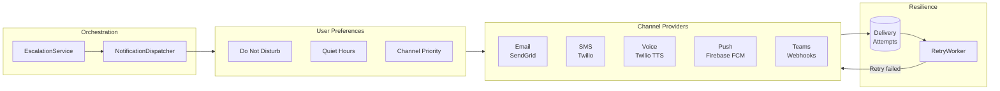

## 4.2 Channel Priority Resolution

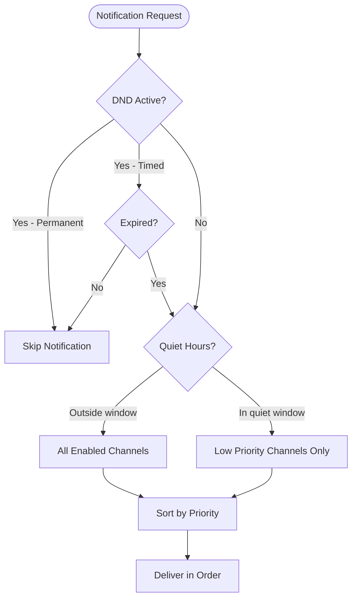

## 4.3 Provider Configuration

| Channel | Provider | Configuration Key |
|---------|----------|-------------------|
| Email | SendGrid | `Notifications:SendGrid:ApiKey` |
| SMS | Twilio | `Notifications:Twilio:AccountSid`, `AuthToken` |
| Voice | Twilio | Same as SMS, uses Polly neural TTS |
| Push | Firebase | `Notifications:Firebase:ProjectId`, `ServiceAccountJson` |
| Teams | Incoming Webhook | Per-integration webhook URL |

## 4.4 Retry Strategy

Failed deliveries are retried by `NotificationRetryWorker` with exponential backoff:
- **Attempt 1**: Immediate
- **Attempt 2**: +1 minute
- **Attempt 3**: +5 minutes
- **Attempt 4**: +15 minutes (final)

---

# 5. On-Call Scheduling

## 5.1 Rotation Algorithm

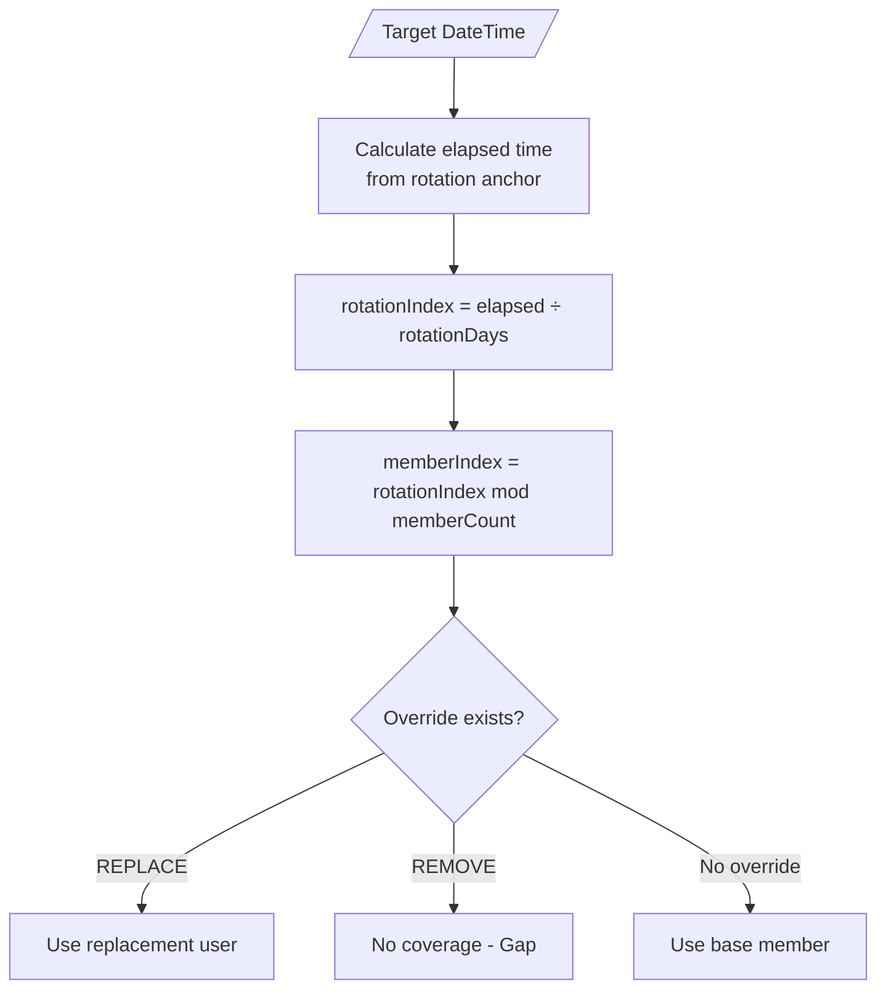

## 5.2 Schedule Structure

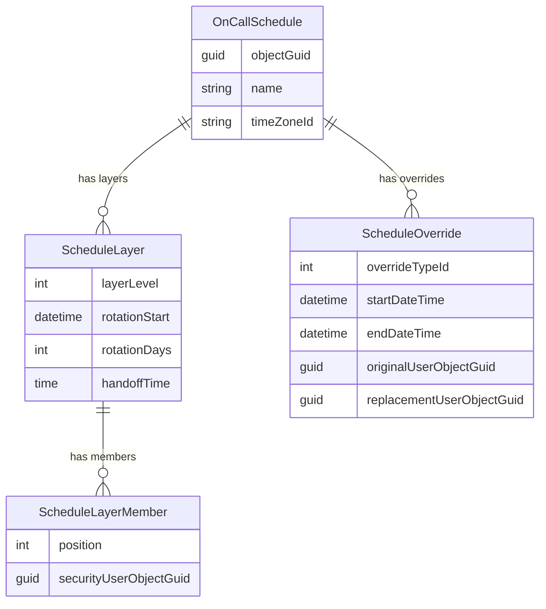

## 5.3 Override Types

| Type | ID | Behavior |
|------|-----|----------|
| **Swap** | 1 | Reciprocal exchange between two users |
| **Replace** | 2 | Substitute one user with another |
| **Remove** | 3 | Creates a coverage gap |

---

# 6. Client UI Architecture

## 6.1 Component Hierarchy

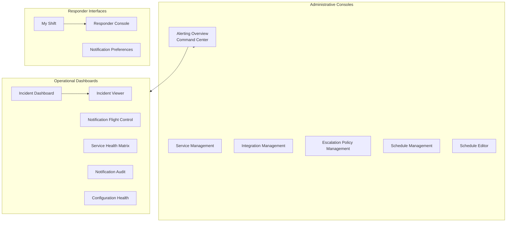

## 6.2 Key Premium UI Patterns

| Pattern | Component | Description |
|---------|-----------|-------------|
| **87** | Hero Headers | Gradient glassmorphism with bouncy icons |
| **23** | Flight Control | Real-time pipeline monitoring |
| **105** | My Shift | Personal on-call HUD |
| **135** | Title-Icon-Wrapper | Gold standard header consistency |
| **136** | Identity Proxy | Client-side GUID→name resolution |
| **139** | Notification Audit | Forensic content inspection |

---

# 7. API Surface

## 7.1 Custom Controllers

| Controller | Endpoints | Purpose |
|------------|-----------|---------|
| `AlertsController` | `POST /trigger`, `POST /resolve` | External alert ingestion |
| `IncidentManagementController` | Full CRUD + actions | Incident lifecycle management |
| `DashboardController` | `GET /stats`, `GET /incidents` | Real-time dashboard data |
| `IntegrationManagementController` | CRUD + API key ops | Integration configuration |
| `NotificationFlightControlController` | Pipeline metrics | Notification engine visibility |
| `NotificationAuditController` | Delivery content | Forensic content retrieval |
| `PushTokenController` | Token registration | FCM device management |
| `UsersController` | Identity proxy | Cross-module user resolution |

## 7.2 Authentication Patterns

| Pattern | Use Case | Mechanism |
|---------|----------|-----------|
| **OIDC** | Human users | Bearer token via Security module |
| **API Key** | Automated sources | `X-Api-Key` header with SHA-256 hash |
| **Integration Proxy** | Foundation apps | Service-to-service OIDC |

## 7.3 Inbound Alert Format

```json
{
  "incidentKey": "unique-deduplication-key",
  "title": "CPU Critical on Server-01",
  "description": "CPU utilization exceeded 95% for 5 minutes",
  "severityTypeId": 1,
  "sourcePayloadJson": { /* optional raw data */ }
}
```

---

# 8. Integration Points

## 8.1 Foundation Integration Library

The `FoundationCore.Web` assembly provides:
- `IAlertingIntegrationService` - Typed client for alert operations
- `AlertingIntegrationOptions` - Configuration binding
- OIDC auto-registration at startup

## 8.2 Log-to-Alerting Bridge

Foundation's `LogErrorNotificationConsumer` provides automatic alerting:
- Monitors all log files for ERROR-level entries
- "First-strike" immediate notification
- Temporal suppression to prevent alert fatigue

---

# Appendix: Quick Reference

## Status Codes

| Status | ID | Description |
|--------|-----|-------------|
| Triggered | 1 | New incident, escalation active |
| Acknowledged | 2 | Claimed by responder |
| Resolved | 3 | Issue fixed |

## Severity Levels

| Severity | ID | Sequence |
|----------|-----|----------|
| Critical | 1 | 10 |
| High | 2 | 20 |
| Medium | 3 | 30 |
| Low | 4 | 40 |

## Notification Channels

| Channel | ID | Default Priority |
|---------|-----|-----------------|
| Voice | 3 | 5 (highest) |
| SMS | 2 | 10 |
| Push | 4 | 20 |
| WebPush | 5 | 25 |
| Email | 1 | 30 |
| Teams | 6 | 40 (lowest) |

---

*Documentation generated by AI assistant - February 2026*
