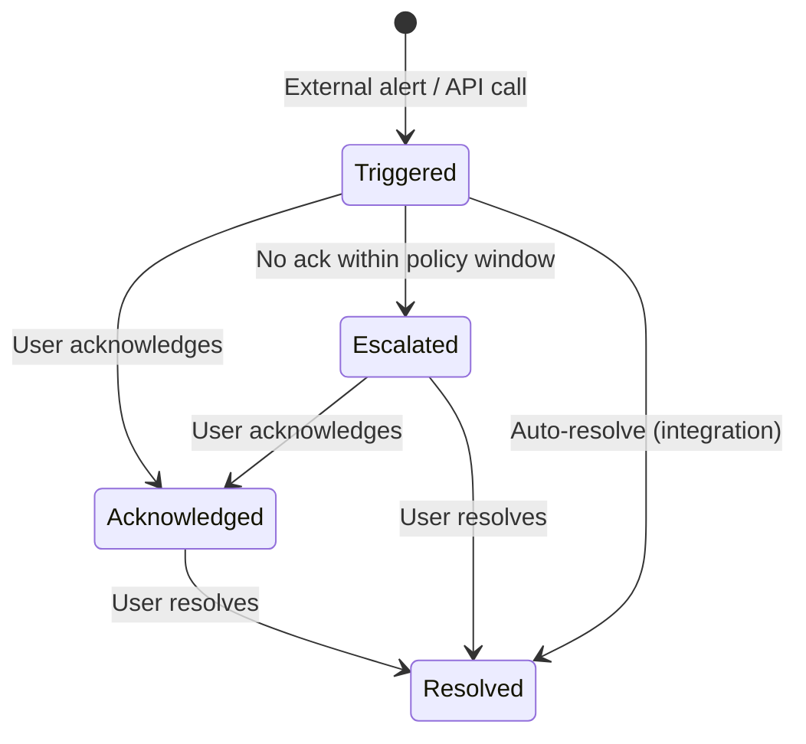
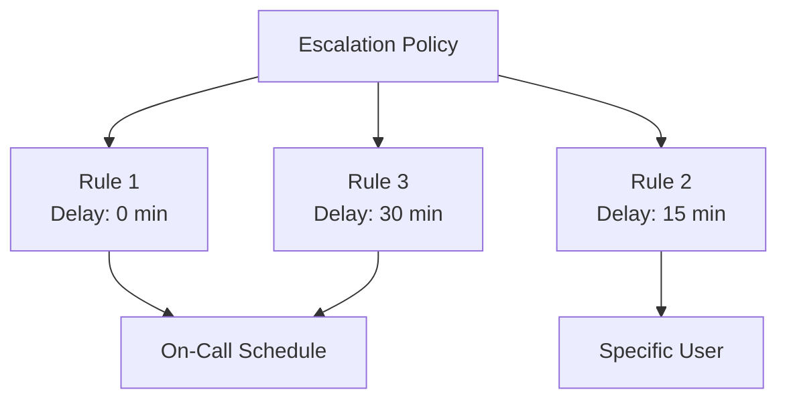
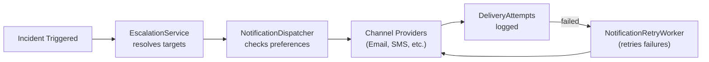

# Alerting — Key Concepts

Core concepts, domain model, and workflows for the Alerting incident management system.

---

## Incident Lifecycle

Incidents flow through a well-defined state machine:

### States

| Status | Meaning |
|--------|---------|
| **Triggered** | New incident, notifications being sent |
| **Acknowledged** | Someone is investigating |
| **Escalated** | Not acknowledged in time, escalated to next responder |
| **Resolved** | Issue fixed, incident closed |

### Incident Properties

Each incident has:
- **Incident key** — unique identifier for deduplication (external integrations use this)
- **Severity** — severity level
- **Service** — which service/system is affected
- **Timeline events** — chronological log of all state changes and actions
- **Notes** — user-added investigation notes
- **Notifications** — record of all sent notifications

---

## Integrations

External systems (Scheduler, Foundation, monitoring tools) can raise incidents via the **Integration API**:

1. An **Integration** is registered with a name and API key
2. The integration maps **IncidentEventTypes** → callback behavior
3. External systems call the `AlertsController` trigger endpoint with their API key
4. Alerting creates/updates incidents and dispatches notifications

### Integration Management

- `IntegrationRegistrationController` — registers new integrations (self-registration)
- `IntegrationManagementController` — manages existing integrations, API keys, callback mappings

---

## Escalation Policies

Escalation policies define **who gets notified and when** for incidents:

### Policy Structure

Each **EscalationRule** specifies:
- **Delay** — how long to wait before this rule fires
- **Target** — an on-call schedule or specific user
- The `EscalationWorker` (background service) continuously checks for unacknowledged incidents and fires rules on schedule

---

## On-Call Schedules

On-call schedules determine **who is responsible** at a given time:

### Schedule Layers

Each schedule has multiple **layers**, ordered by priority:
- Each layer has **members** with rotation periods
- Higher-priority layers override lower ones
- **Schedule overrides** temporarily replace the on-call user (vacations, swaps)

### Override Types

| Type | Purpose |
|------|---------|
| Replace | Temporarily swap in a different responder |
| Block | No one on-call during this period |

---

## Notification System

The notification system is a multi-channel delivery pipeline:

### Channels (5 providers)

| Provider | Class | Config Required |
|----------|-------|----------------|
| **Email** | `EmailNotificationProvider` | SendGrid API key |
| **SMS** | `SmsNotificationProvider` | Twilio credentials |
| **Voice Call** | `VoiceCallNotificationProvider` | Twilio credentials |
| **Microsoft Teams** | `TeamsNotificationProvider` | Teams webhook URL |
| **Push Notification** | `PushNotificationProvider` | Firebase credentials |

### User Notification Preferences

Each user configures:
- **Channel preferences** — which channels are enabled (e.g., Email + Push but not SMS)
- **Quiet hours** — time windows where notifications are suppressed or downgraded
- **Severity filters** — minimum severity for each channel

### Notification Flow

### Retry Logic

- `NotificationRetryWorker` runs on a configurable interval (default: 60s)
- Failed notifications are retried up to `MaxRetryAttempts` (default: 3)
- Exponential backoff via `RetryBackoffMinutes` (default: 1, 5, 15 minutes)

---

## Notification Flight Control

The **NotificationFlightControlService** provides a safety layer to prevent notification storms:
- Rate limiting per user/channel
- Deduplication of identical notifications
- Emergency override capabilities
- Managed via `NotificationFlightControlController`

---

## Dashboard

The `DashboardService` and `DashboardController` provide:
- Active incident counts by status and severity
- Service health summaries
- Integration status overview
- Metrics exposed via `AlertingMetricsProvider` for Foundation's System Health dashboard

---

## Services & Controllers Reference

### Custom Controllers (8)

| Controller | Purpose |
|-----------|---------|
| `AlertsController` | External alert ingestion API (trigger/resolve by key) |
| `DashboardController` | Dashboard summary data |
| `IncidentManagementController` | Incident CRUD for authenticated users (list, detail, acknowledge, resolve, add notes, stats) |
| `IntegrationManagementController` | Manage integrations and API keys |
| `IntegrationRegistrationController` | Self-registration for external systems |
| `NotificationFlightControlController` | Notification rate control management |
| `NotificationAuditController` | Notification delivery audit trail |
| `UsersController` | User notification preference management |
| `PushTokenController` | Push notification token registration |

### Services (6 core + notification subsystem)

| Service | Purpose |
|---------|---------|
| `AlertingService` | Incident lifecycle: trigger, acknowledge, resolve, timeline, deduplication |
| `DashboardService` | Dashboard aggregation queries |
| `EscalationService` | Processes pending escalations, resolves on-call targets |
| `NotificationFlightControlService` | Rate limiting, deduplication, emergency controls |
| `NotificationAuditService` | Notification delivery logging |
| `UserService` | User preference management |

### Notification Subsystem (11 files)

| Class | Purpose |
|-------|---------|
| `NotificationDispatcher` | Orchestrates multi-channel delivery with preference/quiet-hour resolution |
| `EmailNotificationProvider` | SendGrid email delivery |
| `SmsNotificationProvider` | Twilio SMS delivery |
| `VoiceCallNotificationProvider` | Twilio voice call delivery |
| `TeamsNotificationProvider` | Microsoft Teams webhook delivery |
| `PushNotificationProvider` | Firebase push notification delivery |
| `NotificationLogger` | Structured notification logging |
| `NotificationRetryWorker` | Background worker retrying failed deliveries |
| `NotificationRequest` / `NotificationResult` | DTOs for notification pipeline |
| `NotificationEngineOptions` | Config model for `NotificationEngine` section |

### Background Workers

| Worker | Purpose |
|--------|---------|
| `EscalationWorker` | Periodically checks for unacknowledged incidents and fires escalation rules |
| `NotificationRetryWorker` | Retries failed notification deliveries with exponential backoff |
