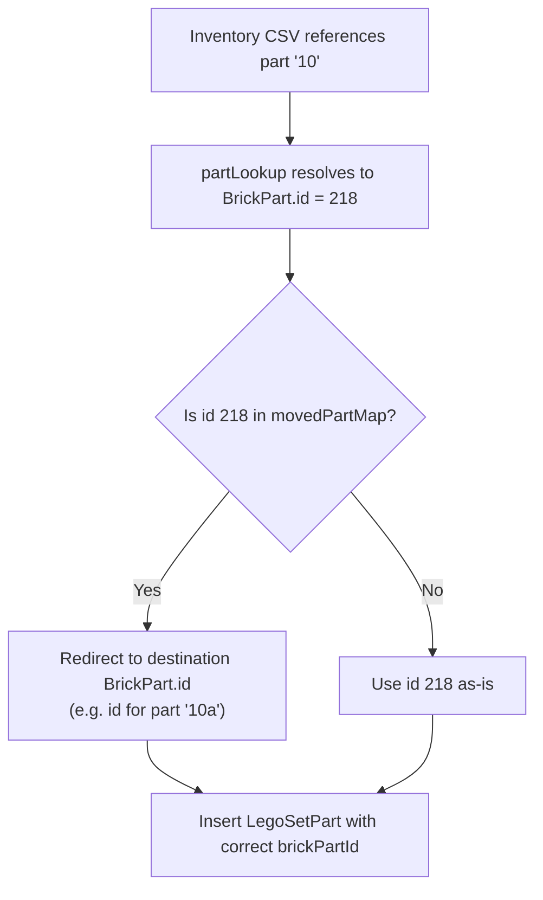

# Moved Part Reconciliation During Rebrickable Import

When Rebrickable set inventories reference an LDraw part that has "Moved" status (e.g. part `10` with title `~Moved to 10a`), the current import blindly links to the moved placeholder part. This makes the "My Catalog" UI display unhelpful entries like "~Moved to 10a". The fix resolves these references during import so inventory rows point to the actual destination part.

## Proposed Changes

### BMC.Rebrickable.Import

#### [MODIFY] [RebrickableImportService.cs](file:///d:/source/repos/scheduler/BMC.Rebrickable.Import/RebrickableImportService.cs)

Add a new private method `BuildMovedPartMap()` that:

1. Queries the database for all `BrickPart` rows where `ldrawTitle` starts with `~Moved to ` (case-insensitive)
2. Parses the destination part ID from the title (e.g. `~Moved to 10a` → `"10a"`)
3. Looks up the destination part by `ldrawPartId` in the existing parts
4. Builds a `Dictionary<int, int>` mapping from the moved part's `BrickPart.id` → destination `BrickPart.id`
5. Follows chains — if part A moved to B and B moved to C, the map should resolve A directly to C
6. Logs any unresolvable moves (destination part not found in DB) as warnings

Modify `ImportInventoryPartsAsync()` to:
1. After building `partLookup`, call `BuildMovedPartMap()` to get the resolution map
2. After resolving `brickPartId` from `partLookup`, check if it's in the moved map and substitute the destination id
3. Log reconciliation statistics at the end (how many parts were redirected)

Modify `ImportElementsAsync()` with the same pattern — after resolving the `partId`, check the moved map and redirect.

---

#### [MODIFY] [Program.cs](file:///d:/source/repos/scheduler/BMC.Rebrickable.Import/Program.cs)

Add `reconcile` as a new import target that can be run standalone to fix already-imported data. This would:

1. Load the moved part map
2. Query `LegoSetPart` rows that reference moved parts
3. Update them to point to the destination part instead
4. Do the same for `BrickElement` rows

This gives you the ability to fix existing data without re-running the full inventory import.

> [!IMPORTANT]
> The `reconcile` target modifies existing `LegoSetPart` and `BrickElement` rows in-place. This is a data correction step and should be safe to re-run (idempotent), but is worth calling out.

---

### Summary of Data Flow



---

## Verification Plan

### Manual Verification

Since there are no existing automated tests for either import project, verification will be manual:

1. **Before the fix** — Run this SQL query to see current moved parts in set inventories:
   ```sql
   SELECT lsp.id, ls.setNumber, bp.ldrawPartId, bp.ldrawTitle
   FROM bmc.LegoSetPart lsp
   JOIN bmc.BrickPart bp ON lsp.brickPartId = bp.id
   JOIN bmc.LegoSet ls ON lsp.legoSetId = ls.id
   WHERE bp.ldrawTitle LIKE '~Moved to%'
   ```
   This should return rows — confirming the problem exists.

2. **Build and run the reconcile step**:
   ```
   dotnet run --project BMC.Rebrickable.Import -- --source <csv-folder> --import reconcile
   ```
   Observe the console output — it should report how many `LegoSetPart` and `BrickElement` rows were redirected, and warn about any unresolvable moves.

3. **After the fix** — Re-run the same SQL query. The result set should be significantly smaller (only unresolvable moves should remain, if any). Verify that the redirected rows now point to real parts with meaningful titles.

4. **UI check** — Open the "My Catalog" UI in the BMC client and browse a set that previously showed "~Moved to..." parts. Confirm the parts now display with their correct titles.
