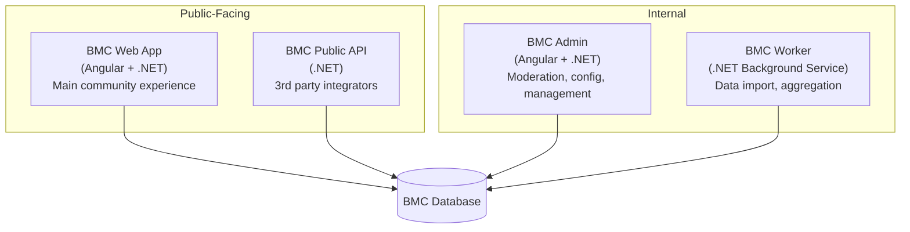

# BMC Community Platform Vision — Refined

> Updated with decisions from planning session, Feb 15 2026

## The Core Concept

**BMC = Steam for LEGO.** The CAD tools and physics simulation are the "games" — the reason people join. The community keeps them. No existing AFOL platform does this well.

| Steam / Epic | BMC |
|---|---|
| Game library (pride of ownership) | Collection showcase (pride of ownership) |
| Rich storefront landing page | Rich public landing with featured MOCs, challenges, exploration |
| Trading cards, badges, achievements | Build achievements, collection milestones |
| Community hub, Workshop | MOC gallery, shared instructions, build challenges |
| Store + wishlist | Parts wishlist + BrickLink/Rebrickable integration |
| Friends, activity feed | Builder profiles, follow system, activity feed |

---

## Key Decisions

| Decision | Direction |
|---|---|
| **User model** | One tenant per user (leverages existing Foundation multi-tenancy) |
| **Landing page** | Rich public content (featured MOCs, set exploration, challenges) — not just a login modal |
| **Set & part exploration** | Go hard — make it a deep, fun browsing experience people spend hours on |
| **Instructions** | Support existing standards where they exist, create our own standard otherwise. Store PDFs/images directly — size is not an issue |
| **Imports** | Build interfaces/importers from Studio, LeoCAD, Rebrickable, BrickLink |
| **Admin** | Separate BMC Admin project for moderation and configuration |
| **Public API** | Separate project, independently deployable |
| **Mobile** | Responsive web (no native apps) |
| **Monetization** | Freemium — physics simulation is the premium unlock |
| **Visibility** | Gallery/exploration = public, personal collection/building = authenticated |
| **First step** | Schema definition to paint the full picture, then incremental feature build |

---

## Architecture: Four Projects

| Project | Purpose |
|---|---|
| **BMC** (existing) | The main web app — public browsing, authenticated building, community |
| **BMC Admin** (new) | Moderation tools, moderator management, content review, platform config |
| **BMC Public API** (new) | RESTful API for integrators to build on BMC data |
| **BMC Worker** (existing, expand) | Background processing — Rebrickable imports, aggregation, notifications |

---

## Platform Layers

### Layer 1: User Identity & Profile
Each user = one Foundation tenant. Profile as the anchor for everything.

- **Public builder profile** — avatar, bio, location, showcase MOCs, collection stats
- **Collection showcase** — part/set counts, rare parts, theme coverage, value estimates
- **Achievement/milestone system** — "10,000 Parts", "First MOC Published", "Technic Master"
- **Activity history** — recent builds, collection additions, published MOCs

### Layer 2: Social & Community
- **Follow system** — follow builders, see their activity
- **Activity feed** — builds, collection updates, published MOCs, challenge entries
- **MOC Gallery** — public showcase with tags, likes/favourites, comments, featured rotation
- **Build Challenges** — community or admin-curated ("Under 100 parts vehicle", themed events)
- **Discussion/comments** on MOCs and instructions

### Layer 3: Content & Exploration
This is where "go hard on the data" lives.

- **Set Explorer** — deep browsing of all LEGO sets by theme/year/part count, drill into inventories, see which parts you own, related sets
- **Part Explorer** — browse parts with 3D previews, see what sets they appear in, colour availability, related parts
- **Minifig Browser** — explore the minifig universe, see which sets include them
- **Theme Trees** — visual navigation of the LEGO theme hierarchy
- **"Can I Build This?"** — check any shared MOC or official set against your collection
- **Publish MOCs** — share as viewable 3D model with full parts list
- **Share Instructions** — publish build manuals in BMC's format, or upload PDF/images of existing ones
- **MOC forking** — copy a published MOC as a starting point

### Layer 4: Collection & Trading
- **Set tracker** — owned, wanted, built, display-only status
- **Price integration** — BrickLink historical price data for collection value tracking
- **Missing parts finder** — gaps between collection and build projects
- **Parts list export** — one-click BOM → BrickLink wanted list / Rebrickable
- **Trade matching** — "I have X, I need Y" (future)

### Layer 5: Gamification
- **Collection leaderboards** — most parts, rarest, most complete themes
- **Building stats** — total bricks placed, projects completed
- **Seasonal events** — themed challenges with badges
- **"Collection score"** — computed from volume, rarity, diversity

---

## Landing Page Vision

The unauthenticated landing page should feel like arriving at Steam or Epic Games:

- **Featured MOCs** — rotating hero showcase of community highlights
- **Trending** — most liked/viewed MOCs this week
- **New Sets** — recently released official LEGO sets
- **Active Challenges** — current build challenges with entry counts
- **Set/Part Explorer** teasers — draw visitors into browsing
- **Builder spotlights** — featured community members
- Clear but non-intrusive login/signup path

> The goal: someone lands here and spends 20 minutes browsing before they even think about signing up. Then they sign up because they *want in*.

---

## Integration Strategy

BMC as the **connective tissue** between fragmented AFOL tools:

| System | Direction | What |
|---|---|---|
| **Rebrickable** | Import | Sets, parts, inventories, relationships, minifigs, elements |
| **BrickLink** | Import + Export | Price data in, wanted lists out |
| **LDraw** | Import | Part 3D geometry (already doing) |
| **Studio** | Import | .ldr/.mpd/.io model files |
| **LeoCAD** | Import | .ldr/.mpd model files |
| **BMC Public API** | Export | Everything — let others build on BMC data |

---

## Instruction Standards Research

Before implementing the instruction system:
- Investigate existing structured formats (LPub meta-commands, Studio's instruction format, LEGO's own XML schema if documented)
- Design BMC's native format to be import-compatible where possible
- Support direct PDF/image upload as a fallback for legacy manuals
- Export to PDF, HTML, and potentially interactive web viewer

---

## Freemium Model

| Tier | Features |
|---|---|
| **Free** | Collection management, set/part exploration, MOC gallery browsing, basic building (limited parts per project?), publish up to N MOCs |
| **Premium** | Physics simulation, unlimited projects & MOCs, advanced rendering, API access, priority support |

> The physics sim is the premium draw — it's unique to BMC and has no free equivalent elsewhere.

---

## Next Steps

**Phase 0: Schema Definition** — Define the complete database schema across all layers to paint the full picture. This means expanding `BmcDatabaseGenerator.cs` with tables for:

- User profiles, achievements, activity
- Social graph (follows, likes, comments)
- MOC publishing and gallery
- Challenge system
- Set ownership tracking (beyond current collection import)
- Instruction sharing and format storage
- Moderation (reports, reviews, bans)
- API keys and rate limiting

Then build incrementally from there, feature by feature.
