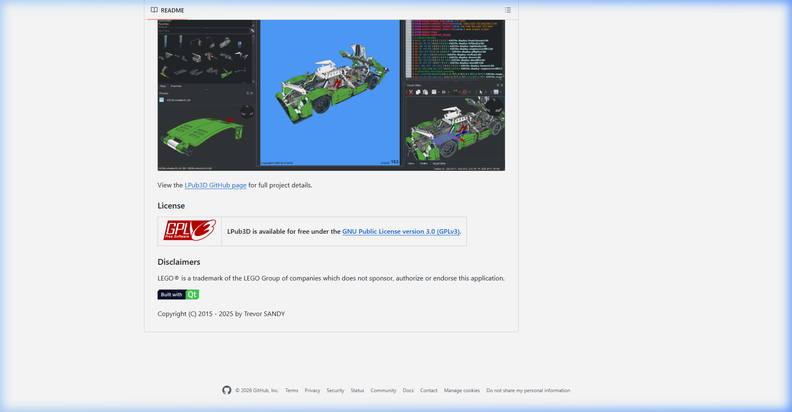
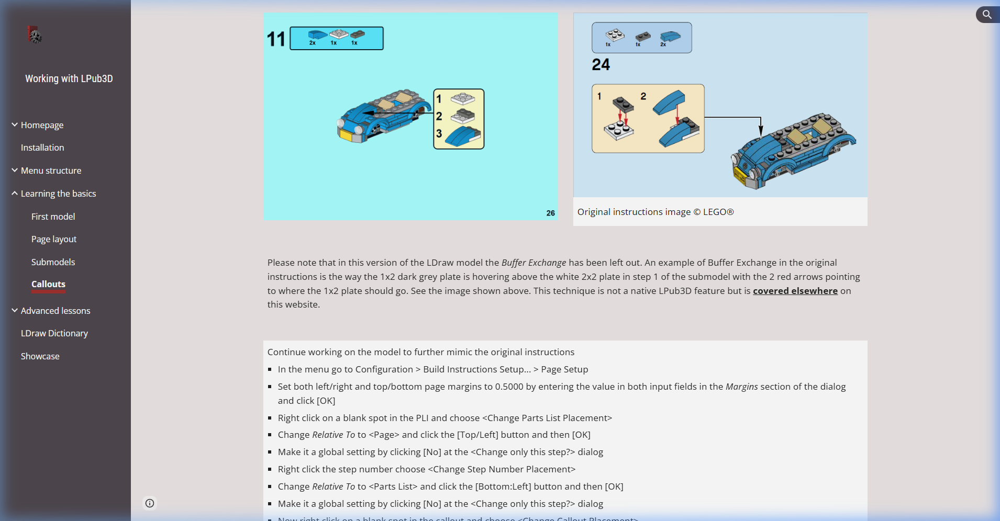

# Manual Generation — Competitive Analysis & Research

> **Status:** Pre-development research  
> **Date:** March 14, 2026  
> **Goal:** Understand the manual generation landscape, learn from LPub3D, and identify touchpoints with the 3D builder

---

## 1. BMC's Current State

BMC already has a working manual generator (`manual-generator.component.ts`, 537 lines):

| Capability | Status |
|-----------|--------|
| Upload LDraw files (.mpd, .ldr, .dat, .lxf) | ✅ |
| Server-side rendering via SignalR (real-time progress) | ✅ |
| Configurable rendering options (page size, camera angles, PBR, edges) | ✅ |
| Step-by-step page preview with pagination | ✅ |
| Download as HTML or PDF | ✅ |
| Print directly | ✅ |
| Step analysis (parts per step, triangle counts) | ✅ |
| Cancel generation | ✅ |

**What's missing vs. LPub3D (see below):**
- FadeStep — highlighting newly added parts per step
- Sub-assembly callouts with pointer arrows
- Parts List Images (PLI) per step
- Bill of Materials (BOM) page
- WYSIWYG page layout editing
- Rotation steps (ROTSTEP) for alternate viewing angles
- Page themes/backgrounds

---

## 2. LPub3D — Deep Competitive Analysis

### What It Is
Open-source desktop application (GPLv3, Qt-based) for generating professional-quality LEGO instruction books from LDraw files. Created by Trevor Sandy. Often produces output **indistinguishable from official LEGO instruction booklets**.

### Editor UI


Multi-pane layout: Parts list (left), 3D viewport (center), LDraw source code (right), Visual Editor (far right). Power-user oriented — requires understanding of LDraw meta-commands.

### Instruction Output Quality


Professional-grade: step numbers, PLI strips with quantities, sub-assembly callouts with numbered sub-steps and pointer arrows.

---

### Key Features (What LPub3D Does)

#### Rendering Engines
| Engine | Purpose |
|--------|---------|
| **LDView** | Fast, high-quality 3D rendering (primary) |
| **LDGLite** | Legacy lightweight renderer |
| **POV-Ray** | Photorealistic ray-traced rendering |
| **Blender** | Advanced rendering via LDraw import add-on |

#### Instruction Layout
| Feature | Detail |
|---------|--------|
| **Page Setup** | Configurable page size, margins, orientation, background themes |
| **Multi-step pages** | Multiple steps per page with column/row dividers |
| **Step numbering** | Automatic or manual, supports continuous numbering across submodels |
| **PLI (Parts List Images)** | Per-step strip showing new parts with 3D renders + quantities |
| **BOM (Bill of Materials)** | Full inventory page with part images, counts, colors |
| **Page numbers** | Automatic with configurable placement |

#### Sub-Assembly Handling
| Feature | Detail |
|---------|--------|
| **Submodel detection** | Automatic from MPD structure |
| **Callout boxes** | Sub-assembly shown in a boxed inset with its own numbered steps |
| **Pointer arrows** | Visual arrows from callout to attachment point on main assembly |
| **Buffer Exchange** | Show temporary part placements (like official LEGO "ghost" overlays) |

#### Build Visualization
| Feature | Detail |
|---------|--------|
| **FadeStep** | Previously-placed parts fade to translucent gray in each new step |
| **HighlightStep** | Newly-added parts glow/highlighted in current step |
| **ROTSTEP** | Rotate the view angle per step for clarity |
| **Build Modifications** | Add/remove/move/recolor parts in specific steps |

---

### Strengths to Learn From

**1. FadeStep + HighlightStep — The Killer Feature**
This is what makes professional instructions readable. Without it, step 47 of a 200-part build is an unreadable mass of same-color bricks. LPub3D fades old parts to translucent gray and highlights new parts in full color.

> **Learning for BMC:** This should be the #1 enhancement to the existing manual generator. The server renderer already knows which parts are new per step (the `StepAnalysis.newParts` data is already there). We just need to change the render to shade old parts differently.

**2. PLI Strips — Parts-per-step reference**
Every step shows a strip of the new parts with quantities (e.g., "2x", "1x") rendered as small 3D thumbnails. Essential for complex builds.

> **Learning for BMC:** The analysis data already has per-step part data. Rendering thumbnail strips and embedding them in the HTML layout is achievable.

**3. Sub-assembly Callouts**
Complex models are broken into sub-assemblies. Each one gets its own numbered mini-sequence in a callout box, with arrows showing where it attaches.

> **Learning for BMC:** LDraw MPD files already define submodels. BMC's renderer could detect these and auto-generate callout boxes. This is a significant effort but high-impact.

**4. WYSIWYG Page Layout**
LPub3D lets users drag-and-drop elements on the page — move the PLI, reposition step numbers, resize the assembly image. BMC currently has no layout editing.

> **Learning for BMC:** A full WYSIWYG editor is ambitious. A pragmatic alternative: offer **layout presets** (Classic, Compact, Technic-style) that auto-arrange elements. This gets 80% of the value for 20% of the effort.

---

### Weaknesses to Exploit

| Gap | BMC Opportunity |
|-----|----------------|
| **Desktop-only** | BMC is browser-based with real-time SignalR streaming. Nobody else does this. |
| **Steep learning curve** | LPub3D requires manual editing of LDraw meta-commands. BMC should auto-detect everything. |
| **No collaboration** | LPub3D is single-user files. BMC can tie manuals to MOCHub for community sharing. |
| **Slow rendering** | POV-Ray is minutes per step. BMC's server-side rasterizer is seconds per step. |
| **No cloud storage** | Manual files are local. BMC can save/share generated manuals per project. |

---

## 3. Other Competitors

### Web Lic (bugeyedmonkeys.com)
**Browser-based** instruction editor. Imports LDraw models, organizes into pages/steps, exports as images or PDF. Has auto-layout. Closest web-based competitor.

> **Threat level:** Low. Small project, limited features. But validates that browser-based instruction generation has demand.

### BrickLink Studio
Desktop. Has basic instruction generation (auto-sequenced from build order). Less control than LPub3D but more accessible.

### LEGO Builder App
Official LEGO app for following existing set instructions. Interactive 3D step-by-step. **Target UX quality** — this is what users expect instructions to *feel* like.

### Cadasio
Converts CAD models to interactive 3D instruction viewers. Not LEGO-specific but interesting tech for interactive manuals.

---

## 4. Touchpoints with the 3D Builder

This is where manual generation and the planned 3D builder share infrastructure:

### Shared Infrastructure
| Component | Manual Generator | 3D Builder | Shared? |
|-----------|-----------------|------------|---------|
| LDraw parser | ✅ server-side | ✅ client-side | **Yes** — same geometry pipeline |
| Part mesh loading | ✅ for renders | ✅ for viewport | **Yes** — GLB cache layer |
| Step sequencing | ✅ from STEP meta | ✅ user-defined build order | **Yes** — same data model |
| Connection graph | ❌ not used | ✅ for snapping | Phase 2 — manual gen can use it for arrow targets |
| Camera/transform | ✅ elevation/azimuth | ✅ orbit controls | Partial — shared math, different UI |

### Future Integration Points
1. **Build → Manual pipeline** — User builds a model in the 3D builder → the builder records the build order as steps → one-click "Generate Manual" from the step sequence. No LDraw file upload needed.
2. **FadeStep from Connection Graph** — The connection graph knows which parts were added at each step. This drives both the builder's "undo history" and the manual's FadeStep rendering.
3. **PLI from Parts Palette** — The builder's parts palette already renders 3D thumbnails. Same thumbnails can populate PLI strips in manuals.
4. **ROTSTEP from Builder Camera** — The builder's camera position at each step becomes the ROTSTEP angle for that instruction page.
5. **Physics → Animated Instructions** — For Technic builds, the physics simulation could generate animated instruction steps showing how mechanisms should move.

### Recommended Sequencing
```
Phase 1: Enhance existing manual generator
         (FadeStep, PLI strips, layout presets)
              ↓
Phase 2: Build the 3D builder (static)
              ↓
Phase 3: Connect builder → manual pipeline
         (build order = step sequence)
              ↓
Phase 4: Physics + animated instructions
```

---

## 5. Priority Enhancement Roadmap (Manual Generator)

### Tier 1 — Quick Wins (enhance existing system)
- [ ] **FadeStep rendering** — shade old parts in translucent gray
- [ ] **HighlightStep** — newly-added parts in full color/slight glow
- [ ] **PLI strips** — render new parts as thumbnail strip per step
- [ ] **Layout presets** — Classic, Compact, Full-page options

### Tier 2 — Medium Effort
- [ ] **BOM page** — full inventory with renders, counts, colors
- [ ] **ROTSTEP support** — parse rotation meta-commands from LDraw
- [ ] **Submodel callouts** — auto-detect from MPD structure, render in boxed insets
- [ ] **Title/cover page** — auto-generated with set image, name, part count
- [ ] **Page themes** — background color/pattern presets

### Tier 3 — Integration (post-3D builder)
- [ ] **Builder → Manual pipeline** — generate from build order, no file upload
- [ ] **Interactive 3D viewer** — LEGO Builder-style step-by-step 3D walkthrough
- [ ] **Community sharing** — publish manuals to MOCHub
- [ ] **Animated Technic steps** — show gear/mechanism movement

---

## 6. References

- [LPub3D Site](https://trevorsandy.github.io/lpub3d/) — gold standard for LDraw instruction generation
- [LPub3D GitHub](https://github.com/trevorsandy/lpub3d) — GPLv3, Qt/C++
- [Working with LPub3D Manual](https://sites.google.com/view/workingwithlpub3d/) — comprehensive tutorials
- [Web Lic](https://bugeyedmonkeys.com) — browser-based instruction editor
- [LEGO Builder App](https://www.lego.com/en-us/service/buildinginstructions/) — target UX quality for interactive instructions
- [Cadasio](https://cadasio.com) — interactive 3D instructions from CAD models
