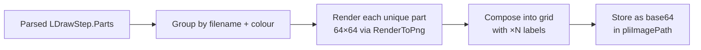

# Phase 2: PLI (Parts List Image) Generation

## Overview

Generate a Parts List Image for each build step showing the individual parts added in that step with quantities. Uses the existing `RenderService` to render each unique part, then composes them into a grid image with quantity labels.

## Architecture


## Proposed Changes

---

### RenderService

#### [MODIFY] [RenderService.cs](file:///g:/source/repos/Scheduler/BMC.LDraw.Render/RenderService.cs)

Add a new `RenderPartThumbnail` method that renders a single LDraw part file at a given colour:

```csharp
public byte[] RenderPartThumbnail(string partFileName, int colourCode, int size = 64)
```

- Resolves `partFileName` against the LDraw library path (e.g. `parts/3001.dat`)
- Renders at `size × size` with SSAA2x, edges on, smooth shading
- Returns PNG bytes (or empty if part file not found)
- Uses a **thumbnail cache** (Dictionary<string, byte[]>) to avoid re-rendering the same part+colour combo across steps

---

### PLI Composition

#### [MODIFY] [ModelImportService.cs](file:///g:/source/repos/Scheduler/BMC/BMC.Server/Services/ModelImportService.cs)

Add **Step 8d** after step image rendering:

1. For each step, get `parsedSteps[stepIdx].Parts` — the parts added in *just that step*
2. Group by `(FileName, ColourCode)` → get unique combos with count
3. Render each unique part via `RenderPartThumbnail(fileName, colourCode, 64)`
4. Compose into a grid using raw RGBA pixel blitting:
   - Grid layout: ceil(sqrt(N)) columns, auto rows
   - Each cell: 64×64 part render + "×N" quantity overlay (when N > 1)
5. Encode composed grid to PNG via `ImageExporter.ToPngBytes()`
6. Store as `"data:image/png;base64,..."` in `pliImagePath`

The quantity text will be rendered as a simple pixel-font overlay (white text with dark shadow for readability on any background).

---

### Manual Editor UI

#### [MODIFY] [manual-editor.component.html](file:///g:/source/repos/Scheduler/BMC/BMC.Client/src/app/components/manual-editor/manual-editor.component.html)

Show PLI image on step cards when `pliImagePath` exists and `showPartsListImage` is true:
- Small thumbnail below the step render image
- Labelled "Parts" with an icon

#### [MODIFY] [manual-editor.component.scss](file:///g:/source/repos/Scheduler/BMC/BMC.Client/src/app/components/manual-editor/manual-editor.component.scss)

- `.step-pli-area` — positioned below step render, smaller size
- `.pli-image` — max-height constrained, object-fit contain

## Verification Plan

### Testing
- Import test model with multiple parts per step
- Verify PLI images appear for each step showing correct parts and quantities
- Verify PLI is hidden when `showPartsListImage` is toggled off
