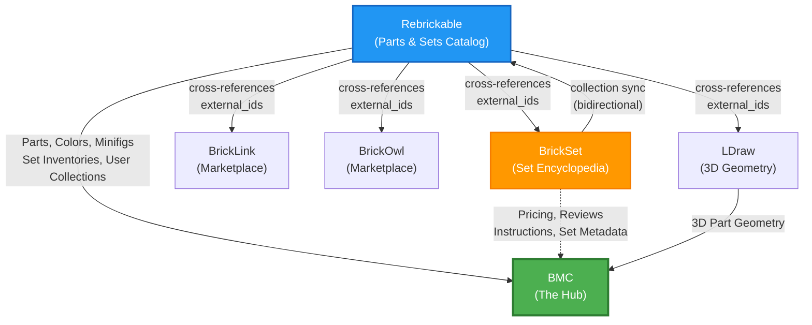

# BrickSet API Recon Report — BMC Integration Opportunities

## Executive Summary

BrickSet.com is a major LEGO set database with **28,754 sets**, **375,043 members**, and **$48B+ in tracked set value**. Its API (v3) is a JSON REST service focused primarily on **set-level data** — including **retail & market pricing** (4 markets), **reviews**, **instructions**, and **collection management** — areas where Rebrickable's API has gaps. Integrating BrickSet alongside the existing Rebrickable integration would significantly advance BMC's "one system to rule them all" vision.

---

## The LEGO Data Landscape



### How Rebrickable & BrickSet Relate Today

- **Rebrickable already provides BrickSet external IDs** for parts via `external_ids.Brickset` in the parts API — BMC already has this in [RebrickablePart.cs](file:///d:/source/repos/scheduler/BMC.Rebrickable/Api/Models/Responses/RebrickablePart.cs#L46-L47)
- **Bidirectional collection sync** between the two platforms — users can sync set collections from BrickSet→Rebrickable or Rebrickable→BrickSet
- **Rebrickable excels at**: parts catalog, part-color relationships, MOC alternate builds, set inventories (what parts are in a set)
- **BrickSet excels at**: set metadata enrichment (pricing, reviews, instructions, subthemes, tags)

---

## BrickSet API v3 — Full Breakdown

**Base URL:** `https://brickset.com/api/v3.asmx/{method}`

### Authentication

| Credential | Purpose | How Obtained |
|---|---|---|
| `apiKey` | Required for all calls | Requested from BrickSet |
| `userHash` | Required for user-specific operations | Returned by `login` method |

### Rate Limits

| Tier | Limit |
|---|---|
| **Test / Individual** | 100 calls/day on `getSets` |
| **Production** | Higher cap by request (granted at BrickSet's discretion) |

> [!WARNING]
> The 100 calls/day limit on `getSets` is quite restrictive. A caching-first approach and/or bulk import strategy will be essential.

### Complete Method Catalog

#### Reference Data (No Auth Required Beyond API Key)

| Method | Parameters | Returns | BMC Value |
|---|---|---|---|
| `getThemes` | `apiKey` | All LEGO themes | Theme cross-reference with Rebrickable themes |
| `getSubthemes` | `apiKey`, `theme` | Subthemes for a theme | **New data** — Rebrickable doesn't have subthemes |
| `getYears` | `apiKey`, `theme` | Years with sets in a theme | Theme/year browsing support |
| `getSets` | `apiKey`, `userHash`, `params` | Set data with filters | **Core method** — pricing, images, piece count, etc. |
| `getAdditionalImages` | `apiKey`, `setID` | Extra images for a set | **New data** — multiple angles, box images |
| `getInstructions` | `apiKey`, `setID` | Instruction PDF links (by ID) | **New data** — direct links to official instructions |
| `getInstructions2` | `apiKey`, `setNumber` | Instruction PDF links (by number) | Same as above, keyed by set number |
| `getReviews` | `apiKey`, `setID` | User reviews for a set | **New data** — community ratings & reviews |
| `getTags` | (via `getSets`) | Set tags/categories | **New data** — curated classification |

#### User Collection (Requires `userHash`)

| Method | Parameters | Returns | BMC Value |
|---|---|---|---|
| `login` | `apiKey`, `username`, `password` | `userHash` | Auth for collection operations |
| `getCollection` | `apiKey`, `userHash` | User's set collection | Sync owned/wanted sets |
| `setCollection` | `apiKey`, `userHash`, `SetID`, `params` | Updated collection record | Push changes back to BrickSet |
| `getMinifigCollection` | `apiKey`, `userHash`, `Params` | User's minifig collection | **New** — minifig ownership tracking |
| `setMinifigCollection` | `apiKey`, `userHash`, `minifigNumber`, `params` | Updated minifig record | Push minifig changes |
| `getUserNotes` | `apiKey`, `userHash` | Set-level notes | Personal annotations |
| `getUserMinifigNotes` | `apiKey`, `userHash` | Minifig-level notes | Personal annotations |
| `getUserFlagLabels` / `setUserFlagLabels` | `apiKey`, `userHash` | Custom flag labels | Custom categorization |

#### Utility

| Method | Parameters | Returns |
|---|---|---|
| `checkKey` | `apiKey` | Key validity |
| `checkUserHash` | `apiKey`, `userHash` | Hash validity |
| `getKeyUsageStats` | `apiKey` | Daily call count |

---

## Data That BrickSet Adds Over Rebrickable

This is what BMC would gain by integrating BrickSet:

| Data Category | Currently Available | BrickSet Adds |
|---|---|---|
| **Retail Pricing** | ❌ None | ✅ UK, US, CA, EU markets |
| **Market Value** | ❌ None | ✅ Current market prices |
| **Set Reviews** | ❌ None | ✅ Community reviews & ratings |
| **Building Instructions** | ❌ None | ✅ Direct PDF links |
| **Additional Set Images** | ✅ 1 image from Rebrickable | ✅ Multiple angles, box art |
| **Subthemes** | ❌ Not in Rebrickable | ✅ Hierarchical theme/subtheme |
| **Set Tags** | ❌ None | ✅ Curated tags |
| **Minifig Collection** | ❌ Not in user model | ✅ Owned/wanted minifigs |
| **Set Wanted Status** | ❌ Not explicit | ✅ Wanted lists |
| **Set Dimensions** | ❌ None | ✅ Box/set dimensions |
| **Availability Status** | ❌ None | ✅ Currently available in stores |

---

## Current BMC Data Model — Integration Points

### Entities That Would Be Enriched by BrickSet

| BMC Entity | File | BrickSet Data to Add |
|---|---|---|
| [LegoSet](file:///d:/source/repos/scheduler/BmcDatabase/Database/LegoSet.cs) | `setNumber`, `name`, `year`, `partCount`, `imageUrl` | `brickSetUrl`, `brickSetId`, retail prices (UK/US/CA/EU), dimensions, availability, additional images |
| [LegoTheme](file:///d:/source/repos/scheduler/BmcDatabase/Database/LegoTheme.cs) | `name`, `rebrickableThemeId` | `brickSetThemeId`, subtheme support |
| [UserSetOwnership](file:///d:/source/repos/scheduler/BmcDatabase/Database/UserSetOwnership.cs) | `quantity`, `personalRating`, `notes`, `status` | BrickSet sync (owned/wanted), BrickSet rating, instructions links |

### Existing Cross-Reference Pattern

Rebrickable already provides external IDs mapping to BrickSet (and BrickLink, BrickOwl, LDraw, LEGO) — this is visible in [RebrickablePartExternalIds](file:///d:/source/repos/scheduler/BMC.Rebrickable/Api/Models/Responses/RebrickablePart.cs#L38-L54):

```csharp
public class RebrickablePartExternalIds
{
    public List<string> BrickLink { get; set; }
    public List<string> BrickOwl { get; set; }
    public List<string> Brickset { get; set; }    // ← Already captured!
    public List<string> Lego { get; set; }
    public List<string> LDraw { get; set; }
}
```

### Existing Rebrickable Integration Architecture (Pattern to Follow)

The established patterns in BMC's Rebrickable integration provide a blueprint:

```
BMC.Rebrickable/
├── Api/
│   ├── RebrickableApiClient.cs     ← 89 strongly-typed methods
│   ├── RebrickableApiException.cs
│   └── Models/Responses/           ← 11 response model files
├── Sync/
│   ├── RebrickableSyncService.cs   ← 1726 lines, bidirectional sync
│   ├── IRebrickableActivityBroadcaster.cs
│   └── SyncModels.cs
└── Import/                         ← Bulk data import
```

A `BMC.BrickSet` project would follow this same layered approach.

---

## Proposed Integration Strategy

### Phase 1: Read-Only Data Enrichment (Low Risk, High Value)

> [!TIP]
> Start here — this requires only an API key, no user auth, and addresses the biggest data gaps.

1. **Create `BMC.BrickSet` project** following the `BMC.Rebrickable` pattern
2. **`BrickSetApiClient`** — typed REST client for API v3
3. **Set data enrichment** — pull pricing, instructions, reviews, and additional images for sets already in BMC
4. **Schema additions** — add `brickSetId`, `brickSetUrl`, pricing fields, and instruction links to `LegoSet`
5. **Caching strategy** — aggressive caching to stay within rate limits (set data changes infrequently)
6. **Cross-reference mapping** — leverage Rebrickable's `external_ids.Brickset` to link parts; use set number matching for sets

### Phase 2: User Collection Sync (Medium Complexity)

1. **`BrickSetUserLink`** entity (mirror pattern from [RebrickableUserLink](file:///d:/source/repos/scheduler/BmcDatabase/Database/RebrickableUserLink.cs))
2. **`BrickSetSyncService`** — collection sync similar to `RebrickableSyncService`
3. **Bidirectional sync** — push owned/wanted status between BMC and BrickSet
4. **SignalR broadcasting** — activity feed for BrickSet sync events (following `IRebrickableActivityBroadcaster` pattern)

### Phase 3: Three-Way Federation (Advanced)

1. **BMC as the master** — user makes changes in BMC, changes fan out to both Rebrickable and BrickSet
2. **Conflict resolution** — when the same set has different data across platforms
3. **Unified collection view** — aggregate data from both sources into a single BMC view

---

## Key Considerations

### Rate Limit Strategy

> [!CAUTION]
> 100 calls/day (test key) is extremely tight. Strategy needed before writing any code.

| Approach | Feasibility |
|---|---|
| **Bulk CSV import** | BrickSet does NOT offer CSV downloads like Rebrickable |
| **Lazy enrichment** | Fetch BrickSet data only when user views a set detail page; cache aggressively |
| **Batch overnight** | If a production key is obtained, batch enrich sets during off-peak hours |
| **Focus on owned sets** | Only enrich sets the user actually has in their collection |
| **Production key request** | Apply to BrickSet for a production key once initial integration is working |

### Set Number Compatibility

- Rebrickable set numbers: `"75192-1"` (with variant suffix)
- BrickSet set numbers: `"75192-1"` (same format)
- **These are compatible** — direct matching should work for most sets

### Auth Model Comparison

| Aspect | Rebrickable | BrickSet |
|---|---|---|
| API key | Per-user API key | Per-application API key |
| User auth | API key → `user_token` | `login` → `userHash` |
| Token lifetime | Long-lived | Session-based |
| Password storage | Never stored (BMC gets token only) | Needed per-session (or cache hash) |

> [!IMPORTANT]
> BrickSet's auth model is less token-friendly than Rebrickable's. The `userHash` appears to be session-based, which means BMC may need to re-authenticate more frequently. The same encrypted credential storage pattern used for Rebrickable (`RebrickableUserLink`) should work, but the re-auth flow will need to be more aggressive.

---

## Recommendation

**BrickSet integration is a clear win** for BMC's "one system that rules them all" goal. The data BrickSet provides — especially pricing, reviews, and instructions — fills genuine gaps that Rebrickable doesn't cover. The existing `BMC.Rebrickable` architecture provides a proven pattern to follow.

**Suggested next step:** Request a BrickSet API key, build the read-only Phase 1 integration, and assess the rate limits before committing to user-level sync.
