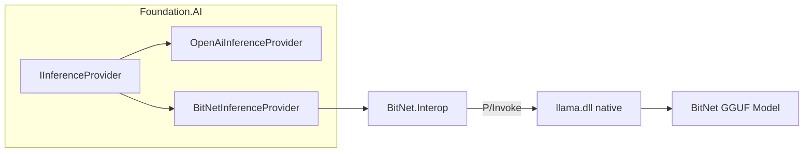

# BitNet → Foundation.AI Integration

## Goal

Integrate the BitNet C# wrapper (`BitNet.Interop`) with the Foundation.AI ecosystem as a local `IInferenceProvider`, and automate the native DLL build so everything works end-to-end.

## Architecture



## Proposed Changes

### 1. Native Build Automation

#### [NEW] [build_native.ps1](file:///G:/source/repos/BitNet/csharp/build_native.ps1)

PowerShell script that automates the CMake native build:
- Runs code generation (`codegen_tl2.py` for x86_64)
- Invokes CMake configure + build (`Release` config, ClangCL toolset)
- Builds `llama.dll` + dependencies into `build/bin/Release/`
- Copies the native DLL to a `runtimes/win-x64/native/` folder for .NET consumption

> [!IMPORTANT]
> Prerequisites: CMake, Clang (via VS Build Tools), Python 3. These are already required by the BitNet project.

---

### 2. Foundation.AI.Inference.BitNet Provider

#### [NEW] [Foundation.AI.Inference.BitNet.csproj](file:///G:/source/repos/Scheduler/Foundation.AI/Foundation.AI.Inference.BitNet/Foundation.AI.Inference.BitNet.csproj)

New project (net10.0) that:
- References `Foundation.AI.Inference` (for `IInferenceProvider`, `InferenceOptions`, etc.)
- References `BitNet.Interop` (the P/Invoke wrapper)
- Provides `BitNetInferenceProvider` and `BitNetInferenceConfig`
- Provides `AddBitNetInference()` DI extension method

#### [NEW] [BitNetInferenceConfig.cs](file:///G:/source/repos/Scheduler/Foundation.AI/Foundation.AI.Inference.BitNet/BitNetInferenceConfig.cs)

Configuration class:
- `ModelPath` — path to the `.gguf` model file
- `ContextSize` — context window (default 2048)
- `Threads` — CPU threads (default auto-detect)
- `GpuLayers` — GPU offload layers (default 0)

#### [NEW] [BitNetInferenceProvider.cs](file:///G:/source/repos/Scheduler/Foundation.AI/Foundation.AI.Inference.BitNet/BitNetInferenceProvider.cs)

Implements `IInferenceProvider`:
- `GenerateAsync` — wraps `BitNetModel.Generate()`
- `GenerateStreamAsync` — wraps `BitNetModel.GenerateTokens()` via `IAsyncEnumerable`
- `ChatAsync` — applies chat template + generates
- `ChatStreamAsync` — applies chat template + streams
- Maps `InferenceOptions` → BitNet sampling params
- Uses `Foundation.AI.Inference.ChatMessage` (not `BitNet.Interop.ChatMessage`)

#### [NEW] [BitNetInferenceExtensions.cs](file:///G:/source/repos/Scheduler/Foundation.AI/Foundation.AI.Inference.BitNet/BitNetInferenceExtensions.cs)

DI registration following the existing pattern:
```csharp
services.AddBitNetInference(c => {
    c.ModelPath = "./models/BitNet-b1.58-2B-4T/ggml-model-i2_s.gguf";
    c.Threads = 8;
});
```

---

### 3. Solution Integration

#### [MODIFY] [Scheduler.sln](file:///G:/source/repos/Scheduler/Scheduler.sln)
Add `Foundation.AI.Inference.BitNet` project to the solution.

#### [MODIFY] [Foundation.AI.csproj](file:///G:/source/repos/Scheduler/Foundation.AI/Foundation.AI/Foundation.AI.csproj)
Add project reference to `Foundation.AI.Inference.BitNet`.

#### [MODIFY] [FoundationAIServiceExtensions.cs](file:///G:/source/repos/Scheduler/Foundation.AI/Foundation.AI/FoundationAIServiceExtensions.cs)
Add `AddBitNetInference()` to the builder XML docs.

---

### 4. BitNet.Interop Adjustments

#### [MODIFY] [ChatMessage.cs](file:///G:/source/repos/BitNet/csharp/BitNet.Interop/ChatMessage.cs)
Rename to `BitNetChatMessage` to avoid collision with `Foundation.AI.Inference.ChatMessage`. The provider will map between the two types.

---

## Verification Plan

### Build Verification
1. Build the native DLL using `build_native.ps1`
2. `dotnet build` the Scheduler solution including the new project

### Integration Test
- Register `BitNetInferenceProvider` via DI
- Call `GenerateAsync("Hello")` and verify output
