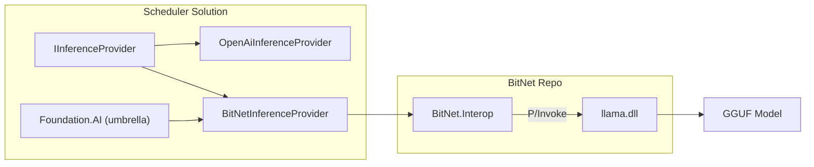

# BitNet C# Wrapper + Foundation.AI Integration — Walkthrough

## Architecture



## Files Created

### BitNet Repo (`G:\source\repos\BitNet\csharp\`)

| File | Purpose |
|------|---------|
| [BitNet.sln](file:///G:/source/repos/BitNet/csharp/BitNet.sln) | Solution for standalone development |
| [build_native.ps1](file:///G:/source/repos/BitNet/csharp/build_native.ps1) | Automates CMake native build |

**BitNet.Interop** — P/Invoke wrapper library:

| File | Purpose |
|------|---------|
| [NativeEnums.cs](file:///G:/source/repos/BitNet/csharp/BitNet.Interop/Native/NativeEnums.cs) | All llama.h C enums |
| [NativeStructs.cs](file:///G:/source/repos/BitNet/csharp/BitNet.Interop/Native/NativeStructs.cs) | Blittable struct definitions |
| [NativeMethods.cs](file:///G:/source/repos/BitNet/csharp/BitNet.Interop/Native/NativeMethods.cs) | ~100+ LibraryImport bindings |
| [LlamaModelHandle.cs](file:///G:/source/repos/BitNet/csharp/BitNet.Interop/Handles/LlamaModelHandle.cs) | SafeHandle for model |
| [LlamaContextHandle.cs](file:///G:/source/repos/BitNet/csharp/BitNet.Interop/Handles/LlamaContextHandle.cs) | SafeHandle for context |
| [LlamaSamplerHandle.cs](file:///G:/source/repos/BitNet/csharp/BitNet.Interop/Handles/LlamaSamplerHandle.cs) | SafeHandle for sampler |
| [BitNetModel.cs](file:///G:/source/repos/BitNet/csharp/BitNet.Interop/BitNetModel.cs) | High-level API |
| [BitNetModelParams.cs](file:///G:/source/repos/BitNet/csharp/BitNet.Interop/BitNetModelParams.cs) | Model loading options |
| [BitNetContextParams.cs](file:///G:/source/repos/BitNet/csharp/BitNet.Interop/BitNetContextParams.cs) | Context options |
| [ChatMessage.cs](file:///G:/source/repos/BitNet/csharp/BitNet.Interop/ChatMessage.cs) | BitNetChatMessage record |

**BitNet.Sample** — Demo console app:

| File | Purpose |
|------|---------|
| [Program.cs](file:///G:/source/repos/BitNet/csharp/BitNet.Sample/Program.cs) | Model loading, tokenization, streaming generation |

### Scheduler Repo (`G:\source\repos\Scheduler\Foundation.AI\`)

**Foundation.AI.Inference.BitNet** — Provider project:

| File | Purpose |
|------|---------|
| [Foundation.AI.Inference.BitNet.csproj](file:///G:/source/repos/Scheduler/Foundation.AI/Foundation.AI.Inference.BitNet/Foundation.AI.Inference.BitNet.csproj) | Project file with cross-repo reference |
| [BitNetInferenceConfig.cs](file:///G:/source/repos/Scheduler/Foundation.AI/Foundation.AI.Inference.BitNet/BitNetInferenceConfig.cs) | Configuration (model path, threads, GPU layers) |
| [BitNetInferenceProvider.cs](file:///G:/source/repos/Scheduler/Foundation.AI/Foundation.AI.Inference.BitNet/BitNetInferenceProvider.cs) | IInferenceProvider implementation |
| [BitNetInferenceExtensions.cs](file:///G:/source/repos/Scheduler/Foundation.AI/Foundation.AI.Inference.BitNet/BitNetInferenceExtensions.cs) | DI `AddBitNetInference()` |

**Modified files:**
- [Foundation.AI.csproj](file:///G:/source/repos/Scheduler/Foundation.AI/Foundation.AI/Foundation.AI.csproj) — added BitNet project reference
- [FoundationAIServiceExtensions.cs](file:///G:/source/repos/Scheduler/Foundation.AI/Foundation.AI/FoundationAIServiceExtensions.cs) — added BitNet to docs

## Usage

```csharp
services.AddFoundationAI(ai => {
    ai.Services.AddBitNetInference(c => {
        c.ModelPath = "./models/BitNet-b1.58-2B-4T/ggml-model-i2_s.gguf";
        c.Threads = 8;
    });
});
```

## Build Verification

```
Build succeeded (8 projects, 0 warnings, 0 errors):
  Foundation.AI.VectorStore
  Foundation.AI.Embed
  Foundation.AI.Inference
  Foundation.AI.Vision
  Foundation.AI.Rag
  BitNet.Interop
  Foundation.AI.Inference.BitNet
  Foundation.AI (umbrella)
```

## Remaining: Native DLL

To produce `llama.dll` from the BitNet repo:
```powershell
cd G:\source\repos\BitNet\csharp
.\build_native.ps1
```
Requires: CMake, Clang (VS Build Tools), Python 3.
