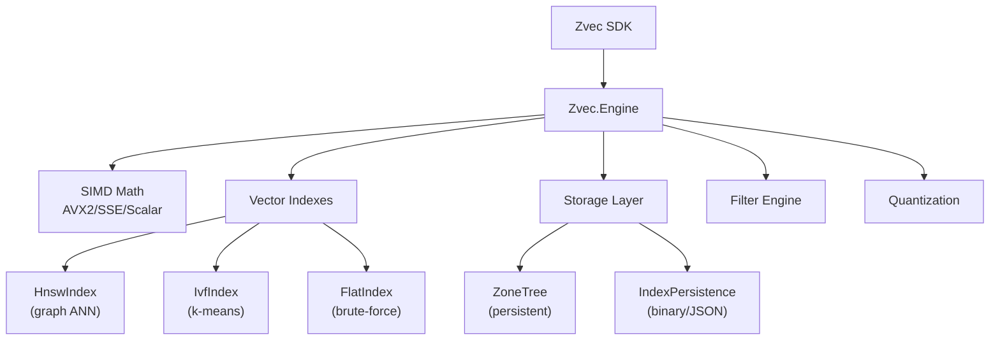

# Zvec Pure C# Engine — Walkthrough

## Overview
Complete pure C# vector database engine. Zero native dependencies, SIMD acceleration, persistent storage via ZoneTree, three index types (Flat, HNSW, IVF), filter expressions, and FP16/INT8/INT4 quantization.

## Architecture



## Files Created

| File | Purpose |
|---|---|
| [DistanceFunction.cs](file:///g:/source/repos/zvec/dotnet/Zvec.Engine/Math/DistanceFunction.cs) | SIMD Euclidean/IP/Cosine with AVX2, FMA, SSE, scalar fallback |
| [Quantization.cs](file:///g:/source/repos/zvec/dotnet/Zvec.Engine/Math/Quantization.cs) | FP16/INT8/INT4 quantization with calibration |
| [Document.cs](file:///g:/source/repos/zvec/dotnet/Zvec.Engine/Core/Document.cs) | Managed document model |
| [Schema.cs](file:///g:/source/repos/zvec/dotnet/Zvec.Engine/Core/Schema.cs) | Field schema, index config, schema builder |
| [Collection.cs](file:///g:/source/repos/zvec/dotnet/Zvec.Engine/Core/Collection.cs) | Central engine — CRUD, queries, indexes, filters, persistence |
| [FlatIndex.cs](file:///g:/source/repos/zvec/dotnet/Zvec.Engine/Index/FlatIndex.cs) | Brute-force search with priority queue |
| [HnswIndex.cs](file:///g:/source/repos/zvec/dotnet/Zvec.Engine/Index/HnswIndex.cs) | HNSW graph — multi-layer ANN, true deletion with graph repair |
| [IvfIndex.cs](file:///g:/source/repos/zvec/dotnet/Zvec.Engine/Index/IvfIndex.cs) | IVF — k-means++ clustering, multi-probe search |
| [IndexPersistence.cs](file:///g:/source/repos/zvec/dotnet/Zvec.Engine/Index/IndexPersistence.cs) | Serialize/deserialize HNSW (binary) and IVF (JSON) graphs |
| [ZoneTreeStorageEngine.cs](file:///g:/source/repos/zvec/dotnet/Zvec.Engine/Storage/ZoneTreeStorageEngine.cs) | Persistent doc/PK storage + metadata persistence |
| [FilterEngine.cs](file:///g:/source/repos/zvec/dotnet/Zvec.Engine/Filter/FilterEngine.cs) | Expression parser + evaluator (AND/OR/NOT, comparisons) |

## Benchmark Results (10K × 128D, Release)

```
Insert:     1,800 docs/sec
Query:      1,505 µs/query (HNSW top-10, FP32)
INT8 Query: 1,800 µs/query (HNSW top-10, quantized ADC)
Filtered:   1,098 µs/query
Fetch:         50 µs/fetch (by PK)
Reopen:       102 ms (loads persisted HNSW graph)
```

### Quantization

| Type | Speed | Max Error | Memory (10K×128D) |
|------|-------|-----------|-------------------|
| FP16 | 1.2 µs/rt | 5.5×10⁻⁵ | 2.4 MB (50%) |
| INT8 | 1.1 µs/rt | 5.6×10⁻⁴ | 1.2 MB (25%) |
| INT4 | 1.6 µs/rt | 9.7×10⁻³ | 0.6 MB (12%) |

## Key Improvements Made

- **True HNSW deletion**: Repairs connections on remove (was stub), reconnects neighbors, handles entry point reassignment
- **Index persistence**: HNSW saved as binary, IVF as JSON — `Open` loads graph directly instead of rebuilding
- **Quantized indexes**: HNSW and IVF support FP16/INT8/INT4 storage with ADC search (decompress on-the-fly)
- **Recalibration**: `Optimize()` recalibrates INT8/INT4 quantization with global min/max across all vectors
- **Numeric type roundtrip**: Fixed `float→JSON→double` mismatch using `IConvertible`
- **`BlobSerializer`**: Custom `ISerializer<byte[]>` for ZoneTree

## Phase Completion

| Phase | Status |
|---|---|
| 1. Foundation & SIMD Math | ✅ |
| 2. Flat Index | ✅ |
| 3. SDK Refactor | ✅ |
| 4. Persistence (ZoneTree) | ✅ |
| 5. Filter Engine | ✅ |
| 6. HNSW Index | ✅ |
| 7. IVF Index | ✅ |
| 8. Quantization | ✅ |
| 9. Testing & Polish | ✅ |
