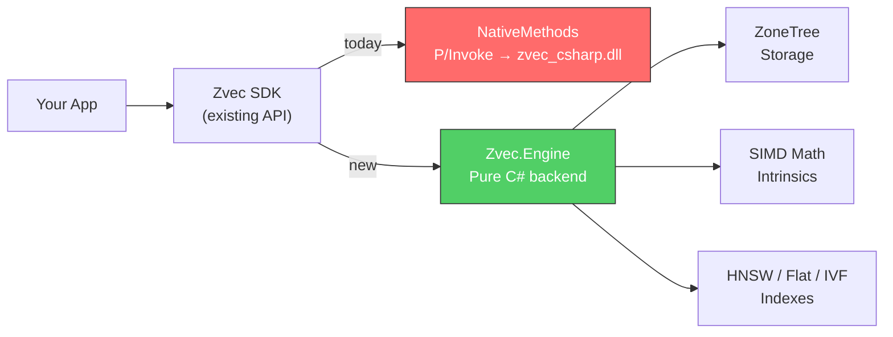
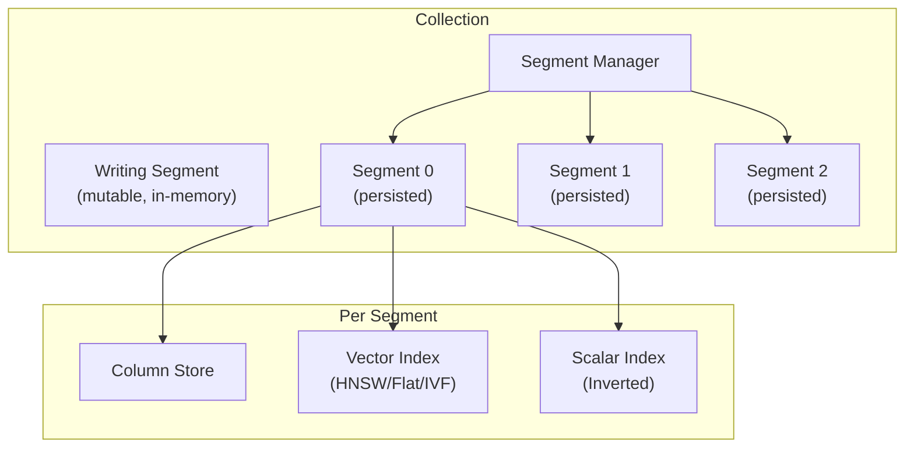

# Pure C# Vector Database: Architecture Design

## The Idea

Replace the native C++ backend (`zvec_csharp.dll`) with a **pure C# engine** that implements the same managed API surface — the existing [ZvecCollection](file:///g:/source/repos/zvec/dotnet/Zvec/ZvecCollection.cs), [ZvecDoc](file:///g:/source/repos/zvec/dotnet/Zvec/ZvecDoc.cs), and [CollectionSchema](file:///g:/source/repos/zvec/dotnet/Zvec/CollectionSchema.cs) classes stay the same, but instead of calling `NativeMethods` P/Invoke, they call into a new `Zvec.Engine` project — 100% managed C#.



---

## Existing API Contract (What Stays Unchanged)

The public API surface you'd keep as-is:

| Class | Methods | Purpose |
|---|---|---|
| `ZvecCollection` | `CreateAndOpen`, `Open`, `Destroy`, `Flush`, `Optimize`, `Insert`, `Upsert`, `Update`, `Delete`, `DeleteByFilter`, `Query`, `Fetch`, `CreateIndex`, `DropIndex` | Main entry point |
| `ZvecDoc` | `Set(field, value)` × 10 overloads, `GetBool/Int32/Int64/Float/Double/String/VectorFP32`, `PrimaryKey`, `Score`, `DocId` | Document CRUD |
| `CollectionSchema` | `AddField`, `AddVector`, `SetMaxDocCountPerSegment` | Schema definition |
| `IndexParams` | `HnswIndexParams`, `FlatIndexParams`, `IvfIndexParams`, `InvertIndexParams` | Index config |
| `QueryParams` | `HnswQueryParams`, `FlatQueryParams`, `IvfQueryParams` | Query tuning |
| `QueryResult` | `Count`, indexer, `IEnumerable<ZvecDoc>` | Result iteration |

> [!IMPORTANT]
> The key refactor: these classes would no longer hold `IntPtr` handles and call native methods. Instead, they'd hold references to managed engine objects directly. No marshalling, no P/Invoke, no native DLL.

---

## Project Structure

```
Zvec.sln
├── Zvec/                          # Public SDK (mostly unchanged API)
│   ├── ZvecCollection.cs          # Refactored to call Engine instead of NativeMethods
│   ├── ZvecDoc.cs                 # Pure managed document (Dictionary-based)
│   ├── CollectionSchema.cs        # Pure managed schema definition
│   ├── IndexParams.cs             # POCO config objects (no IntPtr)
│   ├── QueryParams.cs             # POCO config objects (no IntPtr)
│   └── Enums.cs                   # Unchanged
│
├── Zvec.Engine/                   # NEW: Pure C# database engine
│   ├── Core/
│   │   ├── Collection.cs          # Collection lifecycle, segment management
│   │   ├── Segment.cs             # Segment read/write, flush, dump
│   │   ├── SegmentManager.cs      # Multi-segment coordination
│   │   ├── VersionManager.cs      # MVCC version management
│   │   ├── Document.cs            # Internal doc representation
│   │   └── Schema.cs              # Internal schema management
│   │
│   ├── Index/
│   │   ├── IVectorIndex.cs        # Interface for all index types
│   │   ├── Hnsw/
│   │   │   ├── HnswGraph.cs       # Multi-layer navigable graph
│   │   │   ├── HnswBuilder.cs     # Concurrent graph construction
│   │   │   └── HnswSearcher.cs    # Greedy beam search
│   │   ├── Flat/
│   │   │   ├── FlatIndex.cs       # Brute-force with quantization
│   │   │   └── FlatSearcher.cs    # Exhaustive scan + SIMD
│   │   ├── Ivf/
│   │   │   ├── IvfIndex.cs        # Inverted file with k-means
│   │   │   ├── IvfBuilder.cs      # Cluster training
│   │   │   └── IvfSearcher.cs     # Multi-probe search
│   │   └── Scalar/
│   │       └── InvertedIndex.cs   # Scalar field indexing
│   │
│   ├── Math/
│   │   ├── DistanceFunction.cs    # Distance metric factory
│   │   ├── SimdEuclidean.cs       # AVX2/SSE Euclidean distance
│   │   ├── SimdCosine.cs          # AVX2/SSE Cosine similarity
│   │   ├── SimdInnerProduct.cs    # AVX2/SSE Inner product
│   │   └── Quantizer.cs           # FP16/INT8/INT4 quantization
│   │
│   ├── Storage/
│   │   ├── IStorageEngine.cs      # Abstraction over storage backend
│   │   ├── ZoneTreeStorage.cs     # ZoneTree implementation
│   │   └── ColumnStore.cs         # Columnar per-field storage
│   │
│   ├── Filter/
│   │   ├── FilterParser.cs        # Expression parser (zvec filter syntax)
│   │   ├── FilterEvaluator.cs     # Runtime evaluation
│   │   └── FilterAst.cs           # AST node types
│   │
│   └── Concurrency/
│       ├── ReadWriteLock.cs        # ReaderWriterLockSlim wrapper
│       └── DeleteStore.cs         # Concurrent deletion tracking
│
├── Zvec.Engine.Tests/             # NEW: Comprehensive test suite
│   ├── Math/
│   ├── Index/
│   ├── Storage/
│   └── Integration/
│
└── Zvec.Interop/                  # DEPRECATED (kept for native fallback)
```

---

## NuGet Dependencies

Every native C++ dependency maps to a managed equivalent:

| C++ Dependency | NuGet Replacement | Purpose | Pure C#? |
|---|---|---|---|
| **RocksDB** | **ZoneTree** `(Tenray.ZoneTree)` | Persistent LSM key-value store | ✅ Yes |
| **LZ4** | **K4os.Compression.LZ4** | Segment compression | ✅ Yes |
| **CRoaring** | **Equativ.RoaringBitmaps** | Deletion bitmaps, filters | ✅ Yes |
| **ANTLR4** | **Antlr4.Runtime.Standard** | Filter expression parsing | ✅ Yes |
| **Protobuf** | **Google.Protobuf** | Schema/version serialization | ✅ Yes |
| **sparsehash** | `Dictionary<TKey,TValue>` | High-perf hash maps | ✅ Built-in |
| **glog** | `Microsoft.Extensions.Logging` | Logging | ✅ Built-in |
| **yaml-cpp** | Not needed | Config is programmatic | N/A |
| **Arrow** | Not needed (custom columnar) | Column storage | N/A |
| **SIMD intrinsics** | `System.Runtime.Intrinsics` | Vector math | ✅ Built-in |

---

## Component Deep-Dives

### 1. SIMD Distance Math (`Zvec.Engine.Math`)

This is the performance-critical layer. Modern .NET provides **hardware intrinsics** that compile to the same AVX2/SSE instructions as C++.

```csharp
// Example: SIMD Euclidean distance using AVX2
using System.Runtime.Intrinsics;
using System.Runtime.Intrinsics.X86;

public static class SimdEuclidean
{
    public static float Distance(ReadOnlySpan<float> a, ReadOnlySpan<float> b)
    {
        var sumVec = Vector256<float>.Zero;
        int i = 0;

        if (Avx2.IsSupported)
        {
            for (; i <= a.Length - 8; i += 8)
            {
                var va = Vector256.LoadUnsafe(ref MemoryMarshal.GetReference(a[i..]));
                var vb = Vector256.LoadUnsafe(ref MemoryMarshal.GetReference(b[i..]));
                var diff = Avx.Subtract(va, vb);
                sumVec = Avx.Add(sumVec, Avx.Multiply(diff, diff));
            }
        }

        float sum = Vector256.Sum(sumVec);
        for (; i < a.Length; i++)  // scalar tail
        {
            float d = a[i] - b[i];
            sum += d * d;
        }
        return MathF.Sqrt(sum);
    }
}
```

**Expected performance**: 3-5x scalar, within ~20-30% of hand-tuned C++ intrinsics per published benchmarks. For billion-scale, this gap matters; for million-scale workloads it's negligible.

**Supported metrics**:
- L2 (Euclidean)
- Cosine similarity
- Inner Product (IP)
- MIPS-L2

**Quantization**: FP16 via `Half` (.NET 7+), INT8, INT4 with lookup tables.

---

### 2. HNSW Index (`Zvec.Engine.Index.Hnsw`)

The HNSW algorithm is well-understood and has mature C# implementations. We'd build our own tailored implementation:

```csharp
public sealed class HnswGraph<TKey> where TKey : notnull
{
    private readonly int _m;                // max connections per layer
    private readonly int _efConstruction;   // beam width during build
    private readonly int _maxLevel;
    private readonly ConcurrentDictionary<int, List<int>>[] _layers;
    private readonly float[][] _vectors;
    private readonly Func<ReadOnlySpan<float>, ReadOnlySpan<float>, float> _distance;
    
    public void Insert(int id, ReadOnlySpan<float> vector) { /* ... */ }
    
    public IReadOnlyList<(int Id, float Distance)> Search(
        ReadOnlySpan<float> query, int topk, int ef) { /* ... */ }
}
```

**Key design decisions**:
- Use `ReadOnlySpan<float>` throughout (no allocations on query path)
- `ReaderWriterLockSlim` for concurrent insert + search
- Level assignment via `Math.Log` probability
- Greedy beam search with priority queue (`PriorityQueue<TElement, TPriority>` — built into .NET 6+)

---

### 3. Storage Engine (`Zvec.Engine.Storage`)

Replace RocksDB with **ZoneTree**, a pure C# LSM-tree database:

```csharp
public sealed class ZoneTreeStorage : IStorageEngine, IDisposable
{
    private readonly IZoneTree<string, byte[]> _metaStore;    // schema, versions
    private readonly IZoneTree<long, byte[]> _docStore;       // doc_id → serialized doc
    private readonly IZoneTree<string, long> _pkIndex;        // pk → doc_id
    
    public void PutDocument(long docId, string pk, Document doc) { /* ... */ }
    public Document? GetByDocId(long docId) { /* ... */ }
    public Document? GetByPk(string pk) { /* ... */ }
    public void Delete(string pk) { /* ... */ }
    public void Flush() { /* ... */ }
}
```

**Why ZoneTree over alternatives**:
- Pure C#, no native dependencies
- LSM-based like RocksDB (similar performance model)
- ACID transactions
- Claims 100M inserts in 20 seconds
- WAL with multiple durability modes

---

### 4. Segment Architecture (`Zvec.Engine.Core`)

Mirror zvec's segment model — data is organized into immutable segments plus one active writing segment:



- **Writing segment**: Buffers inserts in memory, flushes to ZoneTree on `Flush()`
- **Persisted segments**: Immutable, mmap-like read via `MemoryMappedFile`
- **Optimize/Compact**: Merge small segments into larger ones, rebuild indexes

---

### 5. Filter Engine (`Zvec.Engine.Filter`)

Instead of the full ANTLR SQL parser, implement a **simpler expression parser** for zvec's filter syntax:

```
category == "electronics" AND price > 10.0
```

This is a straightforward recursive-descent parser — no need for ANTLR unless you want full SQL:

```csharp
public interface IFilterNode
{
    bool Evaluate(Document doc);
}

// ComparisonNode: field op value
// LogicalNode: AND / OR / NOT
// Example: new AndNode(
//   new ComparisonNode("category", Op.Eq, "electronics"),
//   new ComparisonNode("price", Op.Gt, 10.0)
// )
```

> [!TIP]
> If full SQL compatibility is later desired, `Antlr4.Runtime.Standard` is available as a pure .NET NuGet package. You can reuse zvec's existing ANTLR grammar file.

---

## How the SDK Refactor Works

The existing `ZvecCollection` currently wraps native handles via `IntPtr`. In the new model, it wraps managed engine objects directly:

```diff
 public sealed class ZvecCollection : IDisposable
 {
-    private IntPtr _handle;
+    private Zvec.Engine.Core.Collection _engine;
 
     public static ZvecCollection CreateAndOpen(
         string path, CollectionSchema schema, CollectionOptions? options = null)
     {
-        NativeMethods.ThrowIfError(
-            NativeMethods.zvec_collection_create_and_open(..., out var handle));
-        return new ZvecCollection(handle);
+        var engine = Zvec.Engine.Core.Collection.CreateAndOpen(
+            path, schema.ToEngineSchema(), options?.ToEngineOptions());
+        return new ZvecCollection(engine);
     }
 
     public void Insert(params ZvecDoc[] docs)
     {
-        var handles = docs.Select(d => d.Handle).ToArray();
-        NativeMethods.zvec_collection_insert(_handle, handles, handles.Length);
+        var engineDocs = docs.Select(d => d.ToEngineDocument()).ToList();
+        _engine.Insert(engineDocs);
     }
 
     public QueryResult Query(string fieldName, ReadOnlySpan<float> vector, ...)
     {
-        fixed (float* pVec = vector) { ... P/Invoke ... }
+        var results = _engine.Query(fieldName, vector, topk, filter);
+        return new QueryResult(results);  // wraps managed list
     }
```

**ZvecDoc becomes a pure managed object**:

```diff
 public sealed class ZvecDoc : IDisposable
 {
-    internal IntPtr Handle { get; private set; }
+    internal Dictionary<string, object> Fields { get; } = new();
+    internal Dictionary<string, float[]> Vectors { get; } = new();
 
     public ZvecDoc Set(string field, float value)
     {
-        NativeMethods.zvec_doc_set_float(Handle, field, value);
+        Fields[field] = value;
         return this;
     }
```

---

## Estimated Effort & Phasing

| Phase | Scope | Effort | Deliverable |
|---|---|---|---|
| **1. Foundation** | Project scaffolding, SIMD math layer, storage abstraction | 2-3 weeks | Distance functions, ZoneTree integration, basic doc CRUD |
| **2. Flat Index** | Brute-force search (simplest algorithm) | 1 week | End-to-end insert → query working |
| **3. HNSW Index** | Graph-based approximate search | 2-3 weeks | HNSW build + search + serialization |
| **4. SDK Refactor** | Rewire `Zvec/` classes to use Engine | 1 week | Existing test harness passes |
| **5. Segment & Persistence** | Multi-segment, versioning, flush, optimize | 2-3 weeks | Durable collections, compaction |
| **6. Filter Engine** | Expression parser + evaluator | 1 week | Filtered queries working |
| **7. IVF Index** | K-means clustering + inverted file | 2 weeks | IVF build + search |
| **8. Quantization** | FP16, INT8, INT4 support | 1-2 weeks | Quantized index variants |
| **9. Testing & Polish** | Benchmarks, edge cases, CI | 2 weeks | Production-ready |
| **Total** | | **~14-18 weeks** (1 developer) | |

> [!NOTE]
> This is significantly less than the 16-23 month "port the C++" estimate because we're building from idiomatic C# patterns, leveraging NuGet libraries, and implementing only what the existing API surface requires — not replicating every internal C++ abstraction.

---

## Performance Expectations

| Operation | C++ zvec (estimated) | C# Engine (projected) | Gap |
|---|---|---|---|
| Distance calc (FP32) | ~1x (baseline) | ~1.2-1.5x | SIMD intrinsics are near-parity |
| HNSW search (1M vectors) | ~1ms | ~2-4ms | GC + managed overhead |
| Insert throughput | ~500K docs/sec | ~200-400K docs/sec | Managed allocation |
| Storage (flush/read) | RocksDB native | ZoneTree managed | Comparable |
| Memory usage | Manual management | GC managed | ~1.3-2x higher |

For workloads up to **~10M vectors** this should be more than adequate. Billion-scale is where native C++ pulls ahead significantly.

---

## What You Gain

1. **Zero native dependencies** — no more cross-compiling `zvec_csharp.dll` for every platform
2. **Single `dotnet publish`** — just works on Windows, Linux, macOS, ARM64
3. **Debuggable** — step through the entire engine in Visual Studio
4. **Testable** — standard xUnit/NUnit, no native test harness
5. **Extensible** — add new index types, metrics, storage backends in C#
6. **NuGet distributable** — ship as a single NuGet package
7. **AOT compatible** — works with .NET Native AOT compilation

## What You Lose

1. **Peak performance** — ~20-50% slower on hot paths vs hand-tuned C++ SIMD
2. **Billion-scale** — practical ceiling around 10-50M vectors before GC pressure becomes an issue
3. **Sparse vector support** — would need additional work (not in current C# API)
4. **Battle-tested Proxima algorithms** — you're reimplementing, not reusing Alibaba's tuning

---

## Recommended First Steps

If you want to proceed, I'd suggest this order:

1. **Create `Zvec.Engine` project** with the SIMD math layer — this is the most fun part and immediately validates feasibility
2. **Implement Flat index** — simplest algorithm, proves the full pipeline
3. **Wire up existing `Zvec.Test/Program.cs`** to use the managed engine — instant validation against the known-working test
4. **Then tackle HNSW** — the high-value index type

The existing [Program.cs](file:///g:/source/repos/zvec/dotnet/Zvec.Test/Program.cs) test harness is a perfect acceptance test — when it passes against the pure C# backend, you have feature parity.
