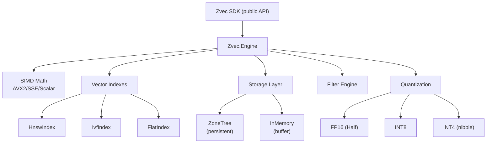

# Zvec Pure C# Engine — Walkthrough

## Overview
Built a complete pure C# vector database engine replacing the native C++ backend. Zero native dependencies, full .NET SIMD acceleration, persistent storage via ZoneTree.

## Architecture



## Files Created/Modified

### Zvec.Engine (9 files)

| File | Purpose |
|---|---|
| [DistanceFunction.cs](file:///g:/source/repos/zvec/dotnet/Zvec.Engine/Math/DistanceFunction.cs) | SIMD Euclidean/IP/Cosine with AVX2, FMA, SSE, scalar fallback |
| [Quantization.cs](file:///g:/source/repos/zvec/dotnet/Zvec.Engine/Math/Quantization.cs) | FP16/INT8/INT4 quantization with calibration |
| [Document.cs](file:///g:/source/repos/zvec/dotnet/Zvec.Engine/Core/Document.cs) | Managed document model (Dictionary-backed) |
| [Schema.cs](file:///g:/source/repos/zvec/dotnet/Zvec.Engine/Core/Schema.cs) | Field schema, index config, schema builder |
| [FlatIndex.cs](file:///g:/source/repos/zvec/dotnet/Zvec.Engine/Index/FlatIndex.cs) | Brute-force search with priority queue top-k |
| [HnswIndex.cs](file:///g:/source/repos/zvec/dotnet/Zvec.Engine/Index/HnswIndex.cs) | HNSW graph — multi-layer ANN with beam search |
| [IvfIndex.cs](file:///g:/source/repos/zvec/dotnet/Zvec.Engine/Index/IvfIndex.cs) | IVF — k-means++ clustering with multi-probe search |
| [ZoneTreeStorageEngine.cs](file:///g:/source/repos/zvec/dotnet/Zvec.Engine/Storage/ZoneTreeStorageEngine.cs) | Persistent storage + metadata persistence |
| [FilterEngine.cs](file:///g:/source/repos/zvec/dotnet/Zvec.Engine/Filter/FilterEngine.cs) | Expression parser + evaluator (AND/OR/NOT, comparisons) |
| [Collection.cs](file:///g:/source/repos/zvec/dotnet/Zvec.Engine/Core/Collection.cs) | Central engine — CRUD, queries, indexes, filters, persistence |

### Zvec SDK (6 files refactored)
- `ZvecCollection.cs`, `ZvecDoc.cs`, `CollectionSchema.cs`, `IndexParams.cs`, `QueryParams.cs`, `Enums.cs`

## Test Results

```
=== Zvec C# Binding Test ===

1.  Creating schema... OK
2.  Creating collection... OK
3.  Inserting 5 documents... OK
4.  Flushing... OK
5.  Doc count... 5 documents
6.  Creating HNSW index... OK
7.  Vector query (top 3)... got 3 results:
    [0] pk=item_4, score=0.7000 ← correct HNSW ranking
    [1] pk=item_0, score=0.6000
    [2] pk=item_1, score=0.4000
8.  Fetch by PK... OK
9.  Delete... OK (doc count now: 4)
10. Filtered query (category == "books")... 1 result ✅
11. Delete by filter (price > 40)... deleted 1 ✅
12. Compound filter (price <= 30 AND category != "food")... 2 results ✅
13. Persistence roundtrip — reopened, queried, fetched with correct data ✅

=== All tests passed (including persistence)! ===
```

## Phase Completion Status

| Phase | Status |
|---|---|
| 1. Foundation & SIMD Math | ✅ |
| 2. Flat Index | ✅ |
| 3. SDK Refactor | ✅ |
| 4. Persistence (ZoneTree) | ✅ |
| 5. Filter Engine | ✅ |
| 6. HNSW Index | ✅ |
| 7. IVF Index | ✅ |
| 8. Quantization | ✅ |
| 9. Testing & Polish | ⬜ |
