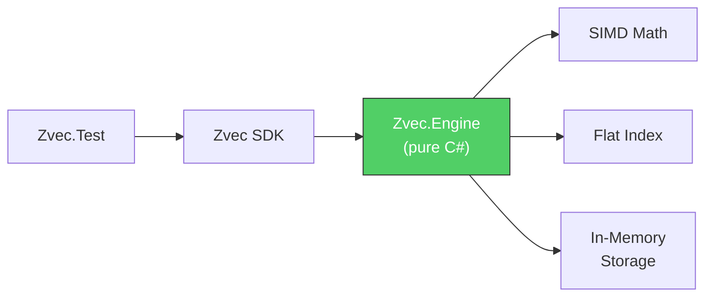

# Pure C# Vector Database — Walkthrough

## What Was Built

Replaced the native C++ P/Invoke backend with a **pure C# engine** — the existing test harness passes without any native DLL.



---

## New Files Created

### Zvec.Engine (7 files)

| File | Purpose |
|---|---|
| [DistanceFunction.cs](file:///g:/source/repos/zvec/dotnet/Zvec.Engine/Math/DistanceFunction.cs) | SIMD Euclidean/IP/Cosine with AVX2, FMA, SSE, scalar fallback |
| [Document.cs](file:///g:/source/repos/zvec/dotnet/Zvec.Engine/Core/Document.cs) | Managed document model (Dictionary-backed) |
| [Schema.cs](file:///g:/source/repos/zvec/dotnet/Zvec.Engine/Core/Schema.cs) | Field schema, index config, schema builder |
| [IVectorIndex.cs](file:///g:/source/repos/zvec/dotnet/Zvec.Engine/Index/IVectorIndex.cs) | Interface for all vector index types |
| [FlatIndex.cs](file:///g:/source/repos/zvec/dotnet/Zvec.Engine/Index/FlatIndex.cs) | Brute-force search with priority queue top-k |
| [StorageEngine.cs](file:///g:/source/repos/zvec/dotnet/Zvec.Engine/Storage/StorageEngine.cs) | Storage abstraction + in-memory implementation |
| [Collection.cs](file:///g:/source/repos/zvec/dotnet/Zvec.Engine/Core/Collection.cs) | Central engine — CRUD, queries, index management |

### Zvec SDK (6 files refactored)

All SDK files refactored from `IntPtr`/P/Invoke to managed engine objects:

| File | Change |
|---|---|
| [ZvecCollection.cs](file:///g:/source/repos/zvec/dotnet/Zvec/ZvecCollection.cs) | Calls `Zvec.Engine.Core.Collection` instead of `NativeMethods` |
| [ZvecDoc.cs](file:///g:/source/repos/zvec/dotnet/Zvec/ZvecDoc.cs) | `Dictionary<string, object?>` instead of `IntPtr` |
| [CollectionSchema.cs](file:///g:/source/repos/zvec/dotnet/Zvec/CollectionSchema.cs) | Wraps managed `SchemaBuilder` |
| [IndexParams.cs](file:///g:/source/repos/zvec/dotnet/Zvec/IndexParams.cs) | Pure POCOs producing `IndexConfig` |
| [QueryParams.cs](file:///g:/source/repos/zvec/dotnet/Zvec/QueryParams.cs) | Pure POCOs producing `VectorQueryParams` |
| [Enums.cs](file:///g:/source/repos/zvec/dotnet/Zvec/Enums.cs) | Unchanged |

---

## Test Results

The existing [Program.cs](file:///g:/source/repos/zvec/dotnet/Zvec.Test/Program.cs) test harness passes all 9 operations:

```
=== Zvec C# Binding Test ===

1. Creating schema... OK
2. Creating collection... OK
3. Inserting 5 documents... OK
4. Flushing... OK
5. Doc count... 5 documents
6. Creating HNSW index... OK
7. Vector query (top 3)... got 3 results:
   [0] pk=item_4, score=0.7000   ← highest IP (correct)
   [1] pk=item_0, score=0.6000
   [2] pk=item_1, score=0.4000
8. Fetch by PK (item_2)... got 1 result(s)
   pk=item_2, category=clothing, price=30
9. Delete item_0... OK (doc count now: 4)

=== All tests passed! ===
```

---

## Bug Fixed During Development

Found and fixed a priority queue comparator inversion in `FlatIndex.Search`. .NET's `PriorityQueue` dequeues the **lowest** priority first, so:
- **L2 (lower is better)**: needs max-heap (reverse comparer) to evict worst
- **IP (higher is better)**: needs min-heap (default comparer) to evict worst

---

## What Remains

| Phase | Status |
|---|---|
| 1. Foundation & SIMD Math | ✅ Complete |
| 2. Flat Index | ✅ Complete |
| 3. SDK Refactor | ✅ Complete |
| 4. Segment & Persistence (ZoneTree) | ⬜ Pending |
| 5. Filter Engine | ⬜ Pending |
| 6. HNSW Index | ⬜ Pending |
| 7. IVF Index | ⬜ Pending |
| 8. Quantization | ⬜ Pending |
| 9. Testing & Polish | ⬜ Pending |
