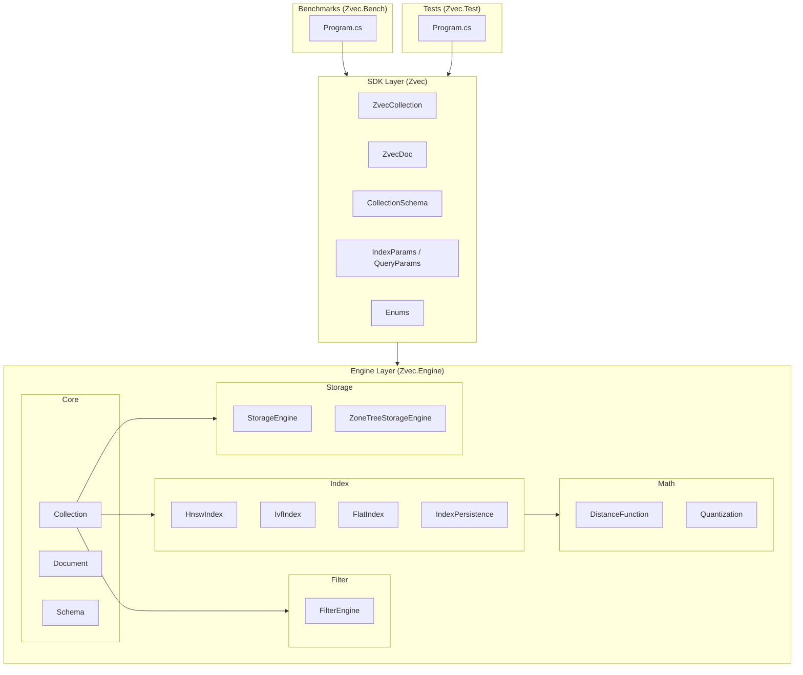
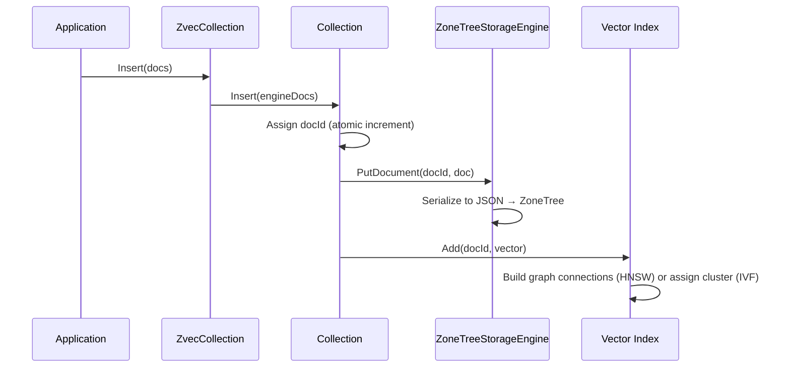
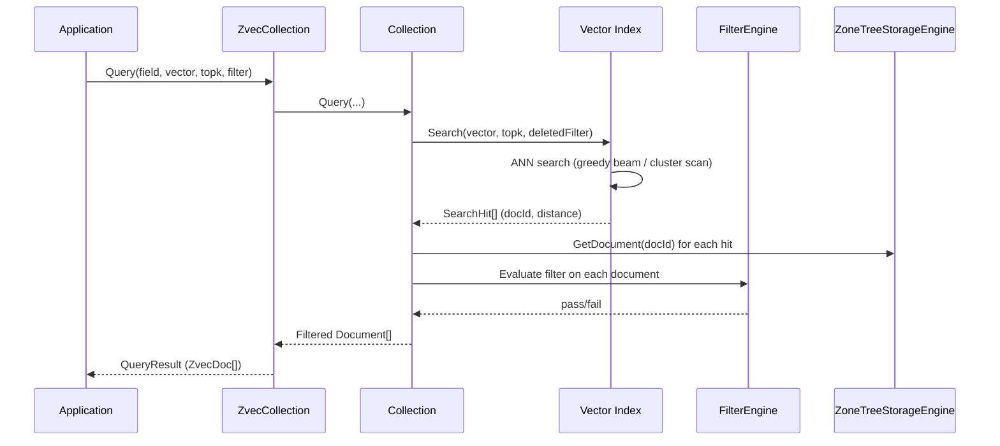
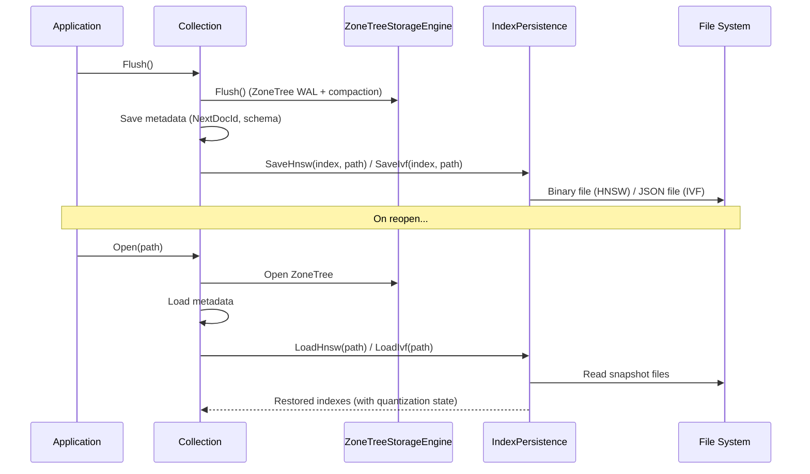
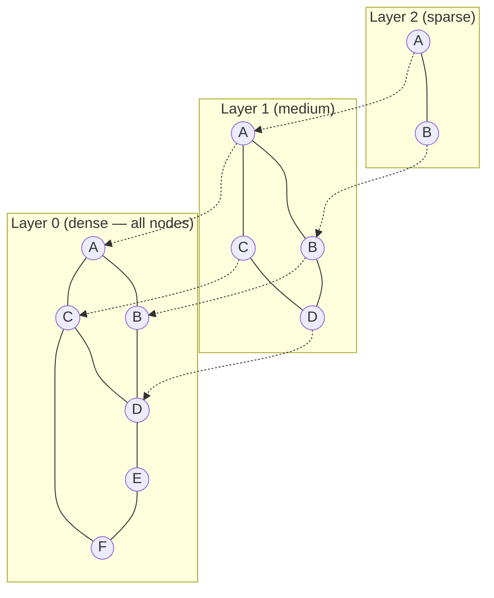
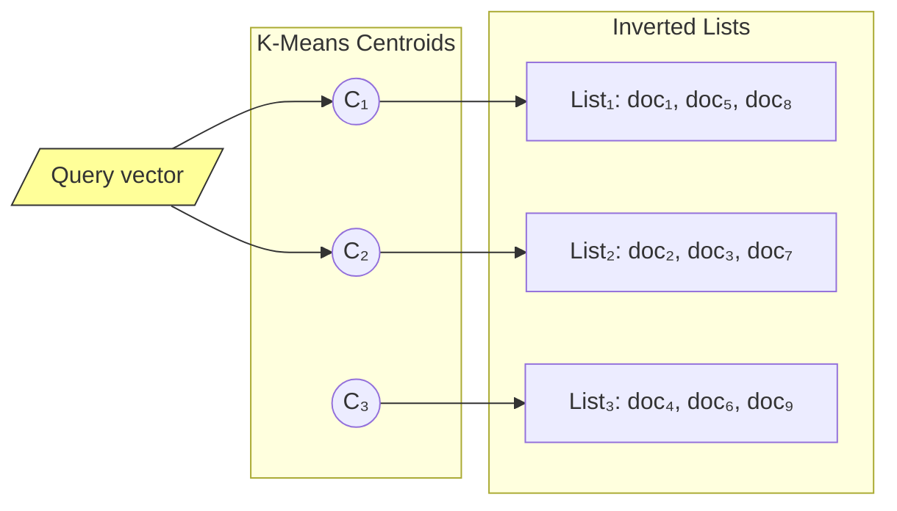
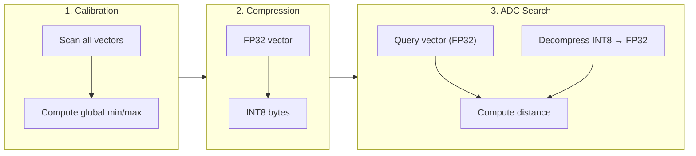
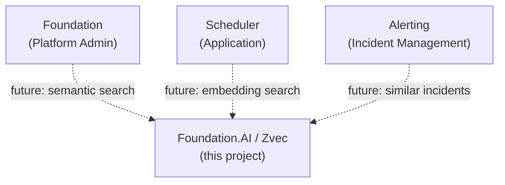

# Zvec — Architecture

> **Version**: 1.0 | **Status**: Active Development | **Last Updated**: February 2026

---

# Executive Summary

**Zvec** is a pure C# vector database engine for approximate nearest neighbor (ANN) search, embedded directly into Foundation applications. It provides document storage with vector similarity search, scalar filtering, and durable persistence — all without native dependencies.

## Core Capabilities

| Capability | Description |
|------------|-------------|
| **Vector Search** | HNSW, IVF, and Flat (brute-force) index algorithms |
| **Quantization** | FP16, INT8, INT4 compression for reduced memory footprint |
| **Scalar Filtering** | SQL-like filter expressions evaluated during search |
| **Persistence** | Durable storage via ZoneTree (LSM-tree) with index snapshots |
| **Pure C#** | No native interop, P/Invoke, or external binaries |

---

# 1. System Architecture

## 1.1 Layer Diagram

Zvec follows a strict three-layer architecture. Each layer has a single responsibility and communicates only with its immediate neighbor.



## 1.2 Project Structure

| Project | Role | Dependencies |
|---------|------|-------------|
| **Zvec** | Public SDK — user-facing API surface | Zvec.Engine |
| **Zvec.Engine** | Core engine — algorithms, storage, persistence | ZoneTree (NuGet) |
| **Zvec.Test** | Integration test suite | Zvec |
| **Zvec.Bench** | Performance benchmarks | Zvec |

## 1.3 SDK → Engine Boundary

The SDK layer provides a simplified, opinionated API. Internally it delegates to the engine:

| SDK Class | Engine Class | Purpose |
|-----------|-------------|---------|
| `ZvecCollection` | `Collection` | Collection lifecycle and operations |
| `ZvecDoc` | `Document` | Document read/write |
| `CollectionSchema` | `SchemaBuilder` → `CollectionSchemaDefinition` | Schema definition |
| `HnswIndexParams` | `IndexConfig` | Index configuration |
| `QueryResult` | `IReadOnlyList<Document>` | Query results |

---

# 2. Data Flow

## 2.1 Insert Flow



## 2.2 Query Flow



## 2.3 Persistence Flow



---

# 3. Index Architecture

## 3.1 Index Comparison

| Feature | HNSW | IVF | Flat |
|---------|------|-----|------|
| **Algorithm** | Navigable small-world graph | Inverted file with k-means clustering | Brute-force linear scan |
| **Build time** | O(n log n) | O(n × k × iterations) | O(1) |
| **Query time** | O(log n) | O(nprobe × n/nlist) | O(n) |
| **Memory** | High (graph + vectors) | Medium (centroids + lists) | Low (vectors only) |
| **Accuracy** | Very high (tunable via ef) | Good (tunable via nprobe) | Exact (100%) |
| **Best for** | General purpose, < 10M vectors | Large datasets, batch workloads | Small datasets, ground truth |
| **Quantization** | ✅ ADC with recalibration | ✅ ADC with per-cluster lists | ❌ |
| **Deletion** | ✅ True delete with graph repair | ✅ List removal | ✅ List removal |
| **Persistence** | Binary snapshot | JSON snapshot | Rebuild from storage |

## 3.2 HNSW Graph Structure



Search starts at the top layer and greedily descends, narrowing the search space at each level.

## 3.3 IVF Partition Structure



At query time, only the nearest `nprobe` clusters are scanned instead of the full dataset.

---

# 4. Storage Model

## 4.1 ZoneTree (LSM-Tree)

Zvec uses [ZoneTree](https://github.com/koculu/ZoneTree) as its durable key-value store. ZoneTree is a .NET LSM-tree implementation providing:

- **Write-optimized**: Append-only writes with write-ahead log (WAL)
- **Sorted keys**: Long docId keys enable efficient range scans
- **Compaction**: Background merge of sorted runs
- **ACID**: Crash-safe with WAL recovery

## 4.2 Document Encoding

Documents are stored as JSON-serialized byte arrays keyed by `long docId`:

```
Key:   long docId (8 bytes)
Value: UTF-8 JSON bytes
       {
         "PrimaryKey": "item_42",
         "Fields": { "category": "electronics", "price": 29.99 },
         "Vectors": { "embedding": [0.1, 0.2, ...] }
       }
```

## 4.3 On-Disk Layout

```
<collection-path>/
├── metadata.json           # Schema, NextDocId, index configs
├── data/                   # ZoneTree files
│   ├── *.wal               # Write-ahead log
│   └── *.zonedata          # Sorted run segments
├── index_<field>.hnsw      # Binary HNSW snapshot
└── index_<field>.ivf       # JSON IVF snapshot
```

---

# 5. Persistence Formats

## 5.1 HNSW Binary Format

```
┌──────────────────────────────┐
│ Magic: "HNSW" (4 bytes)     │
│ Version: 1 (int32)          │
│ MaxLevel (int32)            │
│ EntryPointIdx (int32)       │
│ NodeCount (int32)           │
├──────────────────────────────┤
│ For each node:              │
│   DocId (int64)             │
│   IsDeleted (byte)          │
│   VectorLength (int32)      │
│   Vector (float32[])        │
│   Level (int32)             │
│   For each layer 0..Level:  │
│     NeighborCount (int32)   │
│     Neighbors (int32[])     │
│   QVecLength (int32)        │
│   QVec (byte[]) if present  │
└──────────────────────────────┘
```

## 5.2 IVF JSON Format

```json
{
  "Trained": true,
  "Dimension": 128,
  "Centroids": [[0.1, 0.2, ...], ...],
  "Lists": [
    [{ "DocId": 1, "Vector": [...], "QVec": "base64..." }, ...]
  ],
  "QCalibrated": true,
  "Int8CalMin": -1.5, "Int8CalMax": 2.3,
  "Int4CalMin": -1.5, "Int4CalMax": 2.3
}
```

---

# 6. Quantization Pipeline



| Type | Bytes/Component | Bins | Error | Use Case |
|------|----------------|------|-------|----------|
| FP16 | 2 | 65,536 | Very low | Memory savings with minimal quality loss |
| INT8 | 1 | 256 | Low | Good balance of compression and accuracy |
| INT4 | 0.5 | 16 | Moderate | Maximum compression, lower accuracy |

---

# 7. Relationship to Other Projects



Zvec is an **independent, embeddable library** — it has no dependencies on the Foundation platform and can be used standalone. Future Foundation applications may embed Zvec for semantic search, document similarity, or recommendation features.

---

*Documentation generated by AI assistant — February 2026*
