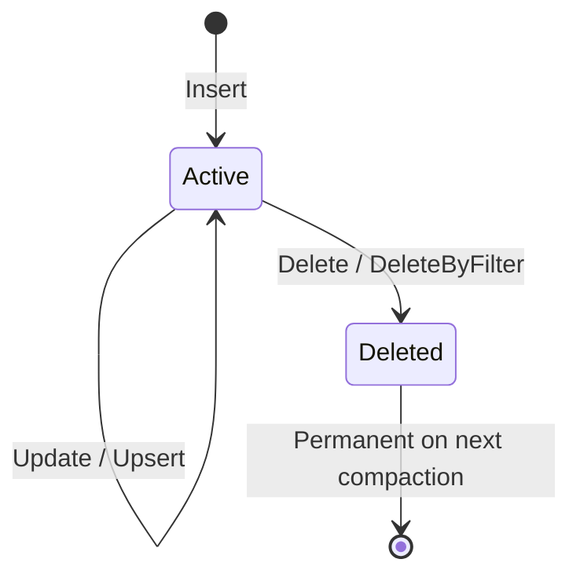

# Zvec — Key Concepts

Core concepts, theory, and terminology for the Zvec vector database engine.

---

## Vector Search

### What Are Embeddings?

An **embedding** is a fixed-length array of floating-point numbers that represents a piece of data (text, image, audio) in a high-dimensional space. Similar items have embeddings that are *close together* in this space, allowing similarity search via distance computation.

```
"happy cat"   → [0.82, 0.15, 0.43, ...]   ┐
"joyful kitten"→ [0.79, 0.18, 0.41, ...]   ├─ close together
"sad dog"     → [0.12, 0.87, 0.31, ...]   ┘  far from these
```

Embeddings are typically produced by machine learning models (e.g., OpenAI, BERT, CLIP) and can have 128 to 4096+ dimensions.

### Exact vs Approximate Search

| Approach | Method | Guarantee | Speed |
|----------|--------|-----------|-------|
| **Exact (KNN)** | Compare query to every vector | Perfect results | O(n) — too slow at scale |
| **Approximate (ANN)** | Use index structures to skip most comparisons | Near-perfect (tunable) | O(log n) or better |

Zvec supports both: **Flat** index for exact search, **HNSW** and **IVF** for approximate search.

---

## Distance Metrics

Distance metrics measure **how similar two vectors are**. The choice of metric must match how your embeddings were trained.

### Euclidean Distance (L2)

**Formula**: `d(a,b) = √(Σ(aᵢ - bᵢ)²)`

Measures the straight-line distance between two points. **Lower is more similar.** Best for embeddings where absolute magnitude matters (e.g., spatial coordinates, some image models).

### Cosine Similarity

**Formula**: `cos(a,b) = (a·b) / (‖a‖·‖b‖)`

Measures the angle between two vectors, ignoring magnitude. **Higher is more similar** (range: -1 to 1). Best for text embeddings where direction matters more than length (most NLP models).

> [!TIP]
> If your embeddings are already L2-normalized (unit vectors), cosine similarity is equivalent to inner product — use IP for better performance.

### Inner Product (IP)

**Formula**: `ip(a,b) = Σ(aᵢ × bᵢ)`

Dot product of two vectors. **Higher is more similar.** Best for normalized embeddings and Maximum Inner Product Search (MIPS). This is the fastest metric since it skips the normalization step.

### Hamming Distance

**Formula**: `d(a,b) = count of differing bits`

For binary vectors only. Counts bit positions that differ. **Lower is more similar.** Used with binary hash embeddings.

### Choosing a Metric

| Your embeddings are... | Use |
|------------------------|-----|
| Text (OpenAI, BERT, sentence-transformers) | **Cosine** or **IP** (if normalized) |
| Images (CLIP, ResNet) | **Cosine** or **L2** |
| Already normalized to unit length | **IP** (fastest) |
| Binary hashes | **Hamming** |

---

## HNSW (Hierarchical Navigable Small World)

### Theory

HNSW builds a multi-layer graph where each node is a vector. Think of it like a **highway system**:

- **Top layers** (sparse): Expressways — few nodes, long-distance connections. Gets you close to the target region fast.
- **Bottom layer** (dense): Local streets — all nodes, short-distance connections. Refines the search precisely.

This is inspired by **skip lists** — the probabilistic data structure where higher layers provide shortcuts. The key insight is that small-world graphs (where most nodes are reachable in a few hops) enable extremely efficient greedy search.

### How Search Works

1. Start at the **entry point** (top layer)
2. **Greedy walk**: Move to the neighbor closest to the query vector
3. When no closer neighbor exists, **descend** to the next layer
4. At layer 0, expand the search beam to find top-k candidates

### Parameters

| Parameter | What It Controls | Effect of Increasing |
|-----------|-----------------|---------------------|
| **M** | Max connections per node per layer | Better recall, more memory, slower build |
| **efConstruction** | Beam width during index building | Better graph quality, slower build |
| **ef** | Beam width during search (query-time) | Better recall, slower search |
| **maxLevel** | Auto-calculated from M | More layers → better routing |

> [!IMPORTANT]
> The most impactful parameter for search quality is **ef** (query-time). Start with ef=64 and increase if recall is insufficient. M=16 and efConstruction=200 are good defaults.

### Deletion

Zvec implements **true deletion** — not just tombstone marking. When a node is deleted:
1. The node is removed from every neighbor's connection list
2. Orphaned neighbors are reconnected to maintain graph traversability
3. If the deleted node was the entry point, a new entry point is selected

---

## IVF (Inverted File Index)

### Theory

IVF partitions the vector space into **clusters** (Voronoi cells) using k-means. Think of it like organizing a library:

- **Training**: Sort all books into subject sections (clusters)
- **Searching**: Find the nearest section(s), then scan only those shelves

### How It Works

1. **Train**: Run k-means on all vectors to find `nlist` cluster centroids
2. **Insert**: Assign each new vector to its nearest centroid's inverted list
3. **Search**: Find the `nprobe` nearest centroids to the query, then scan only those lists

### Parameters

| Parameter | What It Controls | Effect of Increasing |
|-----------|-----------------|---------------------|
| **nlist** | Number of clusters | Faster search (smaller lists), but need more vectors per cluster |
| **nprobe** | Clusters scanned per query | Better recall, slower search |

> [!TIP]
> Rule of thumb: `nlist ≈ √(n)` where n is the number of vectors. `nprobe = nlist/10` is a good starting point. IVF requires at least 10 vectors to train.

### K-Means Training

Zvec uses **mini-batch k-means** with random initialization:
1. Select `nlist` random vectors as initial centroids
2. Assign each vector to its nearest centroid
3. Recalculate centroids as the mean of assigned vectors
4. Repeat for up to 20 iterations or until convergence

Training is triggered by `Collection.Optimize()` and must be called before clustered search works. Before training, IVF falls back to linear scan.

---

## Quantization

### Why Quantize?

Full-precision vectors use 4 bytes per component (FP32). A 768-dimensional embedding uses **3KB per vector**. At 1 million vectors, that's **3GB** just for vectors. Quantization reduces this:

| Type | Bytes/Component | Compression | Memory for 1M × 768d |
|------|----------------|-------------|----------------------|
| FP32 | 4.0 | 1× (baseline) | 3.0 GB |
| FP16 | 2.0 | 2× | 1.5 GB |
| INT8 | 1.0 | 4× | 750 MB |
| INT4 | 0.5 | 8× | 375 MB |

### Calibration

INT8 and INT4 require **calibration** — determining the min/max range of vector components to map floating-point values into integer bins:

```
FP32 value:  -1.5 ──────────── 0.0 ──────────── 2.3
INT8 bin:      0  ─────── 98 ─── 127 ────── 191 ── 255
```

**Global calibration** scans all vectors to find a single min/max range. This is more accurate than per-vector calibration because it uses a consistent scale for distance computation.

> [!WARNING]
> If new vectors have values outside the calibrated range, they will be **clipped** to the min/max bounds. Call `Optimize()` periodically to recalibrate with the full dataset.

### Asymmetric Distance Computation (ADC)

Zvec uses **ADC** for quantized search: the **query vector stays in FP32** while **database vectors are in compressed form**. At search time, each compressed vector is decompressed on-the-fly for distance computation. This gives better accuracy than symmetric (both quantized) comparison.

### FP16 (Half-Precision)

- **Lossless** within the `Half` precision range (~3.3 decimal digits)
- No calibration needed — direct cast from `float` to `Half`
- Good default choice for moderate memory savings

### INT8 (Uniform Scalar)

- Maps `[min, max]` → `[0, 255]` with uniform spacing
- 256 distinct bins — introduces small quantization noise
- Requires calibration (one-time scan of all vectors)

### INT4 (Packed Nibble)

- Maps `[min, max]` → `[0, 15]` with uniform spacing
- Only 16 bins — noticeable accuracy loss, especially for fine-grained similarity
- Two components packed per byte for maximum compression
- Best for large-scale retrieval where approximate results are acceptable

---

## Filter Expressions

Zvec supports SQL-like filter expressions that are evaluated on scalar fields during vector search. Filters are applied **post-retrieval** — the vector index returns candidates, then filters narrow the results.

### Grammar

```
expression  = comparison ( ("AND" | "OR") comparison )*
comparison  = field_name operator value
            | "NOT" comparison
            | "(" expression ")"

operator    = "==" | "!=" | ">" | "<" | ">=" | "<="
value       = string_literal | number | "true" | "false" | "null"
```

### Supported Operators

| Operator | Example | Description |
|----------|---------|-------------|
| `==` | `category == "books"` | Equality |
| `!=` | `status != "deleted"` | Inequality |
| `>` | `price > 10.0` | Greater than |
| `<` | `price < 100` | Less than |
| `>=` | `rating >= 4.5` | Greater than or equal |
| `<=` | `count <= 50` | Less than or equal |
| `AND` | `price > 10 AND category == "books"` | Logical AND |
| `OR` | `color == "red" OR color == "blue"` | Logical OR |
| `NOT` | `NOT archived == true` | Logical NOT |

### Type Coercion

The filter engine performs automatic type coercion for comparisons:
- Numeric fields can be compared with integer or floating-point literals
- String comparisons are case-sensitive
- Boolean fields compare with `true` / `false` literals
- Null checks use `field == null` or `field != null`

---

## Collections & Schemas

### Collection

A **collection** is a named container for documents with a defined schema. It owns:
- A **storage engine** (ZoneTree) for durable document storage
- One or more **vector indexes** for similarity search
- A **filter engine** for scalar field filtering

### Schema

A schema defines the fields a collection accepts:

```csharp
var schema = new CollectionSchema("products")
    .AddField("name", DataType.String, nullable: false)
    .AddField("price", DataType.Float, nullable: true)
    .AddField("category", DataType.String, nullable: true)
    .AddVector("embedding", DataType.VectorFP32,
               dimension: 768,
               indexParams: new HnswIndexParams(MetricType.Cosine));
```

### Documents

Documents are **schemaless dictionaries** with a required primary key. They can contain:
- **Scalar fields**: strings, numbers, booleans
- **Vector fields**: float arrays (matched to schema dimension)
- **Primary key**: unique string identifier for deduplication

### Document Lifecycle



Deleted documents are immediately excluded from search results. The underlying storage marks them as deleted; physical removal happens during ZoneTree compaction.

---

*Documentation generated by AI assistant — February 2026*
