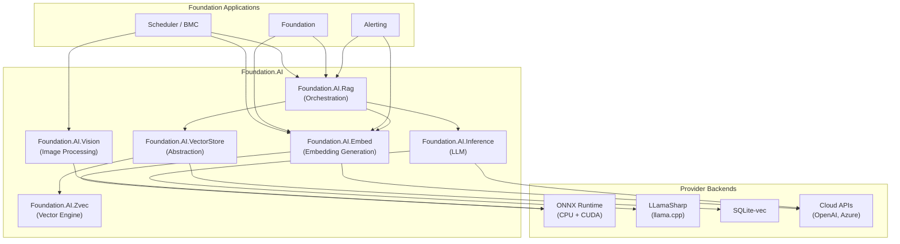
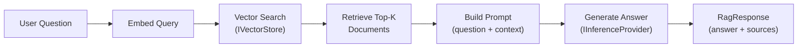

# Foundation.AI — Architecture Plan

A local-first AI processing platform for the Foundation development stack, providing semantic search, embedding generation, LLM inference, vision processing, and RAG orchestration — all embeddable with no external service dependencies.

---

## Design Principles

1. **Local-first** — Run entirely on local hardware (64+ cores, 64GB+ RAM, NVIDIA GPU). Cloud is a fallback, not a requirement.
2. **Provider abstraction** — Every capability (embeddings, inference, vector storage) is behind an interface. Swap local ↔ cloud via configuration.
3. **GPU-accelerated** — ONNX Runtime CUDA EP and llama.cpp CUDA for production throughput.
4. **Foundation-native** — Follows existing Foundation patterns (DI registration, configuration sections, logging, health checks).
5. **Incremental adoption** — Each component is independently useful. Applications opt-in to specific capabilities.

---

## 1. System Overview



---

## 2. Component Libraries

### 2.1 Foundation.AI.VectorStore

**Purpose:** Unified vector storage abstraction with pluggable backends.

```csharp
namespace Foundation.AI.VectorStore;

public interface IVectorStore
{
    // Collection management
    Task CreateCollectionAsync(string name, int dimension, VectorStoreOptions? options = null);
    Task<bool> CollectionExistsAsync(string name);
    Task DeleteCollectionAsync(string name);

    // Document operations
    Task UpsertAsync(string collection, string id, float[] vector,
                     Dictionary<string, object>? metadata = null);
    Task UpsertBatchAsync(string collection, IReadOnlyList<VectorDocument> documents);
    Task DeleteAsync(string collection, string id);

    // Search
    Task<IReadOnlyList<VectorSearchResult>> SearchAsync(
        string collection, float[] query, int topK = 10,
        string? filter = null, bool includeVectors = false);
}

public record VectorDocument(string Id, float[] Vector, Dictionary<string, object>? Metadata = null);
public record VectorSearchResult(string Id, float Score, Dictionary<string, object>? Metadata);
```

**Providers:**

| Provider | NuGet Dependency | Best For |
|----------|-----------------|----------|
| `ZvecVectorStore` | Foundation.AI.Zvec | Dedicated vector workloads, HNSW/IVF, quantization |
| `SqliteVecVectorStore` | sqlite-vec | Co-located with EF Core SQLite databases |
| `AzureAISearchStore` | Azure.Search.Documents | Cloud-scale, managed infrastructure |

**Registration pattern:**
```csharp
// In Program.cs or Startup
services.AddFoundationAI(ai => {
    ai.AddVectorStore<ZvecVectorStore>(options => {
        options.BasePath = "./ai-data/vectors";
        options.DefaultMetric = MetricType.Cosine;
        options.DefaultIndex = IndexType.Hnsw;
    });
});
```

---

### 2.2 Foundation.AI.Embed

**Purpose:** Generate embeddings from text, images, or structured data.

```csharp
namespace Foundation.AI.Embed;

public interface IEmbeddingProvider
{
    int Dimension { get; }
    Task<float[]> EmbedAsync(string text, CancellationToken ct = default);
    Task<float[][]> EmbedBatchAsync(IReadOnlyList<string> texts, CancellationToken ct = default);
}

// Extended for multi-modal
public interface IMultiModalEmbeddingProvider : IEmbeddingProvider
{
    Task<float[]> EmbedImageAsync(ReadOnlyMemory<byte> imageBytes, CancellationToken ct = default);
}
```

**Providers:**

| Provider | Model | Dimension | Speed (GPU) | Use Case |
|----------|-------|-----------|-------------|----------|
| `OnnxEmbeddingProvider` | all-MiniLM-L6-v2 | 384 | ~5K/sec | Fast, general purpose |
| `OnnxEmbeddingProvider` | BGE-small-en-v1.5 | 384 | ~4K/sec | High quality, English |
| `OnnxEmbeddingProvider` | BGE-M3 | 1024 | ~1K/sec | Multilingual, highest quality |
| `OpenAiEmbeddingProvider` | text-embedding-3-small | 1536 | API-limited | Cloud fallback |
| `ClipEmbeddingProvider` | CLIP ViT-B/32 | 512 | ~2K/sec | Text + image (multi-modal) |

**Key design decisions:**
- Models are ONNX-exported and bundled as local files (not downloaded at runtime)
- GPU acceleration via ONNX Runtime CUDA Execution Provider
- Tokenization handled internally (HuggingFace tokenizers via managed bindings)
- Batch processing for throughput — GPU batching is 10-50× faster than sequential

---

### 2.3 Foundation.AI.Inference

**Purpose:** Local LLM inference for text generation, summarization, and RAG responses.

```csharp
namespace Foundation.AI.Inference;

public interface IInferenceProvider
{
    Task<string> GenerateAsync(string prompt, InferenceOptions? options = null,
                               CancellationToken ct = default);
    IAsyncEnumerable<string> GenerateStreamAsync(string prompt, InferenceOptions? options = null,
                                                  CancellationToken ct = default);
    Task<ChatResponse> ChatAsync(IReadOnlyList<ChatMessage> messages,
                                  InferenceOptions? options = null,
                                  CancellationToken ct = default);
}

public class InferenceOptions
{
    public float Temperature { get; set; } = 0.7f;
    public int MaxTokens { get; set; } = 1024;
    public float TopP { get; set; } = 0.9f;
    public string? SystemPrompt { get; set; }
}

public record ChatMessage(string Role, string Content);  // "system", "user", "assistant"
public record ChatResponse(string Content, int TokensUsed);
```

**Providers:**

| Provider | Backend | Models | GPU |
|----------|---------|--------|-----|
| `LlamaInferenceProvider` | LLamaSharp (llama.cpp C# bindings) | GGUF format: Llama 3 8B, Mistral 7B, Phi-3 | CUDA ✅ |
| `OpenAiInferenceProvider` | OpenAI / Azure OpenAI API | GPT-4o, GPT-4o-mini | Cloud |

**Key design decisions:**
- LLamaSharp wraps llama.cpp natively — battle-tested C++ inference with C# bindings
- GGUF quantized models (Q4_K_M) fit in ~5GB VRAM for 7-8B parameter models
- Streaming support for responsive UX
- System prompts are configurable per-use-case (RAG, summarization, analysis)

---

### 2.4 Foundation.AI.Vision

**Purpose:** Image analysis, classification, and embedding for multi-modal search.

```csharp
namespace Foundation.AI.Vision;

public interface IVisionProvider
{
    Task<float[]> EmbedImageAsync(ReadOnlyMemory<byte> imageBytes, CancellationToken ct = default);
    Task<IReadOnlyList<DetectedObject>> DetectObjectsAsync(ReadOnlyMemory<byte> imageBytes,
                                                            CancellationToken ct = default);
    Task<string> DescribeImageAsync(ReadOnlyMemory<byte> imageBytes,
                                     CancellationToken ct = default);
}

public record DetectedObject(string Label, float Confidence, BoundingBox Box);
public record BoundingBox(float X, float Y, float Width, float Height);
```

**Providers:**

| Provider | Model | Capability |
|----------|-------|-----------|
| `ClipVisionProvider` | CLIP ViT-B/32 (ONNX) | Image embeddings for similarity search |
| `YoloVisionProvider` | YOLOv8 (ONNX) | Object detection and classification |
| `LlavaVisionProvider` | LLaVA (via LLamaSharp) | Image description / VQA |

**BMC-specific use cases:**
- Classify surface conditions from site photos
- Analyze heatmap images for pattern anomalies
- Embed drone/site imagery for visual similarity search

---

### 2.5 Foundation.AI.Rag

**Purpose:** RAG orchestration — ties together embedding, vector search, and LLM generation.

```csharp
namespace Foundation.AI.Rag;

public interface IRagService
{
    Task<RagResponse> QueryAsync(string question, RagOptions? options = null,
                                  CancellationToken ct = default);
    Task IndexDocumentAsync(string collection, string docId, string text,
                            Dictionary<string, object>? metadata = null,
                            CancellationToken ct = default);
    Task IndexBatchAsync(string collection, IReadOnlyList<RagDocument> documents,
                          CancellationToken ct = default);
}

public class RagOptions
{
    public string Collection { get; set; } = "default";
    public int TopK { get; set; } = 5;
    public string? Filter { get; set; }
    public string? SystemPrompt { get; set; }
    public float MinRelevanceScore { get; set; } = 0.3f;
}

public record RagDocument(string Id, string Text, Dictionary<string, object>? Metadata = null);
public record RagResponse(string Answer, IReadOnlyList<RagSource> Sources);
public record RagSource(string DocId, string Excerpt, float Score);
```

**Pipeline:**


**Chunking strategy:**
- Documents split into overlapping chunks (default: 512 tokens, 64 token overlap)
- Each chunk stored with source metadata (docId, chunk index, original position)
- Retrieval returns chunks; response includes source attribution

---

## 3. Foundation.AI Project Structure

```
Foundation.AI/
├── Zvec/                             ✅ Exists — vector database engine
│   ├── Zvec/                         (SDK)
│   ├── Zvec.Engine/                  (Core engine)
│   ├── Zvec.Test/
│   └── Zvec.Bench/
│
├── Foundation.AI.VectorStore/        📋 Phase 1
│   ├── IVectorStore.cs               (Core interface)
│   ├── VectorStoreOptions.cs
│   ├── Providers/
│   │   ├── ZvecVectorStore.cs
│   │   └── SqliteVecVectorStore.cs
│   └── DependencyInjection/
│       └── VectorStoreServiceExtensions.cs
│
├── Foundation.AI.Embed/              📋 Phase 1
│   ├── IEmbeddingProvider.cs          (Core interface)
│   ├── Providers/
│   │   ├── OnnxEmbeddingProvider.cs
│   │   └── OpenAiEmbeddingProvider.cs
│   ├── Models/                        (ONNX model files, .gitignored)
│   └── DependencyInjection/
│       └── EmbedServiceExtensions.cs
│
├── Foundation.AI.Inference/          📋 Phase 2
│   ├── IInferenceProvider.cs
│   ├── Providers/
│   │   ├── LlamaInferenceProvider.cs
│   │   └── OpenAiInferenceProvider.cs
│   ├── Models/                        (GGUF model files, .gitignored)
│   └── DependencyInjection/
│
├── Foundation.AI.Rag/                📋 Phase 2
│   ├── IRagService.cs
│   ├── RagService.cs
│   ├── Chunking/
│   │   ├── IDocumentChunker.cs
│   │   └── TokenChunker.cs
│   └── DependencyInjection/
│
├── Foundation.AI.Vision/             📋 Phase 3
│   ├── IVisionProvider.cs
│   ├── Providers/
│   │   ├── ClipVisionProvider.cs
│   │   └── YoloVisionProvider.cs
│   └── DependencyInjection/
│
└── Foundation.AI.Test/               📋 Phase 1
    └── (Integration tests for all components)
```

---

## 4. Technology Stack

| Layer | Local Technology | Cloud Fallback | NuGet Package |
|-------|-----------------|----------------|---------------|
| **Embeddings** | ONNX Runtime + CUDA EP | OpenAI API | `Microsoft.ML.OnnxRuntime.Gpu` |
| **LLM Inference** | llama.cpp via LLamaSharp | OpenAI / Azure OpenAI | `LLamaSharp`, `LLamaSharp.Backend.Cuda12` |
| **Vision** | ONNX Runtime (CLIP, YOLO) | Azure Computer Vision | `Microsoft.ML.OnnxRuntime.Gpu` |
| **Vector Store (primary)** | Zvec (custom engine) | — | `Foundation.AI.Zvec` |
| **Vector Store (relational)** | SQLite-vec | Azure AI Search | `sqlite-vec` |
| **Tokenization** | Managed tokenizer | — | `Microsoft.ML.Tokenizers` |

---

## 5. Configuration Pattern

```json
{
  "FoundationAI": {
    "VectorStore": {
      "Provider": "Zvec",
      "BasePath": "./ai-data/vectors",
      "DefaultMetric": "Cosine"
    },
    "Embedding": {
      "Provider": "Onnx",
      "ModelPath": "./ai-models/bge-small-en-v1.5.onnx",
      "UseCuda": true,
      "GpuDeviceId": 0,
      "FallbackProvider": "OpenAI",
      "FallbackApiKey": "sk-..."
    },
    "Inference": {
      "Provider": "Llama",
      "ModelPath": "./ai-models/llama-3-8b-instruct.Q4_K_M.gguf",
      "UseCuda": true,
      "GpuLayers": 35,
      "ContextSize": 4096,
      "FallbackProvider": "OpenAI",
      "FallbackApiKey": "sk-..."
    },
    "Vision": {
      "Provider": "Clip",
      "ModelPath": "./ai-models/clip-vit-b32.onnx",
      "UseCuda": true
    },
    "Rag": {
      "ChunkSize": 512,
      "ChunkOverlap": 64,
      "TopK": 5,
      "MinRelevanceScore": 0.3
    }
  }
}
```

---

## 6. Application Integration Scenarios

### Scheduler / BMC
- **Semantic project search** — embed project descriptions, search by natural language
- **Contact/client RAG** — "Who is the geotechnical engineer for projects in Ontario?"
- **Heatmap image analysis** — CLIP embeddings for visual similarity, YOLO for feature detection
- **AI-assisted modeling** — analyze compaction patterns, predict roller pass requirements

### Foundation
- **Semantic user/role search** — find users by description of their responsibilities
- **Audit analysis** — "Show me unusual access patterns this week" via RAG over audit logs
- **Help system** — RAG over Foundation documentation and configuration guides

### Alerting
- **Similar incident detection** — embed incident descriptions, find historical matches
- **Auto-triage** — suggest severity, service, escalation policy from incident content
- **Root cause suggestions** — RAG over resolved incidents for resolution recommendations

---

## 7. Implementation Roadmap

### Phase 1 — Foundation (Weeks 1-3)
> **Goal:** Embedding generation + vector storage abstraction

- [ ] `Foundation.AI.VectorStore` — `IVectorStore` interface + `ZvecVectorStore` provider
- [ ] `Foundation.AI.Embed` — `IEmbeddingProvider` + `OnnxEmbeddingProvider` (CPU + CUDA)
- [ ] Download and validate a small embedding model (all-MiniLM-L6 or BGE-small)
- [ ] DI registration extensions (`services.AddFoundationAI(...)`)
- [ ] Integration tests: embed text → store in Zvec → search by similarity

### Phase 2 — Intelligence (Weeks 4-6)
> **Goal:** LLM inference + RAG orchestration

- [ ] `Foundation.AI.Inference` — `IInferenceProvider` + `LlamaInferenceProvider`
- [ ] `Foundation.AI.Rag` — `IRagService` with chunking, retrieval, and generation
- [ ] Cloud fallback providers (`OpenAiEmbeddingProvider`, `OpenAiInferenceProvider`)
- [ ] `SqliteVecVectorStore` provider
- [ ] End-to-end RAG test: index documents → query → get grounded answer with sources

### Phase 3 — Vision & Integration (Weeks 7-9)
> **Goal:** Multi-modal capabilities + first application integrations

- [ ] `Foundation.AI.Vision` — CLIP image embeddings + YOLO object detection
- [ ] First BMC integration: semantic search over projects
- [ ] First Alerting integration: similar incident detection
- [ ] Foundation health check integration for AI services

### Phase 4 — Polish & Scale (Weeks 10-12)
> **Goal:** Production hardening, monitoring, advanced features

- [ ] Model management (versioning, lazy loading, memory budgeting)
- [ ] Embedding cache (avoid re-embedding unchanged documents)
- [ ] Background indexing service (watch for data changes, auto-embed)
- [ ] Performance benchmarks and tuning
- [ ] `Foundation.AI` architectural documentation (following Foundation/Alerting patterns)

---

## User Review Required

> [!IMPORTANT]
> **Model storage strategy** — ONNX embedding models are 80-400MB, GGUF LLM models are 4-8GB. These should NOT be committed to git. Recommend a local `ai-models/` directory (gitignored) with a setup script or README to download required models. Alternatively, models could be stored on a shared network drive and referenced by path in config.

> [!IMPORTANT]
> **GPU requirements** — CUDA 12 is required for GPU-accelerated providers. The ONNX Runtime GPU and LLamaSharp CUDA packages include the CUDA runtime, but the NVIDIA driver must be installed on the host machine. CPU-only fallback works without any GPU.
