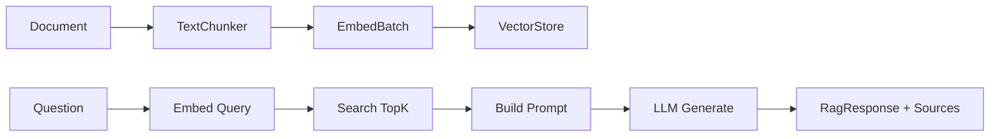

# Foundation.AI — Phase 2 Walkthrough

## What Was Built

2 new projects, completing the AI platform core:

### Projects Created

| Project | Purpose | Key Files |
|---------|---------|-----------|
| **[Foundation.AI.Inference](file:///g:/source/repos/Scheduler/Foundation.AI/Foundation.AI.Inference)** | LLM text generation | `IInferenceProvider`, `OpenAiInferenceProvider`, `ChatMessage`, DI |
| **[Foundation.AI.Rag](file:///g:/source/repos/Scheduler/Foundation.AI/Foundation.AI.Rag)** | RAG orchestration | `IRagService`, `RagService`, `TextChunker`, DI |

### Inference Service

[OpenAiInferenceProvider](file:///g:/source/repos/Scheduler/Foundation.AI/Foundation.AI.Inference/OpenAiInferenceProvider.cs) — works with **OpenAI**, **Azure OpenAI**, and **Ollama** (any OpenAI-compatible endpoint):

```csharp
// OpenAI cloud
services.AddOpenAiInference(c => { c.ApiKey = "sk-..."; c.Model = "gpt-4o-mini"; });

// Ollama local
services.AddOpenAiInference(c => {
    c.Endpoint = "http://localhost:11434/v1/chat/completions";
    c.Model = "llama3";
    c.ApiKey = "ollama";
});
```

Features: generate, stream (SSE), multi-turn chat, chat stream, system prompts, temperature/topP/maxTokens.

### RAG Pipeline

[RagService](file:///g:/source/repos/Scheduler/Foundation.AI/Foundation.AI.Rag/RagService.cs) orchestrates the full pipeline:



[TextChunker](file:///g:/source/repos/Scheduler/Foundation.AI/Foundation.AI.Rag/DocumentChunker.cs) — smart boundary detection (paragraph breaks → sentence endings → whitespace), configurable size/overlap.

## Verification

**Tests:** 12/12 passed (1.3s)

| Suite | Tests | Status |
|-------|-------|--------|
| VectorStore (Phase 1) | 5 | ✅ All passed |
| DocumentChunker | 5 | ✅ All passed |
| RAG Pipeline | 2 | ✅ All passed |

## Foundation.AI — Complete Project Map

```
Foundation.AI/
├── Zvec/                             ✅ Vector database engine
├── Foundation.AI.VectorStore/        ✅ Phase 1 — IVectorStore abstraction
├── Foundation.AI.VectorStore.Zvec/   ✅ Phase 1 — Zvec provider
├── Foundation.AI.Embed/              ✅ Phase 1 — ONNX + OpenAI + Fallback
├── Foundation.AI.Inference/          ✅ Phase 2 — OpenAI/Ollama LLM
├── Foundation.AI.Rag/                ✅ Phase 2 — Full RAG pipeline
├── Foundation.AI.Test/               ✅ 12 tests passing
└── Foundation.AI.Vision/             📋 Phase 3 — Coming next
```
