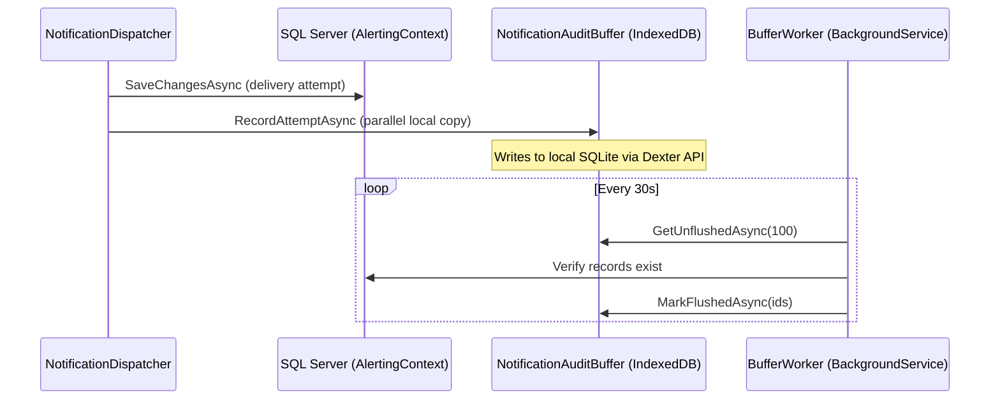

# Walkthrough: Notification Audit Local Buffer

Integration of `Foundation.IndexedDB` as a write-ahead buffer for notification delivery audit records in the Alerting system.

## Architecture



## Changes Made

| File | Action | Purpose |
|------|--------|---------|
| [Alerting.Server.csproj](file:///g:/source/repos/Scheduler/Alerting/Alerting.Server/Alerting.Server.csproj) | Modified | Added `Foundation.IndexedDB` project reference |
| [LocalDeliveryRecord.cs](file:///g:/source/repos/Scheduler/Alerting/Alerting.Server/Models/LocalDeliveryRecord.cs) | New | POCO model for local store with 14 fields |
| [NotificationAuditBuffer.cs](file:///g:/source/repos/Scheduler/Alerting/Alerting.Server/Services/NotificationAuditBuffer.cs) | New | Core buffer service: `NotificationAuditDb` (Dexter), `INotificationAuditBuffer`, and implementation |
| [NotificationAuditBufferWorker.cs](file:///g:/source/repos/Scheduler/Alerting/Alerting.Server/Services/NotificationAuditBufferWorker.cs) | New | Background flush worker (configurable interval/batch) |
| [NotificationDispatcher.cs](file:///g:/source/repos/Scheduler/Alerting/Alerting.Server/Services/Notifications/NotificationDispatcher.cs) | Modified | Injected `INotificationAuditBuffer`, added local write after SQL save |
| [Program.cs](file:///g:/source/repos/Scheduler/Alerting/Alerting.Server/Program.cs) | Modified | Registered singleton buffer + hosted worker |
| [appsettings.json](file:///g:/source/repos/Scheduler/Alerting/Alerting.Server/appsettings.json) | Modified | Added `NotificationAuditBuffer` config section |

## Key Diffs

render_diffs(file:///g:/source/repos/Scheduler/Alerting/Alerting.Server/Services/Notifications/NotificationDispatcher.cs)

render_diffs(file:///g:/source/repos/Scheduler/Alerting/Alerting.Server/Program.cs)

## IndexedDB Schema

```
Store: deliveryAttempts
  ++Id                  → auto-increment primary key
  &CorrelationId        → unique index (dedup with SQL Server objectGuid)
  AttemptedAt           → time-range queries
  ChannelTypeId         → channel filtering
  FlushedToServer       → flush worker queries
```

## Verification

Build result: **0 errors**, 8 pre-existing warnings (nullable annotations, unused fields — all in other files).

```
Build succeeded.
    8 Warning(s)
    0 Error(s)
Time Elapsed 00:00:02.76
```

## Design Decisions

- **Augments, not replaces**: SQL Server writes remain untouched. The local buffer is an additional parallel copy.
- **Fail-safe**: `RecordAttemptAsync` catches all exceptions — a local buffer failure never disrupts notification delivery.
- **Singleton buffer, scoped worker**: The `IDBFactory` and `IDBDatabase` are long-lived; the worker creates scoped `AlertingContext` instances for SQL queries.
- **Flush = verify + mark**: The worker verifies records exist in SQL Server by `objectGuid`, then marks local copies as flushed. No data is copied from local → SQL; the primary write path handles that.
