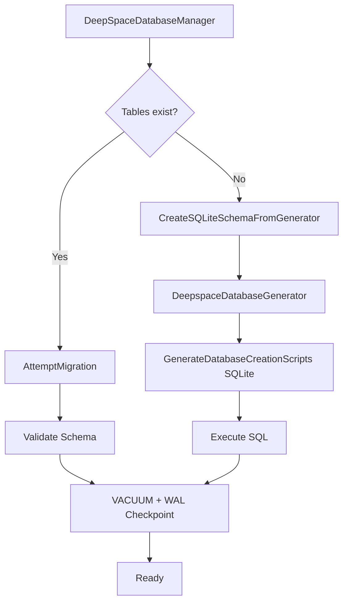

# DeepSpaceDatabase — Runtime SQLite Management Layer

## What Was Built

A new `DeepSpaceDatabase` project providing runtime SQLite database lifecycle management for DeepSpace, adapted from the proven RollerOps pattern in `G:\source\Compactica\RollerOps`.

## Files Created

| File | Purpose |
|---|---|
| [DeepSpaceDatabase.csproj](file:///g:/source/repos/Scheduler/DeepSpaceDatabase/DeepSpaceDatabase.csproj) | Project file with EF Core SQLite + SQL Server packages |
| [DeepSpaceContext.cs](file:///g:/source/repos/Scheduler/DeepSpaceDatabase/Database/DeepSpaceContext.cs) | Minimal stub (will be replaced by FoundationCoreTools scaffolding) |
| [DeepSpaceContextCustom.cs](file:///g:/source/repos/Scheduler/DeepSpaceDatabase/Database/DeepSpaceContextCustom.cs) | Handwritten partial: SQLite config, UTC dates, `TablesExistInSchema()` |
| [DeepSpaceMigration.cs](file:///g:/source/repos/Scheduler/DeepSpaceDatabase/Migration/DeepSpaceMigration.cs) | Schema creation from generator + migration scaffold |
| [SqliteWALInterceptor.cs](file:///g:/source/repos/Scheduler/DeepSpaceDatabase/Utility/SqliteWALInterceptor.cs) | Enhanced WAL mode with 6 tuned PRAGMAs |
| [DeepSpaceDatabaseManager.cs](file:///g:/source/repos/Scheduler/DeepSpaceDatabase/Utility/DeepSpaceDatabaseManager.cs) | Lifecycle orchestrator: create/migrate/validate/tune + RW lock |

## Architecture (from RollerOps)

## Key Design Decisions

- **Generator as runtime source of truth** — `DeepSpaceMigration.CreateSQLiteSchemaFromGenerator()` instantiates `DeepspaceDatabaseGenerator` at runtime, not EF's `EnsureCreated()`. This preserves `COLLATE NOCASE`, indexes, and seed data.
- **Enhanced WAL interceptor** — 6 PRAGMAs (vs Foundation's basic 1) for production-grade SQLite performance.
- **RW lock for concurrency** — `ExecuteWrite()` / `ExecuteRead()` helpers serialize writes while allowing concurrent reads.
- **Separate project** — Keeps EF Core dependencies out of the core `Foundation.Networking.DeepSpace` library.

## Build Results

- `DeepSpaceDatabase.csproj`: **0 errors**, 0 warnings ✅
- (107 pre-existing warnings from FoundationCore)
