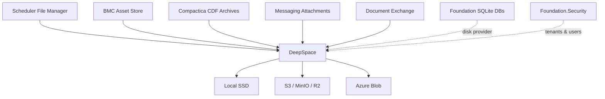

# DeepSpace — Vision Document

> March 2026 · Foundation Infrastructure Stack

---

## What Is DeepSpace?

DeepSpace is a **storage abstraction layer** that gives any Foundation application the illusion of infinite, local disk — regardless of whether data lives on a local SSD, an S3 bucket, Azure Blob Storage, or a combination of all three.

**Core promise:** Interacting with DeepSpace should feel no different than accessing the local filesystem. The application never needs to know or care where its data actually lives.

## Deployment Modes

| Mode | Description | When |
|------|-------------|------|
| **Embedded Library** | `AddDeepSpace()` in any Foundation app | Default for most apps |
| **Standalone Server** | DeepSpace.Host with HTTP API + Management UI | Organization-wide storage service |
| **Hybrid** | Embedded client → standalone server | Apps that need centralized storage |

---

## Strategic Role

DeepSpace is a **cornerstone system** in the Foundation stack. Nearly every application needs storage, and today each solves it independently. DeepSpace unifies this.



---

## Validated Use Cases

### 1. Scheduler File Manager (Job #1)

The Scheduler's file manager currently has its own storage logic via `IFileStorageService`. DeepSpace becomes the backend, giving the file manager provider-agnostic storage. If this works, every other use case follows.

**What this proves:** basic CRUD, streaming, metadata, tagging, folder structure, multi-tenant isolation.

### 2. BMC Asset Store / CDN

The BMC system needs self-hosted imagery for parts and sets — currently hotlinked from Rebrickable/LEGO CDNs. DeepSpace serves as a local CDN with presigned URLs for direct client access.

**What this proves:** read-heavy CDN patterns, bulk import, cross-tenant shared assets, presigned URL delivery.

### 3. Compactica CDF Archives

Compactica generates `.cdata` and `.carchive` files — binary, memory-mappable, 160MB+ per day per project. These are evidentiary records (legal/insurance). DeepSpace manages:

- **Hot tier** — recent CDF files on local SSD for zero-copy reads via `MemoryMappedFile`
- **Warm tier** — older CDF files on S3 for cost-effective retention
- **Cold tier** — archive CDF files on Glacier/Archive for long-term legal compliance
- **Automatic tiering** — files age from hot → warm → cold based on lifecycle rules

**What this proves:** large binary file handling, lifecycle tiering, backup/redundancy for critical data, streaming I/O.

### 4. DeepSpace as Disk for Foundation SQLite Databases

Foundation uses SQLite for operational, security, and auditor databases. DeepSpace becomes the **disk provider** for those files — a Foundation app running on a cheap VPS with limited local storage can host its SQLite databases on DeepSpace-managed remote storage.

- **Transparent disk** — app requests a database path, DeepSpace pulls the `.db` from S3/Azure to a local cache, serves it for read/write, and syncs changes back
- **Zero local disk dependency** — a Foundation app on a minimal VPS doesn't need large local disks; DeepSpace provides the illusion of infinite local storage for databases
- **Snapshot/backup** — periodic snapshots of active SQLite databases to durable cloud storage
- **Schema versioning** — track which version of a schema a database uses, coordinated with `DatabaseGenerator` output

**What this proves:** DeepSpace isn't just a blob store — it's the filesystem layer for the entire Foundation platform.

### 5. Data Backup & Redundancy

DeepSpace manages backup/replication for critical data across the entire Foundation stack:

- Cross-provider replication (local → S3, S3 → Azure for geo-redundancy)
- Scheduled snapshots of critical files
- Point-in-time recovery for managed databases
- Integrity verification (checksum validation across replicas)

---

## Multi-Tenancy & Foundation.Security Integration

DeepSpace is **strongly coupled to Foundation tenancy** via `Foundation.Security`, with full visibility into tenants and users. Cross-tenant shared assets support CDN-type universal data access.

```
/{tenantId}/files/...             ← tenant-scoped data
/{tenantId}/databases/...         ← tenant SQLite databases
/_shared/cdn/...                  ← cross-tenant assets (BMC parts, etc.)
/_shared/templates/...            ← shared templates
/_system/backups/...              ← system-level backup data
```

- **Tenant isolation** enforced at the `StorageManager` level, resolving tenant from Security context
- **User-level tracking** — which user uploaded/modified/accessed files, tied to `SecurityUser`
- **Cross-tenant reads** explicitly opt-in via the `_shared` prefix (CDN-type universal data)
- **Quota management** per tenant — configurable storage limits and alerts
- **Audit trail** — all storage operations logged with tenant+user context for compliance

---

## Storage Tiers & Lifecycle

| Tier | Backing | Access Pattern | Cost | Example |
|------|---------|----------------|------|---------|
| **Hot** | Local SSD | Sub-millisecond, memory-mapped | $$$ | Active CDF files, live SQLite DBs |
| **Warm** | S3 Standard / Azure Hot | ~100ms first byte | $$ | Recent file manager docs, BMC images |
| **Cool** | S3 IA / Azure Cool | ~200ms, retrieval cost | $ | Old project files, historical data |
| **Cold** | Glacier / Azure Archive | Minutes-to-hours retrieval | ¢ | Legal archives, old CDF evidentiary data |

**Lifecycle rules** move objects between tiers automatically:

```
Rule: "CDF Archive Tiering"
  Match:  prefix="{tenant}/cdf/" AND age > 90 days
  Action: move to Warm (S3)

Rule: "CDF Legal Retention"
  Match:  prefix="{tenant}/cdf/" AND age > 2 years
  Action: move to Cold (Glacier)

Rule: "CDN Asset Caching"
  Match:  prefix="_shared/cdn/" AND access_count > 100/day
  Action: keep in Hot (local cache)
```

---

## Standalone Server: Management UI

When running as a standalone server, DeepSpace.Host serves a management interface:

### Provider Dashboard
- Connected stores (local paths, S3 buckets, Azure containers)
- Capacity / utilization per provider
- Health status and latency metrics

### Data Explorer
- File Manager-style UI for browsing raw storage across all providers
- Move/copy objects between providers and tiers
- Bulk operations and migration tools

### Cost Center
- Per-provider cost tracking (S3 egress, storage, API calls)
- Per-tenant usage breakdown and quota management
- Trend projections and budget alerts

### Migration Tools
- "Move everything under prefix X from provider A to provider B"
- Progress tracking, rollback capability
- Scheduled migrations for off-peak execution

### Tenant View
- Storage usage per tenant
- Quota status and enforcement
- Cross-tenant shared asset management

> [!NOTE]
> The management UI should exist in two forms:
> - **Lightweight** — embedded in Foundation.Client for basic storage visibility in any Foundation app's dashboard
> - **Full** — served by DeepSpace.Host for comprehensive standalone management

---

## DeepSpace's Own Database

Following Foundation conventions, DeepSpace needs a `DeepspaceDatabaseGenerator.cs` — just like `SchedulerDatabaseGenerator` and `SecurityDatabaseGenerator` — to define its own schema.

**Key difference:** DeepSpace uses **SQLite** as its database provider so it doesn't depend on SQL Server or Postgres. This keeps it self-contained and deployable anywhere.

### What DeepSpace Tracks

| Table | Purpose |
|-------|--------|
| **StorageObject** | Object registry — key, provider, tier, size, content type, checksums |
| **StorageProvider** | Registered providers — type, config reference, health status |
| **LifecycleRule** | Tier migration rules — prefix match, age threshold, target tier |
| **MigrationJob** | Active/completed tier migrations — progress, status, timestamps |
| **AccessLog** | Object access tracking — for lifecycle rule evaluation (access counts) |
| **ReplicationTarget** | Cross-provider replication config — source/dest provider, sync status |
| **TenantQuota** | Per-tenant storage limits and current usage |

> [!NOTE]
> The `DeepspaceDatabaseGenerator` produces the schema through the same `Foundation.CodeGeneration.DatabaseGenerator` base class, but targets SQLite instead of SQL Server. This means DeepSpace gets the full Foundation treatment — generated controllers, services, audit fields — while remaining zero-dependency on external database servers.

---

## Architecture: What Needs to Change

### Current State (v1.0)
- ✅ `IStorageProvider` abstraction with Local, S3, Azure providers
- ✅ `StorageManager` with streaming support
- ✅ `MaxFileSizeBytes` enforcement
- ✅ Conditional provider registration via DI

### Phase 2: DeepspaceDatabaseGenerator + Foundation.Security
- `DeepspaceDatabaseGenerator.cs` with SQLite provider
- Foundation.Security integration for tenant/user resolution
- Object registry tables for tracking what's stored where
- Audit trail with tenant+user context

### Phase 3: File Manager Integration
- Tenant-aware key routing in `StorageManager`
- Adapter: `IFileStorageService` → `StorageManager`
- Content-Type detection and response headers in Host API
- Host API authentication

### Phase 4: CDN & Presigned URLs
- `IStorageProvider.GetPresignedUrlAsync()` for S3/Azure
- Local provider: serve via Host API endpoint (no presigned URL needed)
- Cache-Control header support

### Phase 5: SQLite as Managed Disk
- DeepSpace-managed SQLite file lifecycle (pull/cache/sync-back)
- Connection string abstraction (app gets a local path, DeepSpace handles the rest)
- Snapshot/versioning API for SQLite databases

### Phase 6: Lifecycle & Tiering
- Rule engine for automatic tier migration
- Background worker for rule evaluation
- Replication manager for cross-provider redundancy
- Integrity checker (periodic checksum verification)

### Phase 7: Management UI
- DeepSpace dashboard in Foundation.Client
- Full management UI in DeepSpace.Host
- Cost tracking and tenant quota management

---

## Cross-Project Integration

| Project | Integration |
|---------|-------------|
| **Foundation.Security** | Tenant/user resolution, access control, audit identity |
| **Locksmith** | API key management for DeepSpace access |
| **Watchtower** | Monitor DeepSpace health, storage capacity alerts |
| **Beacon** | Broadcast storage events (file uploaded, tier changed) |
| **Skynet** | TLS for DeepSpace Host API |
| **Switchboard** | Route storage requests in multi-node deployments |

---

## Success Criteria

1. **File Manager works on DeepSpace** — zero regression, transparent backend swap
2. **Foundation app runs with minimal local disk** — SQLite databases hosted on DeepSpace-managed storage
3. **BMC serves self-hosted images** — no more CDN hotlinking
4. **Compactica CDF files tier automatically** — hot → warm → cold with lifecycle rules
5. **DeepSpace has its own Foundation database** — `DeepspaceDatabaseGenerator` on SQLite, full audit trail
6. **Cost visibility** — know exactly what storage costs per tenant per provider
