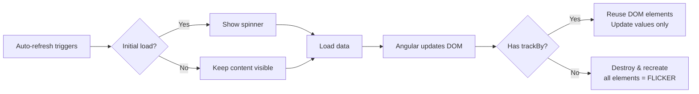

# Systems Dashboard Flicker Reduction - Walkthrough

## Summary
Eliminated screen flickering during 1-second auto-refresh by updating DOM values in-place rather than rebuilding the entire view.

## Changes Made

### TypeScript Component

render_diffs(file:///d:/repos/Scheduler/Foundation/Foundation.Client/src/app/components/systems-dashboard/systems-dashboard.component.ts)

**Key changes:**
1. Added `initialLoadComplete` flag to distinguish initial load from refresh
2. Modified `loadFleetOverview()` and `loadHistoricalData()` to only show spinner on initial load
3. Added 8 `trackBy` functions for stable DOM element identity
4. Added `animation: false` to `chartOptions` and `sparklineOptions` to prevent charts from re-animating on every data update

### HTML Template

render_diffs(file:///d:/repos/Scheduler/Foundation/Foundation.Client/src/app/components/systems-dashboard/systems-dashboard.component.html)

**Applied `trackBy` to 14 `*ngFor` loops across all tabs:**
- Overview tab: applications, metrics, snapshots
- Real-Time tab: app selector, databases, sessions, drives
- Historical tab: snapshots table, collection runs

## How It Works

## Verification

✅ Angular build succeeded (exit code 0)

### Manual Testing
1. Enable 1-second auto-refresh on the Systems Dashboard
2. Observe that values update smoothly without the entire view flickering
3. Verify all three tabs work: Overview, Real-Time, Historical
