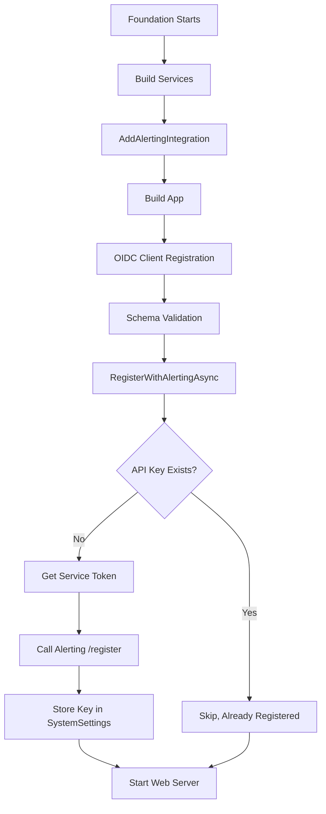

# Foundation → Alerting Auto-Registration at Startup

## Goal
During Foundation startup, automatically register with the Alerting system if:
1. An Alerting URL is configured in appsettings
2. No API key exists in SystemSettings yet

This enables Foundation to raise incidents to Alerting without manual setup.

---

## Proposed Changes

### Configuration (`appsettings.json`)
#### [MODIFY] [appsettings.json](file:///g:/source/repos/Scheduler/Foundation/Foundation.Server/appsettings.json)

Add an `Alerting` configuration section:
```json
"Alerting": {
    "BaseUrl": "https://localhost:11101",
    "ServiceName": "Foundation",
    "ServiceUrl": "https://localhost:9101",
    "CallbackUrl": "https://localhost:9101/api/alerting-webhook"
}
```

---

### Startup Integration
#### [MODIFY] [Program.cs](file:///g:/source/repos/Scheduler/Foundation/Foundation.Server/Program.cs)

1. **Add Alerting DI registration** after line ~240:
   ```csharp
   builder.Services.AddAlertingIntegration(builder.Configuration);
   ```

2. **Add auto-registration method** that runs after OIDC setup (~line 402):
   ```csharp
   await RegisterWithAlertingAsync(app, logger).ConfigureAwait(false);
   ```

3. **Implement the registration method**:
   - Check if `Alerting:BaseUrl` is configured
   - Check if API key exists in SystemSettings
   - If no key, obtain service account OIDC token
   - Call `IAlertingIntegrationService.RegisterAsync()`
   - Log success/failure

---

### New Helper Method in Program.cs

```csharp
private static async Task RegisterWithAlertingAsync(WebApplication app, Logger logger)
{
    var config = app.Configuration;
    var alertingUrl = config["Alerting:BaseUrl"];
    
    // Skip if not configured
    if (string.IsNullOrEmpty(alertingUrl))
    {
        logger.LogInformation("Alerting integration not configured, skipping.");
        return;
    }
    
    var serviceName = config["Alerting:ServiceName"] ?? "Foundation";
    var settingKey = $"Alerting:Integration:{serviceName}:ApiKey";
    
    // Check if already registered
    var existingKey = await SystemSettings.GetSystemSettingAsync(settingKey, null);
    if (!string.IsNullOrEmpty(existingKey))
    {
        logger.LogInformation("Alerting integration already registered for {ServiceName}.", serviceName);
        return;
    }
    
    // Obtain service account token and register
    logger.LogInformation("Registering with Alerting system at {Url}...", alertingUrl);
    
    try
    {
        // Get access token via service account
        var accessToken = await OidcTokenHelper.GetServiceAccountTokenAsync();
        
        // Get the integration service
        var alertingService = app.Services.GetRequiredService<IAlertingIntegrationService>();
        
        // Register
        var result = await alertingService.RegisterAsync(accessToken);
        
        logger.LogInformation("Successfully registered with Alerting. IntegrationId: {Id}", 
            result.IntegrationId);
    }
    catch (Exception ex)
    {
        // Log but don't fail startup - Alerting is optional
        logger.LogWarning(ex, "Failed to register with Alerting system. Alerting features will be unavailable.");
    }
}
```

---

### Service Account Token Helper
#### [NEW] [OidcTokenHelper.cs](file:///g:/source/repos/Scheduler/Foundation/Foundation.Server/OIDC/OidcTokenHelper.cs)

Utility to obtain an access token using the configured service account credentials:
- Read `ServiceAccount:Username` and `ServiceAccount:Password` from config
- Call Foundation's own `/connect/token` endpoint
- Return the access token

---

## Order of Startup



---

## Verification Plan

### Manual Testing
1. Start Alerting.Server on port 11101
2. Ensure Foundation's appsettings has `Alerting:BaseUrl` configured
3. Delete any existing `Alerting:Integration:Foundation:*` SystemSettings
4. Start Foundation.Server
5. Verify logs show successful registration
6. Confirm SystemSettings contains the new API key
