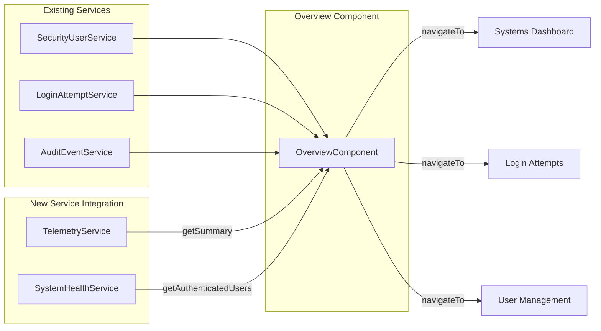

# Foundation Overview → Command Center Enhancement

Transform the Overview component from a basic security metrics dashboard into a comprehensive **Command Center** that showcases the full capabilities of the Foundation monitoring system.

---

## Current State

The Overview component currently displays:
- User greeting + date
- 8 KPI cards (users, logins, audit events)
- 7-day login chart
- Recent activity feed
- Most active modules widget

**Missing:** Fleet health monitoring, telemetry integration, security posture visualization, and navigation to the Systems Dashboard.

---

## Proposed Design

```
┌─────────────────────────────────────────────────────────────────────────────┐
│  HEADER: Greeting + Date + Quick Stats (Fleet Online/Total, Active Users)  │
├─────────────────────────────────────────────────────────────────────────────┤
│                                                                              │
│  ┌──────────────────────────────┐  ┌──────────────────────────────────────┐ │
│  │     FLEET HEALTH PANEL       │  │       SECURITY POSTURE PANEL         │ │
│  │  ┌────┐ ┌────┐ ┌────┐       │  │  ┌─────────────┐  ┌───────────────┐  │ │
│  │  │ ● │ │ ● │ │ ● │ ...    │  │  │ Security    │  │ IP Anomalies  │  │ │
│  │  │App1│ │App2│ │App3│       │  │  │ Score: 94   │  │    2 ⚠        │  │ │
│  │  └────┘ └────┘ └────┘       │  │  └─────────────┘  └───────────────┘  │ │
│  │  [CPU ████░░] [MEM ██████]  │  │  Failed Logins (24h): 12 ↓          │ │
│  │                              │  │  Success Rate: 96.2%                │ │
│  │  ► View Systems Dashboard    │  │  ► View Login Analytics             │ │
│  └──────────────────────────────┘  └──────────────────────────────────────┘ │
│                                                                              │
│  ┌─────────────────────────────────────────────────────────────────────────┐ │
│  │                      QUICK NAVIGATION GRID                               │ │
│  │  ┌────────┐  ┌────────┐  ┌────────┐  ┌────────┐  ┌────────┐  ┌────────┐ │ │
│  │  │ Users  │  │Tenants │  │Modules │  │ Audit  │  │ Logins │  │Systems │ │ │
│  │  │  👥    │  │  🏢    │  │  🧩    │  │  📋    │  │  🔐    │  │  📡    │ │ │
│  │  │  42    │  │  3     │  │  12    │  │  156   │  │  --    │  │ 5/5 ● │ │ │
│  │  └────────┘  └────────┘  └────────┘  └────────┘  └────────┘  └────────┘ │ │
│  └─────────────────────────────────────────────────────────────────────────┘ │
│                                                                              │
│  ┌──────────────────────────────────┐  ┌──────────────────────────────────┐ │
│  │     LOGIN ACTIVITY (7 DAYS)      │  │       RECENT ACTIVITY FEED       │ │
│  │  [existing chart - keep]         │  │  [enhanced with system events]   │ │
│  └──────────────────────────────────┘  └──────────────────────────────────┘ │
│                                                                              │
└─────────────────────────────────────────────────────────────────────────────┘
```

---

## Proposed Changes

### [MODIFY] [overview.component.ts](file:///g:/source/repos/Scheduler/Foundation/Foundation.Client/src/app/components/overview/overview.component.ts)

**Add Service Imports:**
```typescript
import { TelemetryService, TelemetrySummaryResponse } from '../../services/telemetry.service';
import { SystemHealthService, AuthenticatedUsersInfo } from '../../services/system-health.service';
```

**Add Properties:**
```typescript
// Fleet Health
fleetSummary: TelemetrySummaryResponse | null = null;
fleetOnlineCount: number = 0;
fleetTotalCount: number = 0;
avgCpuPercent: number = 0;
avgMemoryPercent: number = 0;

// Security Posture
securityScore: number = 100;
ipAnomalyCount: number = 0;
loginSuccessRate: number = 100;

// Active Sessions
activeSessionCount: number = 0;
```

**Modify `loadDashboardData()`:**
- Add `telemetryService.getSummary()` to forkJoin
- Add `systemHealthService.getAuthenticatedUsers()` to forkJoin
- Process fleet metrics in `processDashboardData()`

**Add Navigation Methods:**
```typescript
navigateToSystems(): void { this.router.navigate(['/systems-dashboard']); }
navigateTo(route: string): void { this.router.navigate([route]); }
```

---

### [MODIFY] [overview.component.html](file:///g:/source/repos/Scheduler/Foundation/Foundation.Client/src/app/components/overview/overview.component.html)

**Phase 1: Update Header Stats Bar** (lines 29-44)
- Replace static stats with: Fleet Online, Active Sessions, Security Score

**Phase 2: Add Fleet Health Panel** (insert after header, before current KPI cards)
- Application status indicators with colored dots (green/yellow/red)
- CPU and Memory mini-progress bars
- Link to Systems Dashboard

**Phase 3: Add Security Posture Panel**
- Security health score (computed from login success rate + anomaly count)
- IP anomaly counter with warning indicator
- Login failure trend (24h vs previous 24h)
- Link to Login Attempts with analytics modal trigger

**Phase 4: Replace KPI Cards Row with Navigation Grid**
- 6 visual cards: Users, Tenants, Modules, Audit, Logins, Systems
- Each with icon, count, and click-to-navigate

**Phase 5: Keep & Enhance Bottom Row**
- Keep existing Login Activity chart
- Keep Recent Activity feed (enhance with system events)

---

### [MODIFY] [overview.component.scss](file:///g:/source/repos/Scheduler/Foundation/Foundation.Client/src/app/components/overview/overview.component.scss)

**Add Styles For:**
- `.fleet-health-panel` - glassmorphic card with grid layout
- `.app-status-dot` - colored indicators (green/yellow/red pulse animation)
- `.security-posture-panel` - gradient card with score visualization
- `.security-score-ring` - SVG circular progress indicator
- `.nav-grid` - responsive 6-column grid
- `.nav-card` - premium hover effects matching Foundation patterns

---

## Data Flow



---

## API Endpoints Used (No Backend Changes)

| Service | Method | Purpose |
|---------|--------|---------|
| TelemetryService | `getSummary()` | Fleet overview data |
| SystemHealthService | `getAuthenticatedUsers()` | Active session count |
| SecurityUserService | `GetSecurityUserList()` | User counts (existing) |
| LoginAttemptService | `GetLoginAttemptList()` | Login metrics (existing) |
| AuditEventService | `GetAuditEventList()` | Audit metrics (existing) |

---

## Verification Plan

### Build Verification
```bash
cd Foundation/Foundation.Client
ng build
```

### Manual Testing
1. Navigate to Overview (`/`)
2. Verify Fleet Health Panel shows application status dots
3. Verify Security Posture shows calculated score
4. Click navigation cards → verify correct routing
5. Verify responsive layout at 1920px, 1366px, and 768px widths

---

## Implementation Phases

| Phase | Scope | Estimated Effort |
|-------|-------|------------------|
| 1 | Fleet Health Panel | ~30 min |
| 2 | Security Posture Panel | ~20 min |
| 3 | Navigation Grid | ~20 min |
| 4 | Styling & Polish | ~15 min |
| 5 | Testing & Verification | ~15 min |

**Total Estimated Time:** ~1.5-2 hours
