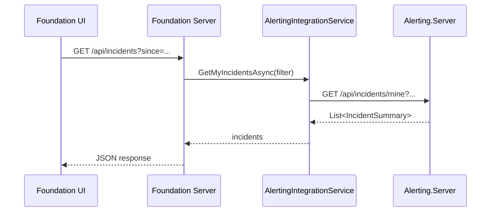

# Foundation Incidents Report Screen

## Goal
Create a new screen in Foundation Admin to display incidents from the Alerting system. This uses the existing `IAlertingIntegrationService.GetMyIncidentsAsync()` method to fetch incidents raised by Foundation.

---

## Proposed Changes

### Backend
#### [NEW] [IncidentsController.cs](file:///g:/source/repos/Scheduler/Foundation/Foundation.Server/Controllers/IncidentsController.cs)

Simple API proxy controller that calls `IAlertingIntegrationService`:
- `GET /api/incidents` → Returns list of incidents with optional filters (since, status, severity, limit)
- Handles cases where Alerting is not configured (returns empty list with message)

---

### Frontend

#### [NEW] [incidents-report/](file:///g:/source/repos/Scheduler/Foundation/Foundation.Client/src/app/components/incidents-report/)

New component directory with:
- `incidents-report.component.ts` - Main component with premium styling
- `incidents-report.component.html` - Template with hero header and table
- `incidents-report.component.scss` - Styles matching existing dashboards

**Features:**
- Premium hero header with gradient (red/orange tones for alerting)
- Filter controls (time range, status, severity)
- Incident table with severity badges, status pills, timestamps
- Link to Alerting system for detailed view
- Auto-refresh toggle

---

#### [NEW] [incidents.service.ts](file:///g:/source/repos/Scheduler/Foundation/Foundation.Client/src/app/services/incidents.service.ts)

Angular service to call the backend:
```typescript
getIncidents(filter?: IncidentFilter): Observable<IncidentSummary[]>
```

---

#### [MODIFY] [app-routing.module.ts](file:///g:/source/repos/Scheduler/Foundation/Foundation.Client/src/app/app-routing.module.ts)

Add route:
```typescript
{ path: 'incidents', component: IncidentsReportComponent, canActivate: [AuthGuard], title: 'Incidents' }
```

---

#### [MODIFY] [app.module.ts](file:///g:/source/repos/Scheduler/Foundation/Foundation.Client/src/app/app.module.ts)

Register component and service.

---

#### [MODIFY] [sidebar.component.ts](file:///g:/source/repos/Scheduler/Foundation/Foundation.Client/src/app/components/sidebar/sidebar.component.ts)

Add "Incidents" menu item under Operations section.

---

## Data Flow



---

## Verification Plan

### Build Verification
```powershell
dotnet build --no-restore Foundation/Foundation.Server
cd Foundation/Foundation.Client && npm run build
```

### Manual Testing
1. Ensure Alerting is running and Foundation is registered
2. Navigate to `/incidents` in Foundation
3. Verify incidents display with correct formatting
4. Test filter controls
