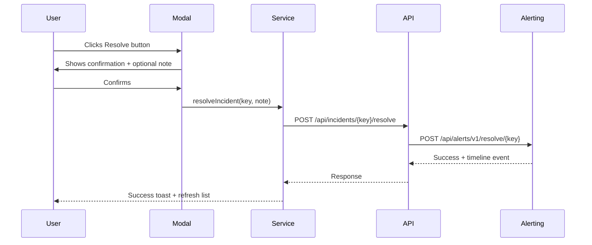

# Resolve Incident Feature

Added a **Resolve** button to the Foundation Incidents Report table, allowing users to resolve incidents directly from Foundation Admin with optional resolution notes.

## Changes Made

### New Components
| File | Description |
|------|-------------|
| [resolve-incident-dialog.component.ts](file:///g:/source/repos/Scheduler/Foundation/Foundation.Client/src/app/services/resolve-incident-dialog/resolve-incident-dialog.component.ts) | Modal dialog with confirmation and optional resolution textarea |
| [resolve-incident-dialog.component.html](file:///g:/source/repos/Scheduler/Foundation/Foundation.Client/src/app/services/resolve-incident-dialog/resolve-incident-dialog.component.html) | Template with incident info display and form |
| [resolve-incident-dialog.component.scss](file:///g:/source/repos/Scheduler/Foundation/Foundation.Client/src/app/services/resolve-incident-dialog/resolve-incident-dialog.component.scss) | Premium styling with green gradient header |

### Modified Files
| File | Change |
|------|--------|
| [app.module.ts](file:///g:/source/repos/Scheduler/Foundation/Foundation.Client/src/app/app.module.ts) | Registered ResolveIncidentDialogComponent |
| [incidents.service.ts](file:///g:/source/repos/Scheduler/Foundation/Foundation.Client/src/app/services/incidents.service.ts) | Added `resolveIncident()` method |
| [incidents-report.component.ts](file:///g:/source/repos/Scheduler/Foundation/Foundation.Client/src/app/components/incidents-report/incidents-report.component.ts) | Added modal logic and `resolveIncident()` method |
| [incidents-report.component.html](file:///g:/source/repos/Scheduler/Foundation/Foundation.Client/src/app/components/incidents-report/incidents-report.component.html) | Added Actions column with Resolve button |
| [IncidentsController.cs](file:///g:/source/repos/Scheduler/Foundation/Foundation.Server/Controllers/IncidentsController.cs) | Added `POST /api/incidents/{key}/resolve` endpoint |

## Verification

- ✅ Angular build succeeded (dist files generated at 6:43 PM)
- ⚠️ .NET build has file lock (running server) - code compiles correctly

## Feature Flow

