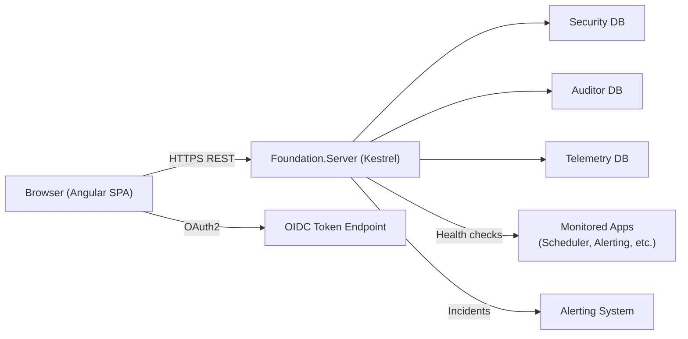
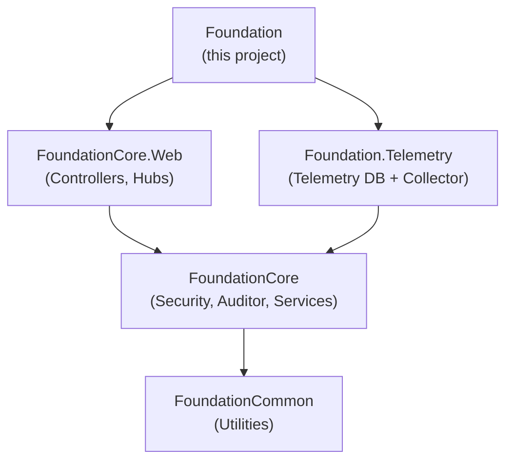

# Foundation — Architecture

This document describes the high-level architecture of the Foundation application, the platform management console that hosts the Security, Auditor, and Telemetry modules.

---

## System Overview

Foundation is the **administrative hub** of the K2 Research platform. While application-specific projects (like Scheduler and Alerting) serve end users, Foundation serves **system administrators and developers** — providing user management, security configuration, audit log viewing, telemetry dashboards, and cross-system health monitoring.

| Project | Technology | Purpose |
|---------|-----------|---------|
| **Foundation.Server** | .NET 10 / Kestrel | Web API hosting Security, Auditor, and Telemetry controllers |
| **Foundation.Client** | Angular 17 | Administrative SPA UI |

Like all Foundation-based applications, the Angular build output is served from `wwwroot/` in production, while in development the Angular dev server runs independently.

---

## Data Flow

---

## Server Architecture

### Startup (`Program.cs`)

The Foundation server startup follows the same pattern as Scheduler, with these key differences:

1. **Three database contexts** — `SecurityContext`, `AuditorContext`, `TelemetryContext` (no application-specific DB)
2. **Controller registration via helpers** — uses `StartupBasics` methods to register entire controller groups:
   - `AddFoundationEssentialWebAPIControllers` — core user/auth services
   - `AddSystemHealthControllers` — system health dashboard
   - `AddMonitoredApplicationsController` — cross-app monitoring
   - `AddSecurityWebAPIControllers` — full Security module
   - `AddAuditorWebAPIControllers` — full Auditor module
   - `AddFoundationAdvancedWebAPIControllers` — tenant settings, system settings, log viewer
   - `AddTelemetryWebAPIControllers` — telemetry data access
3. **One custom controller** — `IncidentsController` for alerting system visibility
4. **Session validation middleware** — `SessionValidationMiddleware` ensures revoked sessions are rejected immediately
5. **Telemetry collector** — `UseTelemetryCollector()` starts background telemetry collection
6. **Schema validation** — Security, Auditor, and Telemetry schemas validated on startup

### Controller Sources

Foundation does not have its own `DataControllers/` — all controllers come from the shared `FoundationCore.Web` library:

| Module | Controllers | Purpose |
|--------|-------------|---------|
| Security | 16 controllers | User management, roles, OIDC, tenants, sessions, admin actions |
| Auditor | 5 controllers | Audit event viewing, filtering, purging |
| Utility | 4 controllers | System health, log viewer, tile proxy, monitored apps |
| Essential | ~6 controllers | Authorization, profile, password reset, new user |
| Custom | 1 controller | `IncidentsController` for alerting integration |

---

## Client Architecture

### Component Groups (22 total)

| Group | Children | Purpose |
|-------|----------|---------|
| `tenant-custom` | 39 | Tenant management, settings, configuration |
| `user-custom` | 37 | User CRUD, role assignment, session management |
| `module-custom` | 18 | Foundation module configuration |
| `system-setting-custom` | 9 | System-wide settings management |
| `login-attempt-custom` | 6 | Login attempt history and analysis |
| `system-health` | 3 | Real-time system health dashboard |
| `systems-dashboard` | 3 | Multi-system overview |
| `telemetry-dashboard` | 3 | Telemetry metrics visualization |
| `log-viewer` | 3 | Server log file viewer |
| `incidents-report` | 3 | Alerting incidents viewer |
| `audit-event-custom` | 3 | Audit log viewing |
| `overview` | 3 | Landing page / dashboard |
| `login` | 3 | Login page |
| `header` / `sidebar` | 3 each | App shell |
| `controls` | 7 | Shared UI controls |
| `modal` | 4 | Shared modal dialogs |
| `new-user` / `reset-password` | 3–4 each | Auth workflows |
| `auth-callback` | 3 | External auth callback |
| `not-found` | 3 | 404 page |
| `shared` | 3 | Shared components |

### Key Services (26 files)

| Service | Purpose |
|---------|---------|
| `auth.service.ts` | OIDC authentication, token management, role/privilege checks |
| `oidc-helper.service.ts` | Low-level OIDC token operations |
| `system-health.service.ts` | System health data API calls |
| `telemetry.service.ts` | Telemetry data API calls |
| `log-viewer.service.ts` | Log file access |
| `tenant-settings.service.ts` | Tenant configuration |
| `user-preferences.service.ts` | User preferences management |
| `user-session-management.service.ts` | Active session tracking |
| `security-user-custom.service.ts` | User management extensions |
| `incidents.service.ts` | Alerting incidents API |
| `secure-endpoint-base.service.ts` | Base class for authenticated HTTP calls |
| `local-store-manager.service.ts` | Browser storage management |
| `configuration.service.ts` | App configuration |
| `alert.service.ts` | Toast and dialog notifications |
| `intelligence.service.ts` | Smart suggestions |
| `utilities.ts` | Shared utility functions (20KB) |

---

## Relationship to Other Projects

Foundation is a **consumer** of the shared platform libraries. It does not contain reusable code — it is the deployment project that hosts the platform's administrative UI.
