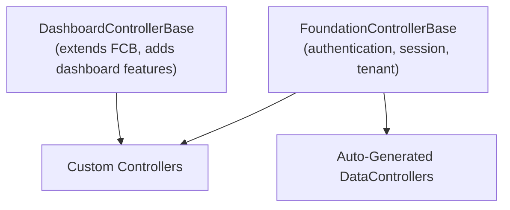

# FoundationCore.Web — Architecture

FoundationCore.Web is a .NET 10 class library that provides the web layer of the Foundation platform: base controllers, auto-generated data controllers, SignalR hubs, middleware, and web-facing services.

---

## Module Structure

```
FoundationCore.Web/
├── Controllers/           ← Custom controllers (27 files)
│   ├── Security/          ← 16 Security module controllers
│   ├── Auditor/           ← 5 Auditor module controllers
│   └── Utility/           ← 4 Utility controllers
│
├── DataControllers/       ← Auto-generated CRUD controllers (44 files)
├── HubConfig/             ← SignalR hub implementations (2 files)
├── Middleware/             ← ASP.NET Core middleware (1 file)
├── Services/              ← Web-facing services (9 files)
│   └── Alerting/          ← Alerting integration (6 files)
├── Utility/               ← Startup helpers and extensions (5 files)
├── Attributes/            ← Custom attributes (1 file)
└── Resources/             ← Localization resources
```

---

## Controller Hierarchy

All Foundation controllers inherit from a two-level hierarchy:



### Base Classes

| Class | Purpose |
|-------|---------|
| `FoundationControllerBase` | Authentication header extraction, session context, tenant resolution, standard error handling |
| `DashboardControllerBase` | Extends `FoundationControllerBase` with dashboard-specific features |

---

## Custom Controllers (27 files)

### Security Controllers (16)

| Controller | Purpose |
|-----------|---------|
| `AuthorizationController` | OIDC token endpoint (password flow), login/logout |
| `SecurityUsersController` | User CRUD, search, filtering |
| `SecurityUsersController.AdminActions` | Admin-only user actions (lock, unlock, force password reset) |
| `SecurityUserSecurityRolesController` | User-role assignment management |
| `SecurityProfileController` | Current user profile access |
| `SecurityDepartmentsController` | Department management |
| `SecurityTeamsController` | Team management |
| `SecurityOrganizationsController` | Organization management |
| `SecurityAuditEventsController` | Security-specific audit events |
| `SessionsController` | Active session viewing and revocation |
| `TenantSettingsController` | Per-tenant settings management |
| `UserSettingsController` | Per-user settings |
| `UserFiltersController` | Saved filter management |
| `NewUserController` | Self-registration flow |
| `ResetPasswordController` | Password reset flow |
| `TwitterController` | Twitter OAuth callback |

### Auditor Controllers (5)

| Controller | Purpose |
|-----------|---------|
| `AuditEventsController` | Audit event listing with filtering |
| `AuditEventEntityStatesController` | Before/after entity state snapshots |
| `AuditEventErrorMessagesController` | Audit error message access |
| `AuditEventPurgeController` | Old audit data purging |
| `AuditPlanBsController` | Audit plan management |

### Utility Controllers (4)

| Controller | Purpose |
|-----------|---------|
| `SystemHealthController` | System health data (DB status, user counts, metrics) |
| `MonitoredApplicationsController` | Cross-application health check results |
| `LogViewerController` | Server log file access |
| `TileProxyController` | Tile layer proxy for map components |

---

## Auto-Generated Data Controllers (44)

> [!CAUTION]
> Files in `DataControllers/` are auto-generated. Do not edit manually.

These provide standard CRUD for Security and Auditor entities (users, roles, tenants, audit events, etc.). Same pattern as Scheduler's auto-generated controllers.

---

## SignalR Hubs (`HubConfig/`)

| Hub | Purpose |
|-----|---------|
| `Hub` | Base SignalR hub for real-time communication |
| `AlertHub` | Specialized hub for alert/notification broadcasting |

Used by the Alerting integration to push real-time incident updates to connected clients.

---

## Middleware (`Middleware/`)

| Middleware | Purpose |
|-----------|---------|
| `SessionValidationMiddleware` | Checks every request against the session store to ensure revoked sessions are rejected immediately. Used by Foundation.Server. |

---

## Services (`Services/`)

### Alerting Integration (6 files)

| File | Purpose |
|------|---------|
| `IAlertingIntegrationService` | Interface for alerting operations |
| `AlertingIntegrationService` | Implementation — registers with Alerting, sends incidents |
| `AlertingIntegrationExtensions` | `AddAlertingIntegration()` DI extension method |
| `AlertingIntegrationOptions` | Configuration model for the `Alerting` section |
| `AlertingIntegrationDtos` | Data transfer objects for alerting API calls |
| `AlertingWebhookControllerBase` | Base controller for receiving alerting webhooks |

### Other Services

| File | Purpose |
|------|---------|
| `LogErrorNotificationExtensions` | `InitializeFromConfiguration()` — sets up error notification batching |
| `MonitoredApplicationService` | Polls configured apps for health status |
| `TileManagementService` | Map tile caching and proxy management |

---

## Utility (`Utility/`)

| File | Purpose |
|------|---------|
| `StartupBasics` | Controller registration helpers: `AddSecurityWebAPIControllers()`, `AddAuditorWebAPIControllers()`, `AddFoundationEssentialWebAPIControllers()`, `AddSystemHealthControllers()`, etc. |
| `TelemetryStartupBasics` | `AddTelemetryWebAPIControllers()` |
| Other utility files | Kestrel binding, controller filtering extensions |

---

## How Applications Use FoundationCore.Web

Every Foundation app references this library:

```csharp
// Program.cs — register controller groups
Foundation.Web.Utility.StartupBasics.AddFoundationEssentialWebAPIControllers(controllers);
Foundation.Web.Utility.StartupBasics.AddSystemHealthControllers(controllers);
// ... pick the groups your app needs

// Register alerting
builder.Services.AddAlertingIntegration(builder.Configuration);

// Register with Alerting on startup
await Foundation.Web.Utility.StartupBasics.RegisterWithAlertingAsync(app, logger);
```
