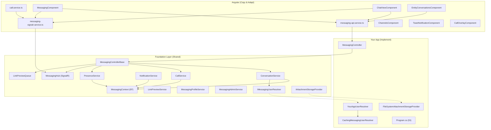

# Messaging Stack — Porting Guide

This guide walks through integrating the Foundation messaging stack into a new Foundation application, using Catalyst as the reference implementation.

> **Last updated:** March 24, 2026

---

## Architecture Overview



---

## Step 1: Database Schema

The messaging tables live under a configurable schema name (e.g. `Catalyst`, `Basecamp`).

### Option A: Database Generator
If your app uses a Foundation database generator, the messaging tables are already defined. Ensure the conversation-related tables exist in your target schema.

### Option B: Manual Script
Run the messaging table creation scripts against your database. The key tables are:

| Table | Purpose |
|-------|---------|
| `Conversation` | Conversation definitions (name, type, entity link) |
| `ConversationType` | Channel, DM, Group, Entity |
| `ConversationUser` | Members of each conversation (includes `role` field) |
| `ConversationMessage` | Messages (includes `scheduledDateTime` for deferred delivery) |
| `ConversationMessageAttachment` | File attachments |
| `ConversationMessageReaction` | Emoji reactions |
| `ConversationMessageUser` | Per-user read tracking |
| `ConversationMessageLinkPreview` | Auto-generated URL preview metadata |
| `ConversationMessageBookmark` | User-specific saved/bookmarked messages |
| `ConversationChannel` | Channels within conversations |
| `ConversationPin` | Pinned conversations per user |
| `Call` | Voice/video call records |
| `CallParticipant` | Per-user call participation |
| `CallEvent` | Call lifecycle audit log |
| `CallStatus` | Call status lookup (Initiated, Ringing, Active, Ended, etc.) |
| `UserPresence` | Online/offline status |
| `Notification` / `NotificationType` / `NotificationDistribution` | Push notifications |

### Schema Configuration
In your `Program.cs`, set the schema name **before** any service registration:

```csharp
Foundation.Messaging.Database.MessagingContext.SchemaName = "YourAppSchemaName";
```

---

## Step 2: Implement Required Interfaces

You must implement **two interfaces** that bridge the messaging system to your app's user model.

### 2a. `IMessagingUserResolver`

This interface resolves user info for the messaging system. Your app's users may live in a completely different table structure, so this bridges the gap.

```csharp
public interface IMessagingUserResolver
{
    Task<MessagingUser?> GetUserAsync(SecurityUser securityUser);
    Task<MessagingUser?> GetUserByIdAsync(int userId, Guid tenantGuid);
    Task<MessagingUser?> GetUserByAccountNameAsync(string accountName, Guid tenantGuid);
    Task<List<MessagingUser>> SearchUsersAsync(string searchTerm, Guid tenantGuid);
    Task<List<MessagingUser>> GetUsersByIdsAsync(IEnumerable<int> userIds, Guid tenantGuid);
}
```

**Create your implementation:**

```csharp
// Example: BasecampUserResolver.cs
public class BasecampUserResolver : IMessagingUserResolver
{
    public async Task<MessagingUser?> GetUserByIdAsync(int userId, Guid tenantGuid)
    {
        // Map your app's user model to MessagingUser
        var user = await db.Users.FirstOrDefaultAsync(u => u.Id == userId);
        if (user == null) return null;
        return new MessagingUser
        {
            id = user.Id,
            displayName = $"{user.FirstName} {user.LastName}",
            accountName = user.AccountName,
            objectGuid = user.ObjectGuid
        };
    }
    // ... implement remaining methods similarly
}
```

**Catalyst reference:** `Catalyst.Server/Services/CatalystUserResolver.cs`

### 2b. `CachingMessagingUserResolver` (Recommended)

Wrap your resolver in the caching decorator to avoid repeated DB lookups. You can copy `CachingMessagingUserResolver.cs` directly — it's generic and wraps any `IMessagingUserResolver` with an in-memory cache (10-minute TTL, three key patterns).

**Catalyst reference:** `Catalyst.Server/Services/CachingMessagingUserResolver.cs`

### 2c. Attachment Storage (Optional)

If you want file attachments, choose a storage provider:

| Provider | Use Case |
|----------|----------|
| `FileSystemAttachmentStorageProvider` | Default — stores files on disk, tenant-isolated |
| `IndexedDBAttachmentStorageProvider` | SQLite-backed — for environments without persistent disk |

Both already exist in Foundation. You just register one in DI.

---

## Step 3: Create Your MessagingController

Subclass Foundation's `MessagingControllerBase`. This gives you all 76 messaging endpoints for free.

```csharp
public partial class MessagingController : MessagingControllerBase
{
    public MessagingController(
        ConversationService conversationService,
        PresenceService presenceService,
        NotificationService notificationService,
        MessagingProfileService profileService,
        MessagingAdminService adminService,
        CallService callService,
        IAttachmentStorageProvider attachmentStorageProvider,
        IMessagingUserResolver userResolver,
        IHubContext<MessagingHub, IMessagingHub> messagingHub,
        LinkPreviewQueue linkPreviewQueue,
        IConfiguration configuration
    ) : base(
        "YourModuleName",           // Module name for audit trail
        "Messaging",                // Entity name
        conversationService,
        presenceService,
        notificationService,
        profileService,
        adminService,
        callService,
        attachmentStorageProvider,
        userResolver,
        messagingHub,
        linkPreviewQueue,
        configuration
    ) { }
}
```

**Catalyst reference:** `Catalyst.Server/Controllers/MessagingController.cs`

> [!TIP]
> The base controller includes:
> - Configurable attachment size limits via `Messaging:MaxAttachmentSizeMB` in `appSettings.json` (default: 100MB)
> - Blocked file extensions (`.exe`, `.bat`, `.ps1`, etc.)
> - Server-side HTML sanitization of all user-submitted message content
> - Per-user rate limiting on `SendMessage` (5/sec)

---

## Step 4: Register Services in `Program.cs`

Add the following to your service configuration:

```csharp
// ─── Messaging ─────────────────────────────────────────────
// 1. Set schema
Foundation.Messaging.Database.MessagingContext.SchemaName = "YourSchema";

// 2. Register user resolver (your implementation + caching wrapper)
builder.Services.AddScoped<YourAppUserResolver>();
builder.Services.AddScoped<IMessagingUserResolver>(sp =>
    new CachingMessagingUserResolver(
        sp.GetRequiredService<YourAppUserResolver>()));

// 3. Register Foundation services
builder.Services.AddScoped<ConversationService>();
builder.Services.AddScoped<PresenceService>();
builder.Services.AddScoped<NotificationService>();
builder.Services.AddScoped<CallService>();
builder.Services.AddScoped<MessagingProfileService>();
builder.Services.AddScoped<MessagingAdminService>();
builder.Services.AddScoped<LinkPreviewService>();

// 4. Register attachment storage
string storagePath = Path.Combine(AppDomain.CurrentDomain.BaseDirectory, "AttachmentStorage");
builder.Services.AddSingleton<IAttachmentStorageProvider>(
    new FileSystemAttachmentStorageProvider(storagePath));

// 5. Register link preview background processing
builder.Services.AddSingleton<LinkPreviewQueue>();
builder.Services.AddHostedService<LinkPreviewBackgroundService>();

// 6. Register scheduled message background processing (optional)
builder.Services.AddHostedService<ScheduledMessageBackgroundService>();

// 7. Add SignalR
builder.Services.AddSignalR();

// 8. Register your controller
controllers.Add(typeof(MessagingController));

// 9. Optionally register a custom notification distribution strategy
// builder.Services.AddScoped<INotificationDistributionStrategy, YourCustomStrategy>();
```

And in the pipeline configuration:

```csharp
// Map SignalR hub
app.MapHub<MessagingHub>("/hubs/messaging");
```

### Optional: Notification Type Seeding

```csharp
await NotificationTypeSeeder.EnsureNotificationTypesExistAsync();
```

### Optional: appSettings.json

```json
{
  "Messaging": {
    "MaxAttachmentSizeMB": 100
  }
}
```

---

## Step 5: Angular Front-End

### 5a. Copy These Services

| File | Purpose |
|------|---------|
| `messaging-api.service.ts` | All REST API calls + TypeScript interfaces |
| `messaging-signalr.service.ts` | SignalR connection, event subscriptions, call signaling relay |
| `toast-notification.service.ts` | Desktop notification toasts |
| `call.service.ts` | WebRTC call lifecycle, peer connection management |

> [!IMPORTANT]
> Update the `baseUrl` in `messaging-api.service.ts` to match your app's API endpoint pattern.

### 5b. Copy These Components

| Component | Files | Purpose |
|-----------|-------|---------|
| **MessagingComponent** | `components/messaging/` (3 files) | Main messaging panel — conversation list, search, presence, overflow menu |
| **ChatViewComponent** | `components/chat-view/` (3 files) | Full chat experience — messages (virtual scroll), threads, reactions, attachments, bookmarks, link previews, channels |
| **ThreadPanelComponent** | `components/chat-view/thread-panel/` (3 files) | Slide-in thread view for threaded replies |
| **ChannelsComponent** | `components/channels/` (3 files) | Channel browser/manager |
| **MessagingPageComponent** | `components/messaging-page/` (2 files) | Fullscreen wrapper route |
| **EntityConversationsComponent** | `components/entity-conversations/` (3 files) | Reusable entity-linked conversations tab |
| **EntityDiscussionComponent** | `components/entity-discussion/` (3 files) | Compact inline discussion panel |
| **ToastNotificationComponent** | `components/toast-notification/` (3 files) | Notification overlay |
| **CallOverlayComponent** | `components/call-overlay/` (3 files) | Voice/video call UI with WebRTC |
| **TiptapEditorComponent** | `components/tiptap-editor/` (3 files) | Rich text message composer |

### 5c. Copy These Pipes

| Pipe | Purpose |
|------|---------|
| `message-format.pipe.ts` | Markdown-like formatting, @mentions, link detection |

### 5d. Copy Shared Styles

| File | Purpose |
|------|---------|
| `_messaging-common.scss` | Shared messaging SCSS partials (dark theme tokens, conversation info panel, typeahead styles) |

### 5e. Register in Your `app.module.ts`

```typescript
import { MessagingComponent } from './components/messaging/messaging.component';
import { MessagingPageComponent } from './components/messaging-page/messaging-page.component';
import { ChannelsComponent } from './components/channels/channels.component';
import { ChatViewComponent } from './components/chat-view/chat-view.component';
import { ThreadPanelComponent } from './components/chat-view/thread-panel/thread-panel.component';
import { ToastNotificationComponent } from './components/toast-notification/toast-notification.component';
import { EntityDiscussionComponent } from './components/entity-discussion/entity-discussion.component';
import { EntityConversationsComponent } from './components/entity-conversations/entity-conversations.component';
import { CallOverlayComponent } from './components/call-overlay/call-overlay.component';
import { TiptapEditorComponent } from './components/tiptap-editor/tiptap-editor.component';
import { MessageFormatPipe } from './pipes/message-format.pipe';

// Also import Angular CDK ScrollingModule for virtual scroll
import { ScrollingModule } from '@angular/cdk/scrolling';

declarations: [
  MessagingComponent,
  MessagingPageComponent,
  ChannelsComponent,
  ChatViewComponent,
  ThreadPanelComponent,
  ToastNotificationComponent,
  EntityDiscussionComponent,
  EntityConversationsComponent,
  CallOverlayComponent,
  TiptapEditorComponent,
  MessageFormatPipe
],
imports: [
  ScrollingModule,  // Required for CDK virtual scroll in message list
  // ... your other imports
]
```

### 5f. Add Routing (Optional)

```typescript
{ path: 'messaging', component: MessagingPageComponent }
```

### 5g. Add the Messaging Button to Your App Shell

```html
<!-- Sidebar or navbar -->
<button (click)="toggleMessaging()" class="messaging-trigger">
  <i class="fa-solid fa-comment-dots"></i>
  <span class="unread-count" *ngIf="unreadCount > 0">{{ unreadCount }}</span>
</button>

<!-- Messaging panel -->
<app-messaging [displayMode]="'panel'"></app-messaging>
```

### 5h. Entity Conversations (Drop-In)

To add conversations to any entity detail view:

```html
<app-entity-conversations
  entityName="YourEntity"
  [entityId]="entity?.id">
</app-entity-conversations>
```

---

## Step 6: Adapt to Your App

### Things to Customize

| Item | What to Change |
|------|----------------|
| **User resolver** | Map your app's user model to `MessagingUser` |
| **Auth service imports** | Update `AuthService` references to your app's auth service |
| **API base URL** | Update the endpoint path in `messaging-api.service.ts` |
| **Color scheme** | The SCSS uses CSS variables — adjust to match your app's theme |
| **Entity names** | Pass your own entity names (e.g. "Project", "Order") to `EntityConversationsComponent` |
| **Call providers** | Configure TURN/STUN server settings for WebRTC calling |

### Things That Work Out of the Box

- All messaging API endpoints (76)
- SignalR real-time messaging with exponential backoff reconnect
- Voice and video calling with WebRTC
- File attachments with thumbnails and blocked extension validation
- Message threading with unread tracking per thread
- Reactions (emoji) with toggle support
- @mentions with autocomplete and server-side notifications
- Read tracking and unread counts
- Presence (online/offline/away/DND/busy)
- Pin/mute conversations
- Bookmark messages
- Schedule messages for deferred delivery
- Forward messages to other conversations
- Link previews (async Open Graph unfurl)
- Search and filter
- Per-conversation avatar colors
- Entity-linked conversations
- Desktop toast notifications (HTML-stripped previews)
- User roles (Admin/Member) with promotion/demotion
- Admin panel (analytics, audit log, delivery logs, flagging, metrics)
- Server-side HTML sanitization (XSS prevention)
- Virtual scrolling for message lists (CDK)

---

## Checklist

```
[ ] Database tables exist in target schema (including Call*, LinkPreview, Bookmark tables)
[ ] MessagingContext.SchemaName set in Program.cs
[ ] IMessagingUserResolver implemented for your user model
[ ] CachingMessagingUserResolver wrapping your resolver
[ ] MessagingController subclassing MessagingControllerBase (with all 11 constructor params)
[ ] DI registrations in Program.cs (7 services + storage + SignalR + background services)
[ ] SignalR hub mapped (/hubs/messaging)
[ ] NotificationTypeSeeder called at startup
[ ] Angular services copied + baseUrl updated (4 service files)
[ ] Angular components copied + registered in module (10 components + 1 pipe)
[ ] ScrollingModule imported for CDK virtual scroll
[ ] _messaging-common.scss copied
[ ] Routing added for fullscreen messaging page
[ ] Messaging button/panel added to app shell
[ ] Auth service imports updated in Angular code
[ ] SCSS theme variables adjusted
[ ] TURN/STUN server configured (if using calls)
[ ] Build passes (server + client)
[ ] Test: create conversation, send message, receive in real-time
[ ] Test: file attachment upload + thumbnail render
[ ] Test: entity conversation from a detail view
[ ] Test: voice/video call between two users
[ ] Test: schedule a message and verify delayed delivery
```
