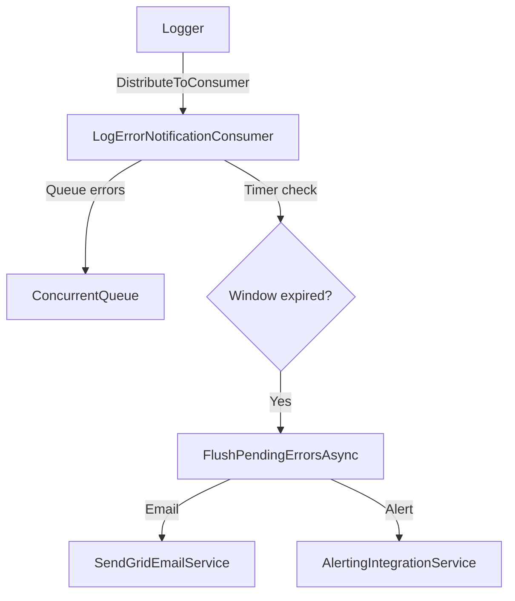

# Log Error Notification System - Walkthrough

## Summary

Implemented a reusable log error notification system that monitors for Exception/Error level log entries and sends batched notifications via email and/or the Alerting system.

## Files Created/Modified

| File | Purpose |
|------|---------|
| [LogErrorNotificationOptions.cs](file:///g:/source/repos/Scheduler/FoundationCore/Utility/LogErrorNotificationOptions.cs) | Configuration options |
| [LogErrorNotificationConsumer.cs](file:///g:/source/repos/Scheduler/FoundationCore/Utility/LogErrorNotificationConsumer.cs) | Core consumer with batching |
| [LogErrorNotificationExtensions.cs](file:///g:/source/repos/Scheduler/FoundationCore.Web/Services/LogErrorNotificationExtensions.cs) | DI extension method |
| [appsettings.json](file:///g:/source/repos/Scheduler/Scheduler/Scheduler.Server/appsettings.json) | Configuration section added |
| [Program.cs](file:///g:/source/repos/Scheduler/Scheduler/Scheduler.Server/Program.cs) | Service registration |

## Architecture



## Key Features

- **Immediate first notification:** First error triggers immediate email/alert
- **Batching window:** Subsequent errors queued for configurable period (default 10 min)
- **Dual channel:** Supports both email (SendGrid) and Alerting simultaneously
- **Thread-safe:** Uses `ConcurrentQueue` and locking for safe concurrent access
- **Graceful degradation:** Falls back if email/alerting not configured

## Configuration

```json
{
  "LogErrorNotification": {
    "SystemName": "Scheduler",
    "Environment": "Development",
    "EnableEmail": true,
    "NotificationEmails": ["admin@example.com"],
    "EmailFromAddress": "scheduler@example.com",
    "EmailFromName": "Scheduler System Monitor",
    "EnableAlerting": true,
    "AlertingSeverity": "High",
    "BatchWindowMinutes": 10,
    "MaxErrorsPerBatch": 100,
    "MinimumLevel": "Error"
  }
}
```

## Verification

- ✅ Build completed with 0 errors
- ⏳ Functional testing pending (requires email/alerting configuration)

## Next Steps for Testing

1. Add email addresses to `NotificationEmails` in `appsettings.json`
2. Configure `EmailFromAddress` with a valid SendGrid sender
3. Run Scheduler.Server
4. Trigger a test error (e.g., via a test endpoint)
5. Verify email arrives
