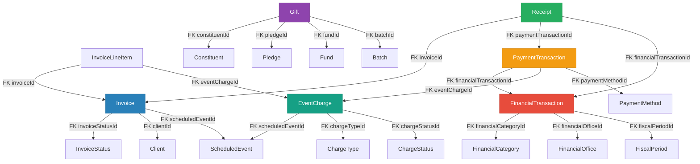
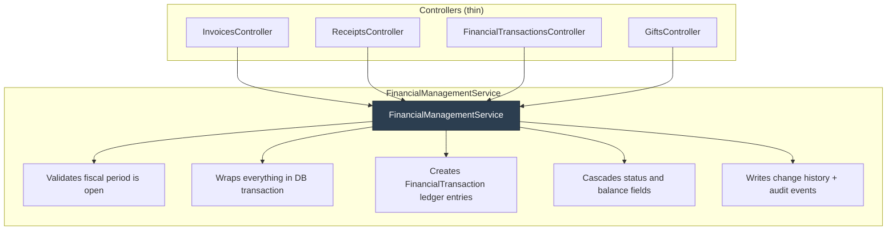

# Financial Architecture Assessment & Service Proposal

## The Current State

The financial subsystem grew organically from a QuickBooks export helper into a system that now manages invoicing, receipting, payment tracking, donations, and reporting. The result is a schema with **all the right tables** but **no central nervous system** connecting them.

### Entity Relationship Map



---

## The "Duct Tape" Diagnosis

### 1. Three Disconnected Money Pipelines

| Pipeline | Path | Problem |
|----------|------|---------|
| **Booking Revenue** | `EventCharge` → `InvoiceLineItem` → `Invoice` → (manual) `amountPaid` | Invoice `amountPaid` is manually set. Nothing enforces `amountPaid = Σ(Receipt.amount)`. No `FinancialTransaction` created when a charge is invoiced or paid. |
| **Payment Processing** | `PaymentTransaction` → `Receipt` | `PaymentTransaction` has an optional `financialTransactionId` but nothing creates one. Receipts can link to invoices OR payment transactions — no enforced pattern. |
| **Donations** | `Gift` → `Pledge.balanceAmount` | Gift records receipts via `receiptTypeId` + `receiptDate` (string/date) instead of linking to a `Receipt`. Pledge `balanceAmount` is manually set. |

> [!CAUTION]
> **None of these pipelines automatically creates a `FinancialTransaction` record.** The general ledger is a completely separate silo. If a user records an invoice payment, the FinancialTransaction table knows nothing about it unless someone manually enters a matching transaction.

### PHMC Import Evidence

The [SchedulerTools PettyHarbourDataLoader](file:///g:/source/repos/Scheduler/SchedulerTools/Program.cs#L1281-L2219) confirms this architecturally:

- **`LoadFinancialTransactions()`** (line 1637): Reads Excel rows → creates `FinancialTransaction` records with `amount`, `taxAmount`, `totalAmount`, `financialCategoryId`. **No FK to EventCharge, Invoice, or Receipt.** These are standalone ledger entries.
- **`LoadBookings()`** (line 1959): Creates `ScheduledEvent` + `EventCharge` records parsed from a completely different spreadsheet. The `chargeStatusId` is set by keyword-matching "paid" in the payment column text. **No Invoice, Receipt, or FinancialTransaction is created for these charges.**
- `FinancialTransaction.totalAmount` on line items like "Hall Rental - Doe" has **no provable link** to the `EventCharge.totalAmount` on the booking for "Doe". They were imported from different Excel files.
- `FiscalPeriod` records are created with `PeriodStatus = "Open"` but **no code anywhere checks or enforces period status** before writing financial data.

### 2. No Balance Enforcement

| Entity | Computed Field | How It Should Work | How It Actually Works |
|--------|---------------|-------------------|----------------------|
| `Invoice.amountPaid` | Sum of payments | `= Σ(linked Receipt.amount)` | Manually set; can go stale |
| `Pledge.balanceAmount` | Remaining balance | `= totalAmount - Σ(Gift.amount)` | Manually set; not transactional |
| `EventCharge.chargeStatusId` | Payment status | Cascaded from invoice/payment | Set independently |

### 3. No Accounting Identity

- No double-entry journal entries (Debits = Credits)
- `journalEntryType` on `FinancialTransaction` is free-text, not Debit/Credit enum
- `isRevenue` is a boolean — insufficient for refunds, deposits, accruals

### 4. Missing Cross-Entity Integrity

When a payment is recorded against an invoice, the following should all happen atomically:
1. ✅ Receipt created *(fixed today)*
2. ❌ Invoice `amountPaid` updated
3. ❌ Invoice status transitioned (Partially Paid → Paid)
4. ❌ `FinancialTransaction` created (revenue recognition)
5. ❌ EventCharge status cascaded
6. ❌ FiscalPeriod validated (is the period open?)

Currently **only step 1 happens**.

---

## Multi-Archetype Financial Operations

The `FinancialManagementService` must serve three distinct tenant types. Here's how the same service covers all three:

### Operations by Tenant Archetype

| Operation | Municipal (PHMC) | Small Business | Non-Profit |
|-----------|:---:|:---:|:---:|
| **Booking Revenue Cycle** | | | |
| `CreateInvoiceFromEvent()` | ✅ Hall rentals, permits | ✅ Service appointments | — |
| `RecordInvoicePayment()` | ✅ Rental payments | ✅ Client payments | — |
| `IssueRefund()` | ✅ Cancelled bookings, damage deposits | ✅ Service refunds | ✅ Gift reversals |
| `VoidInvoice()` | ✅ Admin error correction | ✅ Admin correction | — |
| **Donation Cycle** | | | |
| `RecordGift()` | — | — | ✅ Donations |
| `RecordPledgePayment()` | — | — | ✅ Pledge fulfillment |
| **General Operations** | | | |
| `RecordExpense()` | ✅ Supplies, utilities, contract work | ✅ Operating costs | ✅ Program expenses |
| `RecordDirectRevenue()` | ✅ Permit fees, ad-hoc revenue | ✅ Walk-in sales | ✅ Fundraiser proceeds |
| `ReconcileBalance()` | ✅ Month-end | ✅ Month-end | ✅ Month-end |
| `CloseFiscalPeriod()` | ✅ Council year-end | ✅ Tax year-end | ✅ Fiscal year-end |
| **Reporting** | | | |
| `GetLedgerStatement()` | ✅ Council financial reports | ✅ Profit/Loss | ✅ Donor reports |

### PHMC-Specific Scenario

A hall rental booking flows through:
```
ScheduledEvent (booking) → EventCharge (rental fee) → Invoice (bill) →  
  Receipt (payment received) → FinancialTransaction (revenue recognized)
```

Today: `EventCharge` exists in isolation. The coordinator manually enters a `FinancialTransaction` in a separate UI. If the numbers don't match, nobody knows.

With the service: `CreateInvoiceFromEvent()` atomically creates the Invoice + InvoiceLineItems linked to EventCharges + a `FinancialTransaction` of type "Accounts Receivable". When `RecordInvoicePayment()` is called, it creates the Receipt, updates `Invoice.amountPaid`, cascades `Invoice.invoiceStatusId`, creates a revenue `FinancialTransaction`, and updates `EventCharge.chargeStatusId` — all in one DB transaction.

---

## Proposed Architecture



### Core Service Methods

| Method | Atomically Does |
|--------|----------------|
| `CreateInvoiceFromEvent()` | Invoice + line items + FinancialTransaction (receivable) + EventCharge status → "Invoiced" |
| `RecordInvoicePayment()` | Receipt + update Invoice.amountPaid + cascade Invoice status + FinancialTransaction (revenue) + validate fiscal period |
| `VoidInvoice()` | Reversing FinancialTransaction + cascade Invoice/EventCharge status |
| `RecordGift()` | Gift + update Pledge.balanceAmount + FinancialTransaction (donation) + batch validation |
| `RecordExpense()` | FinancialTransaction (expense) + validate fiscal period + validate category |
| `RecordDirectRevenue()` | FinancialTransaction (revenue) for ad-hoc income not tied to invoices |
| `IssueRefund()` | Reversing FinancialTransaction + Receipt + adjust Invoice.amountPaid |
| `ReconcileBalance()` | Recalculates all derived fields (Invoice.amountPaid, Pledge.balanceAmount) from source records |
| `CloseFiscalPeriod()` | Validates all transactions balanced, sets PeriodStatus to "Closed", records closedDate/closedBy |

### What This Means for the Schema

> [!IMPORTANT]
> The existing database schema is **mostly sufficient**. The tables, FKs, and even `FiscalPeriod.periodStatusId` / `closedDate` / `closedBy` already exist. The missing piece is the **transactional orchestration layer**.

Minimal schema changes needed:
- `EventCharge.totalAmount` field already exists — just needs to be set on line 2198 of the import code
- `FiscalPeriod.periodStatusId` already links to `PeriodStatus` — just needs enforcement in the service

---

## Implementation Phases

### Phase 1: `FinancialManagementService` — Core Service
Create `Scheduler.Server/Services/FinancialManagementService.cs`. Implement the three most critical operations: `RecordInvoicePayment()`, `CreateInvoiceFromEvent()`, and `RecordExpense()`. Refactor controllers to call the service.

### Phase 2: Balance Enforcement
`Invoice.amountPaid` recalculated from `Receipts`. `Pledge.balanceAmount` recalculated from `Gifts`. `EventCharge.chargeStatusId` cascaded.

### Phase 3: Ledger Integration
Every invoice payment creates a revenue `FinancialTransaction`. Every gift creates a donation `FinancialTransaction`. Refunds/voids create reversing transactions.

### Phase 4: Fiscal Period Controls
Validate fiscal period is open before any financial write. Implement period close.

## Verification Plan

- Build verification after each phase
- Manual testing through UI for each operation
- Validate FinancialTransaction records created for all money movements
- Verify balance fields match computed values
