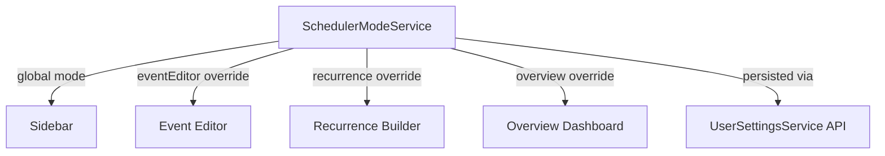

# Simple Mode — Implementation Walkthrough

## What Was Built

A **hierarchical Simple/Advanced mode toggle** for the Scheduler UI that hides power-user features from non-technical users while preserving full capability for advanced users.

## Architecture

**Key design**: Global toggle + per-component overrides. A user can stay in Simple mode globally but unlock Advanced for just the event editor if they grow into it.

## Files Changed

| File | Action | Summary |
|------|--------|---------|
| [scheduler-mode.service.ts](file:///g:/source/repos/Scheduler/Scheduler/Scheduler.Client/src/app/services/scheduler-mode.service.ts) | **NEW** | Hierarchical mode service — global `BehaviorSubject` + per-component override map, persisted via `UserSettingsService` |
| [sidebar.component.ts](file:///g:/source/repos/Scheduler/Scheduler/Scheduler.Client/src/app/components/sidebar/sidebar.component.ts) | MODIFY | Inject mode service, subscribe to `isSimpleMode` |
| [sidebar.component.html](file:///g:/source/repos/Scheduler/Scheduler/Scheduler.Client/src/app/components/sidebar/sidebar.component.html) | MODIFY | Hide Volunteers + Setup groups, add mode toggle pill widget |
| [event-add-edit-modal.component.ts](file:///g:/source/repos/Scheduler/Scheduler/Scheduler.Client/src/app/components/scheduler/event-add-edit-modal/event-add-edit-modal.component.ts) | MODIFY | Inject mode service, subscribe to `isSimpleMode` |
| [event-add-edit-modal.component.html](file:///g:/source/repos/Scheduler/Scheduler/Scheduler.Client/src/app/components/scheduler/event-add-edit-modal/event-add-edit-modal.component.html) | MODIFY | Hide 5 tabs + 10 fields in Details tab |
| [recurrence-builder.component.ts](file:///g:/source/repos/Scheduler/Scheduler/Scheduler.Client/src/app/components/scheduler/recurrence-builder/recurrence-builder.component.ts) | MODIFY | Add `@Input() simpleMode` |
| [recurrence-builder.component.html](file:///g:/source/repos/Scheduler/Scheduler/Scheduler.Client/src/app/components/scheduler/recurrence-builder/recurrence-builder.component.html) | MODIFY | Hide Monthly/Yearly, interval, count-based end |
| [overview.component.ts](file:///g:/source/repos/Scheduler/Scheduler/Scheduler.Client/src/app/components/overview/overview.component.ts) | MODIFY | Inject mode service, subscribe to `isSimpleMode` |
| [overview.component.html](file:///g:/source/repos/Scheduler/Scheduler/Scheduler.Client/src/app/components/overview/overview.component.html) | MODIFY | Hide Activity/Resources cards + 2 stats |

## Simple vs Advanced Comparison

### Sidebar
| Simple | Advanced |
|--------|----------|
| Overview, Schedule, Contacts, Finances | + Volunteers (2), Setup (8), Administration |
| Mode toggle widget at bottom | Mode toggle widget at bottom |

### Event Editor
| Simple (2 tabs) | Advanced (7 tabs) |
|-----------------|-------------------|
| Details: Name, Start/End, All-Day, Location, Contact, Description | + Status, Priority, Color, Target, Client, Office, Source, Calendars, Notes, Dynamic Attrs |
| Recurrence (simplified) | + Assignments, Advanced, Dependencies, Financials, Rental Agreement |

### Recurrence Builder
| Simple | Advanced |
|--------|----------|
| Daily, Weekly | + Monthly, Yearly |
| Day picker (weekly) | + Interval ("every N"), Count-based end, Exceptions |
| End: Never / On date | Full options |

### Overview Dashboard
| Simple | Advanced |
|--------|----------|
| Events Today, Running Now | + Active Resources, Unavailable |
| Today at a Glance, Week Forecast, Quick Access | + Activity (Targets), Resources |

## Build Verification

- **TS compilation**: ✅ No errors from Simple Mode changes
- **Pre-existing warnings**: NG8102 warnings in unrelated components (ShiftPattern, SystemHealth, Volunteer) — not caused by this change

## Manual Testing Checklist

> [!TIP]
> Run the dev server with `cd Scheduler\Scheduler.Client && npx ng serve` and test these scenarios:

- [ ] New user defaults to Simple mode (sidebar shows 4 items, event editor shows 2 tabs)
- [ ] Toggle to Advanced via sidebar widget → all items/tabs appear
- [ ] Toggle back to Simple → features hide cleanly
- [ ] Refresh page → mode persists
- [ ] Create event in Advanced with all fields → switch to Simple → edit event → save → switch back → fields intact
- [ ] Recurrence in Simple: only Daily/Weekly, no interval/count
- [ ] Overview in Simple: no Activity/Resources cards
