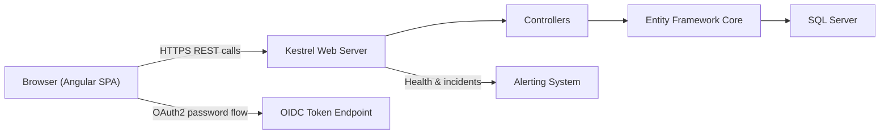
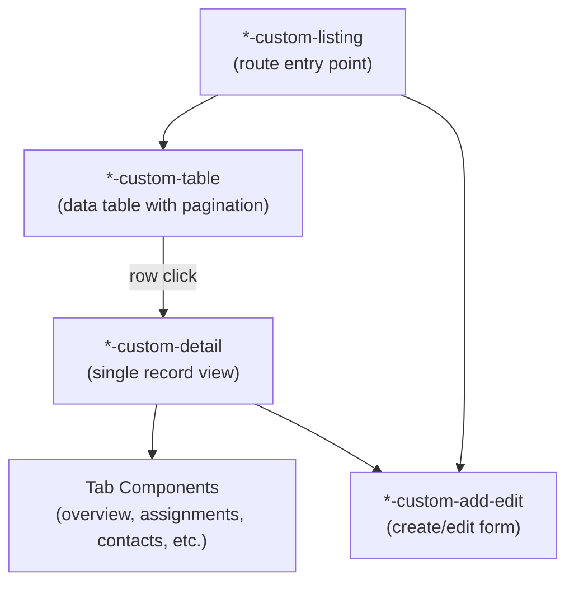

# Scheduler — Architecture

This document describes the high-level architecture of the Scheduler system, covering both the server and client projects and how they relate to the Foundation platform.

---

## System Overview

The Scheduler is a web application built on the **Foundation platform** — a code-generation-based framework for database-centric C# / Angular applications.

It consists of two deployable projects:

| Project | Technology | Purpose |
|---------|-----------|---------|
| **Scheduler.Server** | .NET 10 / Kestrel | Web API, authentication (OIDC), business logic |
| **Scheduler.Client** | Angular 17 | Single-page application UI |

In production, the Angular build output is served as static files from the .NET server's `wwwroot/`.  During development, the Angular dev server runs independently on port 4300 and the .NET server runs on ports 10100 (HTTP) / 10101 (HTTPS).


## Data Flow



All REST calls from the client carry a Bearer token obtained from the OIDC `/connect/token` endpoint.  The server validates the token on every request via OpenIddict middleware.


---

## Foundation Platform Dependencies

The server sits on top of three Foundation layers:

| Layer | Project Reference | Role |
|-------|------------------|------|
| **FoundationCommon** | (transitive) | Cross-platform utilities, thread-safe collections, caching, logging |
| **FoundationCore** | (transitive) | Security & Auditor module definitions, EF base classes, schema validation |
| **FoundationCore.Web** | Direct reference | Base controllers, SignalR alert hub, Kestrel binding extensions |

Additionally:

| Reference | Role |
|-----------|------|
| **SchedulerDatabase** | EF Core entity model (`SchedulerContext`) generated from the database |
| **SchedulerServices** | Shared Scheduler business logic (e.g., `DonorJourneyCalculator`) |


---

## Server Architecture

### Startup (`Program.cs`)

The server startup follows this sequence:

1. **Configuration & logging** — reads `appsettings.json`, initializes the Foundation `Logger`
2. **Foundation services** — Auditor, Security, OIDC (via `BuildFoundationServices`)
3. **Custom service registration** — `RecurrenceExpansionService` (scoped), `SchedulerMetricsProvider` (singleton), `DonorJourneyCalculator` (scoped)
4. **Database contexts** — three EF Core contexts: `SchedulerContext`, `SecurityContext`, `AuditorContext`, all pointing at SQL Server with a `UtcDateTimeInterceptor`
5. **Controller registration** — explicitly listed controllers (Foundation does not discover by convention)
6. **Middleware pipeline** — Session → Static Files → Swagger (dev only) → HTTPS Redirect → Auth → CORS → CSP headers → Controller routing → SPA fallback
7. **Schema validation** — all three database schemas are validated against their EF models on startup
8. **Alerting registration** — self-registers with the Alerting system if configured


### Two-Tier Controller Pattern

Controllers live in two distinct folders:

```
Scheduler.Server/
├── Controllers/          ← Custom business logic (9 controllers)
└── DataControllers/      ← Auto-generated CRUD (138 controllers)
```

#### Auto-Generated Controllers (`DataControllers/`)

> [!CAUTION]
> Files in `DataControllers/` are **auto-generated** by the Foundation Code Generation tools. Do **not** manually edit them — changes will be overwritten the next time code generation runs.

Each auto-generated controller provides:
- Paginated, filterable `GET` (list with all field filters + cross-field text search)
- `GET` row count (same filters, returns count only)
- `GET` list data (minimal id + name format for dropdowns)
- Standard CRUD operations with Foundation security, auditing, and multi-tenancy baked in

#### Custom Controllers (`Controllers/`)

These contain business logic beyond simple CRUD:

| Controller | Purpose |
|-----------|---------|
| `ScheduledEventsController` | Extended event queries with recurrence expansion |
| `ScheduledEventsCalendarController` | Calendar-specific event queries (date-range windowed) |
| `EventResourceAssignmentsController` | Assignment management with conflict awareness |
| `ContactsController` | Contact management with relationship handling |
| `CrewsController` | Crew management with member composition |
| `GiftsController` | Gift/donation tracking |
| `RateSheetsController` | Rate resolution with hierarchical override logic |
| `DataController` | Excel/CSV data export |
| `TenantProfileController` | Tenant profile access with auto-creation |


### Custom Services (`Services/`)

| Service | Lifetime | Purpose |
|---------|----------|---------|
| `RecurrenceExpansionService` | Scoped | Expands `RecurrenceRule` data into virtual `ScheduledEvent` instances within a date range. Supports daily, weekly, monthly (by day-of-month or Nth weekday), and yearly patterns. |
| `SchedulerMetricsProvider` | Singleton | Provides application-level metrics for the System Health dashboard |


### Database Contexts

Three SQL Server databases are used:

| Database | Context | Purpose |
|----------|---------|---------|
| Scheduler | `SchedulerContext` | All application-specific tables (events, resources, offices, etc.) |
| Security | `SecurityContext` | Foundation user management, roles, OIDC clients |
| Auditor | `AuditorContext` | Foundation access auditing |

All DateTime values pass through a `UtcDateTimeInterceptor` to enforce UTC storage.


---

## Client Architecture

### Module Structure

The Angular app uses an NgModule-based architecture (not standalone components):

- `app.module.ts` — root module, registers all components, services, and third-party modules
- `app-routing.module.ts` — all routes in a single file
- `app.component.ts` — shell component handling auth state, toast notifications, and body class toggling

### Key Third-Party Libraries

| Library | Usage |
|---------|-------|
| `@ng-bootstrap/ng-bootstrap` | Modal dialogs, dropdowns, pagination |
| `ngx-toasta` | Toast notifications |
| `bootstrap` | CSS framework + JS for modals |
| `alertifyjs` | Alert/confirm/prompt dialogs |


### Folder Layout

```
src/app/
├── components/                    ← All UI components (22 groups)
│   ├── scheduler/                 ← Core scheduling UI
│   │   ├── scheduler-calendar/    ← Main calendar view
│   │   ├── event-add-edit-modal/  ← Event create/edit dialog
│   │   ├── recurrence-builder/    ← Recurrence rule editor
│   │   ├── template-manager/      ← Event template list
│   │   └── template-add-edit-modal/
│   ├── resource-custom/           ← Resource management (18 sub-components)
│   ├── office-custom/             ← Office management (13 sub-components)
│   ├── contact-custom/            ← Contact management (12 sub-components)
│   ├── crew-custom/               ← Crew management (8 sub-components)
│   ├── client-custom/             ← Client management (9 sub-components)
│   ├── calendar-custom/           ← Calendar entity management (6 sub-components)
│   ├── rate-sheet-custom/         ← Rate sheet management
│   ├── scheduling-target-custom/  ← Scheduling target management
│   ├── overview/                  ← Dashboard with role-based tabs
│   └── ...                        ← login, header, sidebar, system-health, etc.
│
├── services/                      ← Custom application services (25 files)
├── models/                        ← TypeScript models (6 files)
├── pipes/                         ← Custom pipes (5)
├── directives/                    ← Custom directives (5)
├── guards/                        ← Route guards
├── utility-services/              ← Utility services (4)
│
├── scheduler-data-services/       ← ⚠️ Auto-generated data services
└── scheduler-data-components/     ← ⚠️ Auto-generated CRUD components
```

> [!CAUTION]
> The `scheduler-data-services/` and `scheduler-data-components/` folders are **auto-generated**. Do not manually edit files in these folders.


### Entity Component Pattern

Each entity (Resource, Office, Contact, etc.) follows a consistent component hierarchy:



This pattern is consistent across all entity types.  When adding a new entity, follow this exact structure.


### Key Custom Services

| Service | Purpose |
|---------|---------|
| `auth.service.ts` | OIDC authentication, token management, role checks |
| `conflict-detection.service.ts` | Client-side scheduling conflict detection (resource & crew overlaps) |
| `scheduler-helper.service.ts` | Active office count tracking, rate resolution API calls |
| `intelligence.service.ts` | Smart suggestions and auto-population |
| `cache-manager.service.ts` | Client-side data caching |
| `current-user.service.ts` | Current user state and preferences |
| `configuration.service.ts` | Application configuration |
| `alert.service.ts` | Toast and dialog notifications |
| `system-health.service.ts` | System health dashboard data |


### Auto-Generated Data Services

Each database entity has a corresponding auto-generated service in `scheduler-data-services/` that provides:

- Typed HTTP methods for all CRUD operations
- Pagination and filtering parameters matching the server controller signatures
- Authentication header injection via `SecureEndpointBase`
- Error handling with automatic token refresh retry

These services are consumed by both auto-generated and custom components.


---

## Authentication & Authorization

Authentication uses **OpenIddict** with an OAuth2 password flow:

1. Client sends credentials to `/connect/token`
2. Server issues a JWT Bearer token
3. Client includes the token in the `Authorization` header on all API calls
4. Server middleware validates the token and populates the user identity

Foundation security provides:
- **Role-based access** with 6 privilege levels (No Access, Anonymous Read Only, Read Only, Read/Write, Administrative, Custom)
- **Table-level security** with numeric read/write permission levels (0–255)
- **Multi-tenancy** — data isolation by tenant
- **Data visibility** — additional grouping-based data access control


---

## Configuration

### `appsettings.json` Key Sections

| Section | Purpose |
|---------|---------|
| `Settings` | Foundation feature toggles (multi-tenancy, auditor mode, data visibility) |
| `ConnectionStrings` | Three database connection strings (Scheduler, Security, Auditor) |
| `Kestrel` | HTTP/HTTPS endpoints and request size limits |
| `OIDC` | Certificate paths for JWT signing |
| `Logging` | Log level configuration |
| `ServiceAccount` | Background service account credentials |
| `LogErrorNotification` | Error notification via email and Alerting system |
| `Alerting` | Integration with the external Alerting system |
| `MonitoredApplications` | Self-monitoring configuration |


### Environment Overrides

Copy `appsettings.development.json.example` to `appsettings.development.json` and customize for your local environment.  This file is git-ignored.
