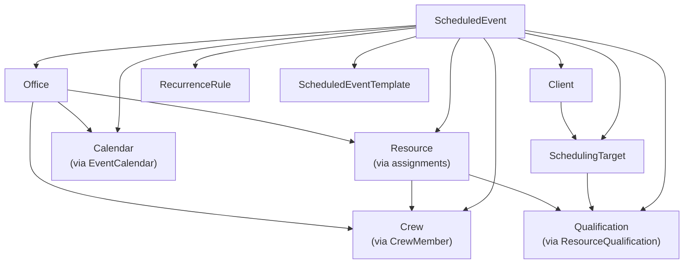

# Scheduler — Key Concepts

This document defines the core domain entities, their relationships, and the key business workflows that drive the Scheduler system.

---

## Core Entities

### ScheduledEvent

The central entity.  Represents a single scheduled occurrence (appointment, session, visit, etc.).

| Field | Purpose |
|-------|---------|
| `startDateTime` / `endDateTime` | Time window (always UTC) |
| `resourceId` | Assigned resource (person doing the work) |
| `crewId` | Assigned crew (group of resources) |
| `officeId` | Originating office |
| `clientId` | Client associated with the event |
| `schedulingTargetId` | Location/site where the event occurs |
| `calendarId` | Calendar the event belongs to |
| `eventStatusId` | Current status (e.g., Scheduled, Confirmed, Completed, Cancelled) |
| `priorityId` | Priority level |
| `recurrenceRuleId` | Links to a recurrence pattern (if recurring) |
| `parentScheduledEventId` | For recurrence exceptions — points back to the master event |
| `bookingSourceTypeId` | How the event was booked |

An event may also have child records for:
- **EventResourceAssignments** — additional resource assignments with roles
- **EventCharges** — billable charges
- **ScheduledEventDependencies** — predecessor/successor links
- **ScheduledEventQualificationRequirements** — qualifications required for the event

---

### Resource

A person or asset that can be assigned to events.

- Has a `resourceTypeId` for categorization
- Belongs to one or more **Offices** (via assignments)
- Can be a member of one or more **Crews**
- Has **Qualifications** (certifications, skills)
- Has **Availability** windows (`ResourceAvailability`)
- Has **Shift Patterns** (`ResourceShift` → `ShiftPattern` → `ShiftPatternDay`)
- Has **Contacts** (phone, email, address via `ResourceContact`)
- Can have **Rate Sheet overrides** for billing rates
- Can subscribe to **Notifications**

---

### Office

An organizational unit representing a physical or logical office location.

- Has `officeTypeId` for categorization
- Contains **Resources** (via assignments)
- Has its own **Contacts** (`OfficeContact`)
- Has associated **Calendars**
- Has associated **Crews**
- Can have **Rate Sheet overrides**

---

### Client

An external organization or individual that receives services.

- Has `clientTypeId` for classification
- Has **Contacts** (`ClientContact`)
- Has **SchedulingTargets** — specific locations/sites associated with this client
- Has event assignments

---

### SchedulingTarget

A specific location or site where events take place.  Always belongs to a **Client**.

- Has `schedulingTargetTypeId`
- Has **Addresses** (`SchedulingTargetAddress`)
- Has **Contacts** (`SchedulingTargetContact`)
- Has **QualificationRequirements** — qualifications needed for work at this target
- Can have **Rate Sheet overrides**

---

### Crew

A named group of **Resources** that can be assigned to events as a unit.

- Has **CrewMembers** linking to individual resources
- Can be assigned to events via `crewId`

---

### Calendar

A named calendar that events can be associated with.

- Used for organizing events into logical groups
- Events link to calendars via `EventCalendar` join records

---

### Contact / Constituent

**Contact** is a person record (name, contact methods, addresses).  Contacts can be linked to Resources, Offices, Clients, and SchedulingTargets via join tables.

**Constituent** is a broader entity used in the fundraising/donation domain, with journey stage tracking.

---

### RateSheet

Defines billing rates.

- Has a `rateTypeId` (e.g., hourly, daily, flat fee)
- Rates follow a **hierarchical override model** (see Rate Resolution below)

---

### Qualification

A named skill, certification, or credential.

- Can be assigned to **Resources** (`ResourceQualification`)
- Can be required by **AssignmentRoles**, **SchedulingTargets**, **ScheduledEvents**, and **EventTemplates**

---

### ScheduledEventTemplate

A pre-defined template for creating events with default values.

- Has template-level charges (`ScheduledEventTemplateCharge`)
- Has template-level qualification requirements (`ScheduledEventTemplateQualificationRequirement`)
- Used to quickly populate event fields during event creation

---

## Entity Relationships

---

## Key Workflows

### Event Scheduling Workflow

1. **Create an event** — select a date/time, optionally apply a template
2. **Assign resources** — pick a resource and/or crew; the system runs **conflict detection**
3. **Set the scheduling target** — location where the work happens (auto-populates the client and office if linked)
4. **Add charges** — billable items for the event
5. **Set recurrence** (optional) — define a repeating pattern
6. **Save** — the event is persisted; recurrence instances are expanded on the fly when the calendar view loads

### Recurrence System

Recurring events are stored as a single **master event** with an attached **RecurrenceRule**.

| Field | Purpose |
|-------|---------|
| `recurrenceFrequencyId` | Daily (1), Weekly (2), Monthly (3), Yearly (4) |
| `interval` | Every N days/weeks/months/years |
| `dayOfWeekMask` | Bitmask: Sun=1, Mon=2, Tue=4, Wed=8, Thu=16, Fri=32, Sat=64 |
| `dayOfMonth` | Specific day of month (for monthly/yearly) |
| `dayOfWeekInMonth` | Nth occurrence (1st, 2nd, 3rd, 4th, 5th=last) |
| `endDate` | When recurrence stops |
| `occurrenceCount` | Alternative to endDate — stop after N occurrences |

**Expansion** happens server-side in `RecurrenceExpansionService`.  When a calendar view requests events for a date range, the service:

1. Finds master events with recurrence rules that intersect the range
2. Generates occurrence dates based on the rule
3. Creates **virtual event instances** — lightweight copies of the master with adjusted dates
4. Filters out dates covered by **RecurrenceExceptions** (deleted or modified instances)

No virtual instances are persisted to the database.  They exist only in the API response.

### Conflict Detection

The `ConflictDetectionService` (client-side) detects scheduling overlaps:

- Two events **conflict** if they share the same non-null `resourceId` or `crewId` **and** their time ranges overlap
- Conflict detection runs on the already-loaded calendar events, including server-expanded recurrence instances
- Conflicts are displayed visually on the calendar and in the event editor

### Rate Resolution

Rate sheets follow a hierarchical override model.  When resolving the applicable rate for an assignment, the system checks (from most specific to least):

1. **Resource-specific** rate sheet override
2. **SchedulingTarget-specific** override
3. **Office-level** override
4. **Global** rate sheet (default)

The `RateSheetsController` on the server provides a `/api/RateSheets/Resolve` endpoint that implements this hierarchy.  The client uses `SchedulerHelperService.resolveRate()` for live rate previews.

### Role-Based Dashboard (Overview)

The Overview page has three tabs, each tailored to a specific user role:

| Tab | Audience | Shows |
|-----|----------|-------|
| **Scheduler** | Scheduling coordinators | Event creation, calendar views, resource assignment |
| **Dispatcher** | Field operations | Today's assignments, crew deployment, real-time status |
| **Manager** | Supervisors | Metrics, utilization summaries, reporting |

---

## Lookup / Reference Tables

These small tables provide dropdown values throughout the UI:

| Table | Examples |
|-------|---------|
| `EventStatuses` | Scheduled, Confirmed, In Progress, Completed, Cancelled |
| `Priorities` | Low, Medium, High, Critical |
| `ResourceTypes` | Staff, Contractor, Equipment |
| `OfficeTypes` | Main Office, Satellite, Virtual |
| `ClientTypes` | Corporate, Individual, Government |
| `ContactTypes` | Primary, Billing, Emergency |
| `ContactMethods` | Phone, Email, Fax, Mobile |
| `AssignmentRoles` | Lead, Support, Observer |
| `AssignmentStatuses` | Pending, Confirmed, Declined |
| `RateTypes` | Hourly, Daily, Flat Fee |
| `RecurrenceFrequencies` | Daily, Weekly, Monthly, Yearly |
| `BookingSourceTypes` | Phone, Email, Web, Walk-In |
| `InteractionTypes` | Call, Meeting, Email, Note |
| `ChargeTypes` | Labour, Materials, Travel |
| `ChargeStatuses` | Pending, Invoiced, Paid |
| `Salutations` | Mr., Mrs., Ms., Dr. |
| `Icons` | UI icon references |

---

## Multi-Tenancy & Data Visibility

The Scheduler runs with both **multi-tenancy** and **data visibility** enabled.

- **Multi-tenancy**: each user belongs to a tenant, and all data is scoped to that tenant.  Users only see their own tenant's data.
- **Data visibility**: an additional layer that groups users and data into visibility groups within a tenant, for finer-grained access control.

These features are implemented at the Foundation level and enforced automatically by the auto-generated data controllers.
