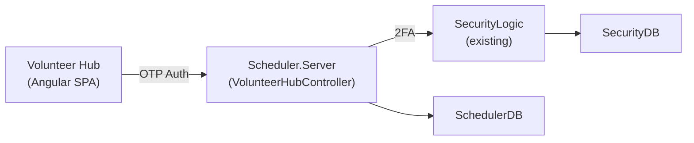

# Volunteer Self-Service Hub — Implementation Plan

Standalone Angular app for volunteers. Uses the **existing security module 2FA infrastructure** for passwordless OTP auth. Skeleton first, features added incrementally.

---

## Architecture



**Auth approach:** Each volunteer gets a `SecurityUser` account (no password, `twoFactorSendByEmail=true`). Login uses the existing `GenerateAndSendTwoFactorToken()` flow, which generates a 6-digit code, saves it with expiry on the SecurityUser record, and sends via `Utility.SendMail()` / `Utility.SendSMS()`. Session managed via the existing `authenticationToken` / `authenticationTokenExpiry` fields.

---

## Phase A: Skeleton + Auth (This Session)

### Layer 1: Database

#### [MODIFY] [SchedulerDatabaseGenerator.cs](file:///d:/source/repos/scheduler/SchedulerDatabaseGenerator/SchedulerDatabaseGenerator.cs)

Add user linkage to VolunteerProfile:
```csharp
volunteerProfileTable.AddGuidField("linkedUserGuid", true)
    .AddScriptComments("Security user GUID for self-service Hub access");
```

> [!NOTE]
> No new OTP table needed — the SecurityUser table already has `twoFactorToken`, `twoFactorTokenExpiry`, `twoFactorSendByEmail`, `twoFactorSendBySMS`, `emailAddress`, `cellPhoneNumber`, `authenticationToken`, and `authenticationTokenExpiry`.

### Layer 2: Server

#### [NEW] VolunteerHubController.cs

Thin controller in `Scheduler.Server` that bridges volunteer Hub requests with existing security + scheduler data:

| Endpoint | Method | Description |
|----------|--------|-------------|
| `/api/volunteerhub/auth/request-code` | POST | Accept email/phone → find SecurityUser → call `GenerateAndSendTwoFactorToken()` |
| `/api/volunteerhub/auth/verify-code` | POST | Verify 2FA code → return `authenticationToken` + expiry |
| `/api/volunteerhub/me` | GET | Resolve session token → `linkedUserGuid` → VolunteerProfile |
| `/api/volunteerhub/me/assignments` | GET | My upcoming + past assignments |

### Layer 3: Client App

#### [NEW] `VolunteerHub/VolunteerHub.Client/` — Angular SPA

```
src/app/
├── services/
│   ├── hub-auth.service.ts       # OTP flow via VolunteerHubController
│   └── hub-api.service.ts        # /me, /me/assignments
├── guards/
│   └── hub-auth.guard.ts         # Route guard checking session token
├── components/
│   ├── hub-login/                 # Email/phone → OTP code entry
│   ├── hub-shell/                 # Layout: bottom tabs (mobile), sidebar (desktop)
│   ├── hub-dashboard/             # Shell: welcome + placeholders
│   ├── hub-schedule/              # Shell: placeholder
│   ├── hub-hours/                 # Shell: placeholder
│   └── hub-profile/               # Shell: placeholder
└── app-routing.module.ts
```

**Login flow:**
1. Enter email/phone → API finds SecurityUser → `GenerateAndSendTwoFactorToken()`
2. Enter 6-digit code → API verifies → returns `authenticationToken` (stored in localStorage)
3. All Hub API calls include token in header; guard checks expiry
4. Session valid for configurable period (default 7 days via `authenticationTokenExpiry`)

---

## Future Phases

| Phase | Features |
|-------|----------|
| **B** | Dashboard: upcoming events, hours summary, alerts |
| **C** | Schedule: FullCalendar with my assignments |
| **D** | Hours: log hours for completed events |
| **E** | Profile: edit availability, skills, emergency contact |

---

## Verification

- DB generator: `dotnet run` (SchedulerDatabaseGenerator)
- Server: `dotnet build`
- Client: `npx ng build --configuration=development`
- Manual: enter email → see OTP in console → verify → see dashboard shell
