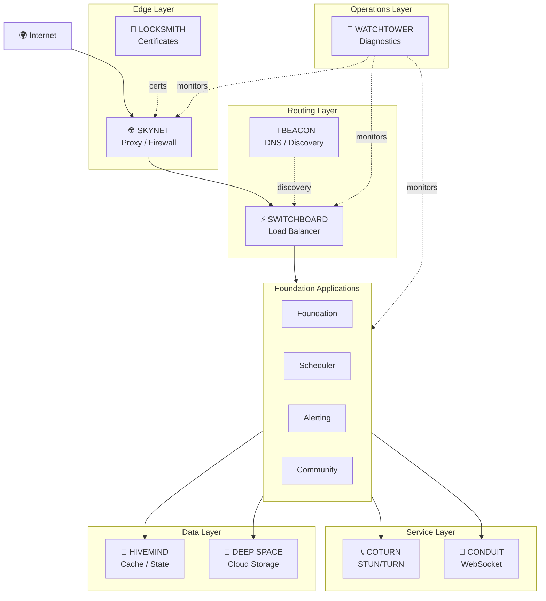

# Foundation Infrastructure Stack — Vision Document

**Theme**: *Foundation's Version of Cloudflare*
**Date**: March 21, 2026
**Premise**: Rent bare metal servers with power and an IP. Everything else is Foundation.

---

## What Exists Today

| Project | Codename | Status |
|---------|----------|--------|
| `Foundation.Networking.Coturn` | — | ✅ Complete. STUN/TURN server (UDP/TCP/TLS), credential generation, standalone host, 11 tests, admin dashboard |

---

## The Full Stack

Organized from low-level networking up to application services. Each project follows the established `Foundation.Networking.Coturn` pattern.

---

### ☢️ SKYNET — Proxy / Firewall / Edge Security

`Foundation.Networking.Skynet`

The **front door** to every Foundation deployment. All inbound traffic flows through Skynet first.

| Capability | Description |
|-----------|-------------|
| **Reverse Proxy** | HTTP/HTTPS forwarding to backend Foundation apps |
| **TLS Termination** | SSL offloading at the edge — backends run plain HTTP internally |
| **IP Firewall** | Allow/deny lists, rate limiting per IP |
| **Region Blocking** | GeoIP-based access control (MaxMind GeoLite2 or similar) |
| **DDoS Mitigation** | Connection rate limiting, SYN flood protection |
| **Request Filtering** | Header inspection, payload size limits, path-based rules |
| **WAF Rules** | Basic web application firewall (SQL injection, XSS patterns) |

**Key Components**:
- `EdgeProxy` — reverse proxy engine with connection pooling
- `FirewallRuleEngine` — evaluates IP/region/rate rules per request
- `GeoIpResolver` — IP → country/region lookup
- `ThreatLog` — audit trail of blocked/flagged requests

**Foundation Dashboard**: Live traffic view, blocked requests, rule management, GeoIP map, rate limit status

> [!IMPORTANT]
> Skynet is the natural **first layer** — it should be built early because everything else benefits from sitting behind it.

---

### ⚡ SWITCHBOARD — Load Balancer / Router

`Foundation.Networking.Switchboard`

**Distributes traffic** across multiple Foundation app instances. Works alongside or behind Skynet.

| Capability | Description |
|-----------|-------------|
| **L7 Load Balancing** | HTTP-aware routing with sticky sessions |
| **Health Checking** | Active health probes to backends (HTTP, TCP, custom) |
| **Routing Strategies** | Round-robin, least-connections, weighted, IP-hash |
| **Auto-Failover** | Removes unhealthy backends, re-adds when recovered |
| **Service Registry** | Foundation apps self-register on startup |
| **Blue/Green Deploys** | Traffic shifting between app versions |

**Key Components**:
- `LoadBalancer` — core routing engine
- `HealthProber` — background health check jobs per backend
- `ServiceRegistry` — dynamic backend registration (pairs with `RegisterWithAlertingAsync()` pattern)
- `RoutingStrategy` — pluggable strategy interface

**Foundation Dashboard**: Backend pool status, request distribution, health history, failover events

> [!TIP]
> Switchboard can consume the existing `IMonitoredApplicationService` health data — the health check infrastructure already exists.

---

### 🧠 HIVEMIND — Distributed Cache / State Persistence

`Foundation.Networking.Hivemind`

**Shared state layer** across all Foundation services. Eliminates the need for external Redis.

| Capability | Description |
|-----------|-------------|
| **Key-Value Cache** | In-memory cache with TTL, LRU eviction |
| **Distributed Mode** | Multi-node cache with consistent hashing |
| **Session Store** | Backing store for Foundation sessions (replaces SQL-based sessions) |
| **Pub/Sub** | Cross-service event notifications |
| **Atomic Operations** | Increment, CAS (compare-and-swap), locks |
| **Persistence** | Optional disk snapshots for crash recovery |

**Key Components**:
- `CacheEngine` — in-memory store with eviction policies
- `DistributedCacheProtocol` — node-to-node replication/gossip
- `HivemindClient` — client library for Foundation apps (implements `IDistributedCache`)
- `PubSubBroker` — publish/subscribe channels

**Foundation Dashboard**: Cache hit/miss rates, memory usage, node health, key inspector

> [!NOTE]
> Hivemind replaces FoundationCore's `Cache` class for multi-server deployments. Single-server stays with the existing in-process cache. The `IDistributedCache` interface makes this transparent.

---

### 🚀 DEEP SPACE — Cloud Storage Abstraction

`Foundation.Networking.DeepSpace`

**Infinite storage** with a unified API, backed by any cloud provider or local disk.

| Capability | Description |
|-----------|-------------|
| **Provider Abstraction** | Uniform API across S3, Azure Blob, GCS, local filesystem |
| **Streaming** | Large file upload/download without memory pressure |
| **Bucket Management** | Create, list, configure storage containers |
| **Presigned URLs** | Time-limited direct-to-storage URLs |
| **Metadata** | Custom metadata on stored objects |
| **Lifecycle Rules** | Auto-archive, auto-delete based on age |

**Key Components**:
- `IStorageProvider` — core abstraction interface
- `S3StorageProvider`, `AzureBlobStorageProvider`, `LocalStorageProvider` — implementations
- `StorageManager` — high-level API (upload, download, copy, move, delete)
- `PresignedUrlGenerator` — time-limited access URLs

**Immediate Use Case**: Scheduler's File Manager currently stores files locally. Deep Space would give it cloud storage backends with zero code changes to the file manager components.

**Foundation Dashboard**: Storage usage per provider/bucket, upload/download activity, lifecycle rule status

---

### 🔭 WATCHTOWER — Network Diagnostics & Monitoring

`Foundation.Networking.Watchtower`

**Eyes on the network**. Ping, traceroute, latency monitoring, and port scanning.

| Capability | Description |
|-----------|-------------|
| **ICMP Ping** | With statistics (min/max/avg/jitter) |
| **Traceroute** | Hop-by-hop path discovery |
| **Port Scanner** | TCP connect scan, service banner detection |
| **Latency Monitor** | Continuous RTT measurement to configured endpoints |
| **Uptime Tracking** | Historical availability data |

**Key Components**:
- `PingService` — ICMP ping with statistics
- `TracerouteService` — hop-by-hop paths
- `PortScanner` — TCP scan with service identification
- `LatencyMonitor` — `RecurringJob`-based continuous measurement
- `UptimeTracker` — feeds into Telemetry

**Foundation Dashboard**: Latency graphs, traceroute visualization, port status matrix, uptime history

> [!TIP]
> Watchtower feeds directly into the existing **Telemetry** and **Alerting** systems — latency spikes or unreachable ports trigger incidents automatically.

---

### 🔑 LOCKSMITH — Certificate Management & SSL Monitoring

`Foundation.Networking.Locksmith`

**Certificate lifecycle management** across all Foundation services.

| Capability | Description |
|-----------|-------------|
| **Certificate Inspection** | Connect to any host, read cert details |
| **Expiry Monitoring** | Background sweep of all endpoints, alert on approaching expiry |
| **ACME Client** | Let's Encrypt / ZeroSSL auto-provisioning |
| **Certificate Store** | Central cert repository for Skynet TLS termination |
| **Chain Validation** | Full certificate chain verification |

**Key Components**:
- `CertificateInspector` — TLS connect and cert extraction
- `CertificateMonitor` — recurring sweep with Alerting integration
- `AcmeClient` — automated cert provisioning (Let's Encrypt)
- `CertificateStore` — secure storage for private keys and certs

**Foundation Dashboard**: Certificate inventory, expiry timeline, auto-renewal status, chain health

> [!IMPORTANT]
> Locksmith + Skynet together give you **automatic HTTPS** for every Foundation service — Locksmith provisions certs, Skynet terminates TLS.

---

### 📡 BEACON — DNS Utilities & Service Discovery

`Foundation.Networking.Beacon`

**Name resolution and service discovery** for Foundation deployments.

| Capability | Description |
|-----------|-------------|
| **DNS Resolver** | Programmatic A, AAAA, CNAME, MX, TXT, SRV queries |
| **DNS Health Checks** | Verify resolution for monitored app hostnames |
| **Service Discovery** | Foundation services register and discover each other by name |
| **Lightweight DNS Server** | Optional internal DNS for Foundation service mesh |

**Key Components**:
- `DnsResolver` — query engine
- `ServiceRegistry` — name-based service discovery (complements Switchboard)
- `DnsHealthChecker` — resolution verification for monitored apps

**Foundation Dashboard**: DNS lookup tool, resolution history, service map

---

### 🔌 CONDUIT — WebSocket Gateway

`Foundation.Networking.Conduit`

**Real-time communication gateway** beyond what SignalR hubs provide.

| Capability | Description |
|-----------|-------------|
| **WebSocket Server** | Standalone server for custom real-time protocols |
| **Protocol Bridging** | WebSocket ↔ TCP, WebSocket ↔ Hivemind Pub/Sub |
| **Connection Management** | Auth, rate limiting, connection pools |
| **Cross-Service Events** | Event bus for inter-service communication |

> [!NOTE]
> Conduit is lower priority — SignalR hubs handle most real-time needs today. This becomes relevant when Foundation apps need cross-service real-time communication at scale.

---

## Infrastructure Tiers



---

## Naming Convention

All projects follow the pattern: `Foundation.Networking.[Codename]`

| Codename | One-Liner |
|----------|-----------|
| **Coturn** | STUN/TURN relay *(done)* |
| **Skynet** | Edge proxy & firewall |
| **Switchboard** | Load balancer & router |
| **Hivemind** | Distributed cache & state |
| **Deep Space** | Cloud storage abstraction |
| **Watchtower** | Network diagnostics |
| **Locksmith** | Certificate management |
| **Beacon** | DNS & service discovery |
| **Conduit** | WebSocket gateway |

---

## Suggested Build Order

**Phase 1 — Security & Visibility** *(enables safe multi-server deployments)*
1. **Watchtower** — see what's happening on the network
2. **Locksmith** — automate HTTPS certificates

**Phase 2 — Edge & Routing** *(multi-server traffic management)*
3. **Skynet** — front door with firewall
4. **Switchboard** — distribute traffic across instances

**Phase 3 — Shared State & Storage** *(stateful multi-server)*
5. **Hivemind** — shared cache/sessions for clustered apps
6. **Deep Space** — infinite storage for files

**Phase 4 — Service Mesh** *(full infrastructure)*
7. **Beacon** — service discovery
8. **Conduit** — real-time cross-service communication

> [!TIP]
> Each phase builds on the previous. Phase 1 tools are useful immediately on single-server deployments. Phase 2+ kicks in when you start scaling to multiple servers.

---

## Architecture Pattern (Per Project)

Every project follows the `Foundation.Networking.Coturn` structure:

```
Foundation.Networking.[Name]/           ← Core library (NuGet-packageable)
  Configuration/                        ← Options + config classes
  Protocol/                             ← Wire protocol (if applicable)
  Server/ or Services/                  ← Core logic
  [Name]ServiceExtensions.cs            ← AddXxx() / UseXxx() DI extensions

Foundation.Networking.[Name].Host/      ← Optional standalone deployment
  Program.cs
  appsettings.json

Foundation.Networking.[Name].Tests/     ← Unit tests

Foundation.Server/Controllers/          ← Admin API controller
Foundation.Client/components/           ← Admin dashboard component
Foundation.Client/services/             ← Angular service
```
